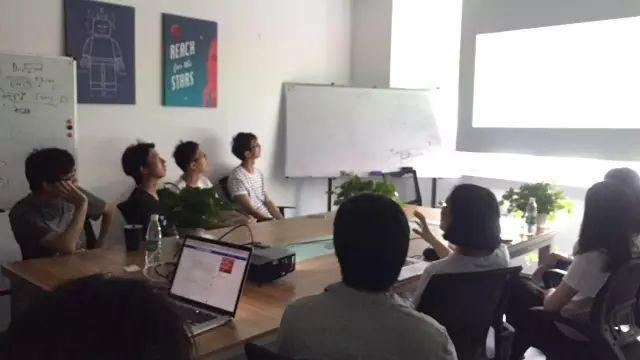
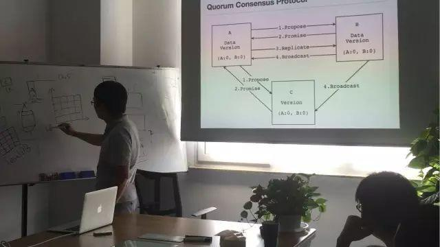

今天是 PingCAP 第 23 期 Meetup，主题是金坤分享的《How to write a good commit message》以及黄华超分享的《QuorumKV：微信分布式 KV 存储系统》。

### 【Topic 1】How to write a good commit message

 

金坤 | PingCAP

**Content：**

This talk about writing good commit messages aims to act as the beginning of a series of talks about writing quality technical content. To emphasise the importance of the commit messages, the talk asked the audience to set up a profile of the potential reviewer who is as cool and picky as the writer of the technical content, or the writer himself in 5 years. Then the talk introduced what is a good commit message and how to write a good commit message by encouraging the audiences to establish good habits, good format and use simple and consistent language, especially to resist the temptation of using lengthy sentences. Best practices and tools from other projects and also covered to trigger further discussions and action items to improve our project.

### 【Topic 2】QuorumKV：微信分布式 KV 存储系统

 

黄华超

**Content：**

本次分享首先介绍了 QuorumKV 诞生的背景以及微信的一些业务情况。并分别从单机存储引擎、分布式协议、数据迁移和冷热数据分离等方面介绍了系统的设计和实现。最后，与大家共同探讨了 QuorumKV 目前基于 Paxos 的一些改造和发展。

