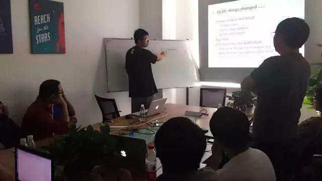

今天是 PingCAP 第 24 期 Meetup，主题是阿里云 ODPS 研发工程师杜川分享的《LLVM 简介及其在大规模 OLAP 中的应用》以及来自小米云平台的杨哲分享的《阻塞访问数据库的相关问题》。

## Topic 1：LLVM 简介及其在大规模 OLAP 中的应用

 

>讲师介绍：杜川，阿里云 ODPS 研发工程师，分布式数据库爱好者，重点关注 SQL 运行时优化以及 Code Generation 技术。

Content：

LLVM 是一个开源的编译器框架及生态链，已在工业界得到广泛的应用（著名的 Clang 编译器就是基于LLVM实现的）。因其前后端分离，模块化等优势，近年来被引入数据库领域，作为 JIT Code Generation 的工具，并吸引了越来越多的关注。本次分享介绍了 LLVM，及其在大规模 OLAP 中的应用。

## Topic 2：阻塞访问数据库的相关问题

>讲师介绍：杨哲，id 杨肉或 yangzhe1991，现就职于小米云平台存储组。曾就职于网易有道、豌豆荚任资深工程师等职位。主要研究分布式数据库，在小米、有道、豌豆荚分别负责 HBase、Cassandra 和 Codis 的开发与维护。

Content：

分享了关于数据库若干问题的一些想法。

