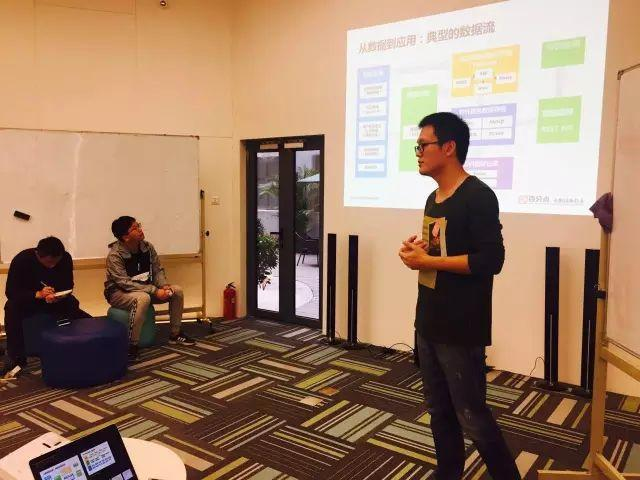
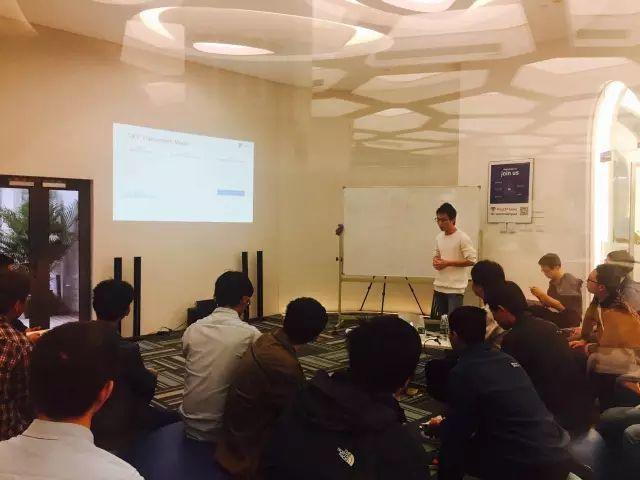
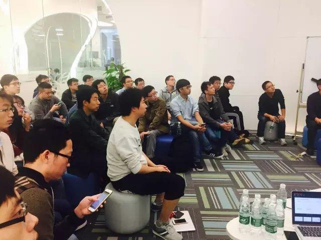
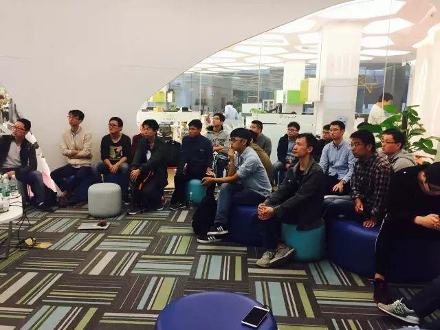

今天是 PingCAP 第 25 期 Meetup，顶着帝都的大雾霾，依然来了很多小伙伴。这一次我们有换新场地噢，但不变的是分享内容依然满满干货。本周的主题分别是百分点集团高级架构师武毅分享的《分布式数据处理在个性化系统的应用》以及张金鹏分享的《TiKV 性能优化》。

### Topic 1：分布式数据处理在个性化系统的应用

>讲师介绍：武毅，现任百分点集团高级架构师，负责大数据平台基础架构的设计与研发，曾参与个性化推荐系统等多个大型系统的设计和开发。Linux 爱好者，活跃于 GitHub，Ubuntu 等社区，重点关注分布式技术，平台技术。

Content：

相信大家也都在各自的领域用到过不同的分布式存储／计算开源工具，本周我们分享了一些在运营个性化系统时使用分布式存储／计算工具遇到的坑和经验。

### Topic 2：TiKV 性能优化

张金鹏 | PingCAP

Content：

RocksDB 的 Column Families 之间会共享 WAL，但是又有各自的 memtables 和 sst files，共享 WAL 使得实现跨 CF 的 atomic 操作变成可能，不同 CF 的 memtables 和 sst files 是分离开的，这样我们可以将不同类型的数据分别存放在不同的 CF 内，根据数据的性质给 CF 定制不同配置，使数据的写入和访问达到最佳状态。

在目前 TiKV 中，读命令只能发给 leader，以防读取到旧的状态，在之前的版本中通过走一次 Raft 来确定当前节点是否是 leader，引入 leader lease 之后，命令发送到在 lease 内的leader 上时，不需要再走一次 Raft 了，可以直接读取本地数据。

当 RocksDB tombstone keys 太多的时候 seek 操作会非常慢，可以根据情况使用 iterator 的 upper bound 功能或者使用 RocksDB 的 singledelete 来解决这个问题.

最后我们给出了一些与 MySQL 的性能对比数据。可以看出，我们在写入性能、聚合操作和一些复杂查询上已经完全超过 MySQL 了。

✏️ 分享两张新场地的图片给你们！看～是不是宽敞又明亮 😊

