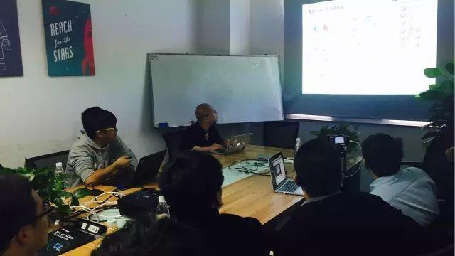
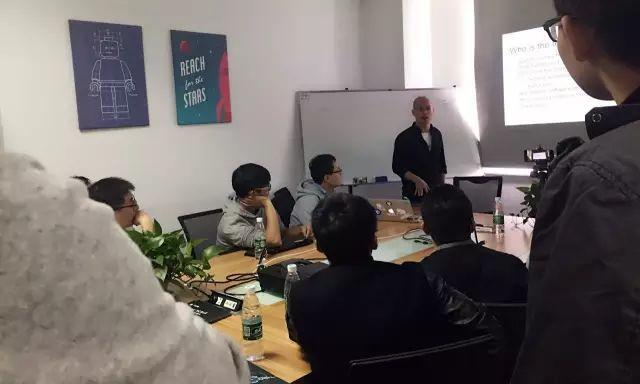

今天是 PingCAP 第 26 期 Meetup，主题是开源项目 speedy 作者张成远分享的《京东分布式数据库实践》以及刘奇分享的《深度探索分布式系统测试》。我司 CEO 亲自出台，现场不时传来三观碎一地的声音

另外，本周初次试水直播 (✿◡‿◡)

### Topic 1：京东分布式数据库实践

>讲师介绍：张成远，《Mariadb 原理与实现》作者，开源项目 speedy 作者。目前就职于京东数据库系统研发团队，负责京东分布式数据库系统架构与研发工作，主导了京东分布式数据库系统在公司的落地及大规模推广。擅长高性能服务器开发，擅长分布式数据库/存储/缓存等大规模分布式系统架构。

Content： 

1. 介绍京东分布式数据库的设计与实现；

2. 介绍去 oracle 的发展历程以及遇到的一些坑；

3. 如何做到高效的运维监控等。

### Topic 2：深度探索分布式系统测试

>讲师介绍：刘奇，PingCAP 联合创始人兼 CEO，先后创建了 Codis、TiDB/TiKV 等知名开源项目。现从事开源的分布式 NewSQL 数据库 TiDB/TiKV 开发。擅长高并发、大规模、分布式数据库系统架构设计。

Content：

主讲人自我点评称：“这是一次毁三观的分享”，因为这里定义了什么是及格的测试。如果您曾经认为自己的分布式系统测试做得非常好，听完之后，您会发现自己可能还远不到好的级别。

分布式系统测试是很少被提及的话题，但分布式系统测试的困难甚至大于写一个分布式系统。一般大家普遍的看法是平时用得很多的分布式系统都是比较稳定的，然而当新的测试方法和工具出现时，可以发现很多新的 bug 或者极大的提高了测试的复现率。复现率是解决 bug 的基础，分布式系统 bug 的复现难度也远大于单机系统。

本周刘奇和大家分享了分布式系统测试的一些困难，以及 PingCAP 和其它大型分布式系统的测试经验。为了方便未到现场的童鞋，后续小编会将本次分享内容整理成文档共享出来，让我们一起，毁~三~观~ :)

