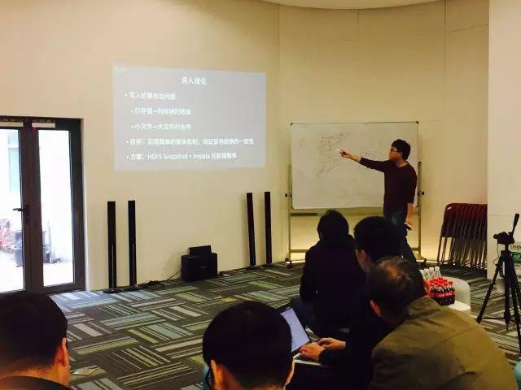
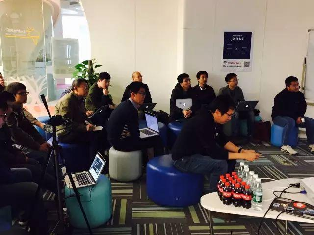
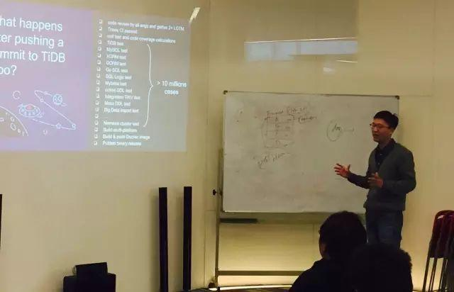

今天是 PingCAP 第 27 期 Meetup，主题是神策数据联合创始人&首席架构师付力力分享的《Impala 在用户行为分析中的应用与优化》以及刘寅分享的《How we build CI/CD for TiDB at scale》。

### Topic 1：Impala 在用户行为分析中的应用与优化

>讲师介绍：付力力，神策数据联合创始人&首席架构师，曾任百度、豌豆荚资深研发工程师，熟悉大规模数据处理、数据仓库、OLAP 数据库等领域。

Content：

1\. 介绍用户行为分析的典型应用场景；

2\. 简单介绍 Impala 的架构和实现；

3\. 使用 Impala 进行用户行为分析的基本做法；

4\. 针对特定场景对 Impala 进行的一些优化和改造。

### Topic 2：How we build CI/CD for TiDB at scale

>讲师介绍：刘寅，PingCAP engineer，现负责 TiDB 商业产品开发和自动化运维。

Content：

主要分享了我们如何为分布式数据库 TiDB 构建持续集成和持续交付平台，以支撑 TiDB 背后上千万的自动化测试 case，和多平台构建及发布。

其中，重点介绍了以 Jenkins 为核心的开源工具，配合 Docker ／ Kubernetes 来搭建分布式可扩展的 CI/CD 系统。Jenkins 2.0 之后的 pipeline script 的支持极大地提升分布式构建的灵活性，我们可以明确定义整个构建过程的不同阶段，并且决定这些阶段运行在集群的某个节点上，让耗时的任务并行处理，极大缩短从代码提交到上线发布的周期。同时结合实际场景的例子，讲解了 jenkins 的一些实用技巧和我们遇到的坑。

