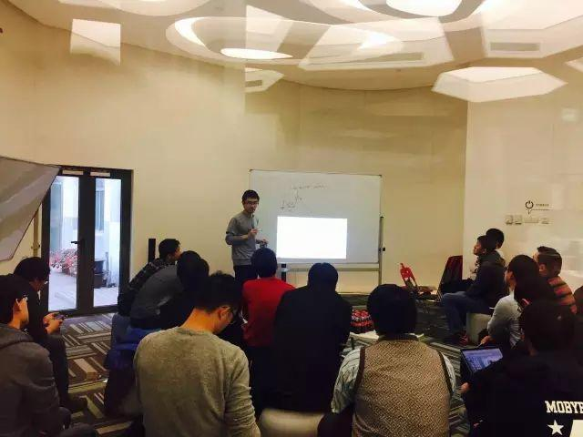

今天是 PingCAP 第 28 期 Meetup，主题是 TalkingData 数据经理时延军分享的《Spark 架构设计要点剖析》以及韩飞分享的《Performing group-by before join》。

### Topic 1：Spark 架构设计要点剖析

>讲师介绍：时延军，TalkingData 数据经理，负责领域工程数据平台架构和研发，曾在 COMODO 中国负责基础数据平台建设，在车语传媒考拉 FM 负责后端数据平台架构（支持离线+实时分析处理）。推崇工程师文化，热爱开源，乐于分享，兴趣广泛，熟悉大数据技术生态，擅长软件系统架构、分布式计算系统设计。

Content：

1、RDD 特性，RDD 是如何抽象数据集的；

2、详解 Spark 基本架构；

3、Spark 内部核心组件及其交互；

4、逻辑执行计划与物理执行计划；

5、Spark 资源管理与任务调度。

### Topic2：Performing group-by before join

>讲师介绍：韩飞，PingCAP 研发工程师（PingCAP SQL 小王子），TiDB SQL Optimizer 主要作者，专注于 SQL 优化技术。前阿里云研发工程师，参与开发 ODPS SQL 查询优化器 Lot。

Content：

Efficient processing of aggregation queries is essential for decision support applications. This talk introduces a class of query trans-formations, called eager aggregation that allows a query optimizer to push group-by operations down the query tree. Eager aggregation partially pushes a group-by past a join.

