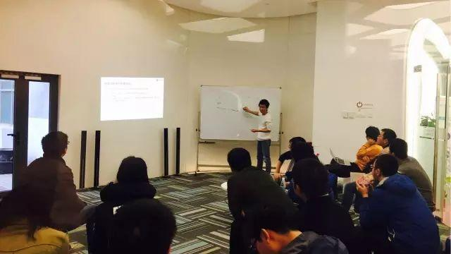

今天是 PingCAP 第 29 期 Meetup，主题是映客服务端架构师王振涛分享的《映客直播服务端架构优化之路》以及张金鹏分享的《MySQL 与 TiDB 的事务机制》。

### Topic 1：映客直播服务端架构优化之路

>讲师介绍：王振涛，南开大学计算机硕士毕业，曾先后供职于腾讯、搜狗等互联网公司，拥有多年的服务端研发、面向服务体系结构设计经验，专注于解决海量数据存储和计算带来的分布式、高并发、强一致性等技术难题和挑战。2016 年初加入映客直播，担任服务端架构师，主要负责映客基础平台架构设计、评审和用户体系的研发工作，经历了映客业务快速发展、构建高可用大容量基础服务体系的过程，对分布式计算、微服务、分布式数据库架构、高可用高并发系统设计等方面都有较深刻的理解和实践经验。

Content：

1、介绍了映客服务端架构演进历程；

2、关于服务端技术选型的探索和思考；

3、移动直播典型应用场景分析。

### Topic 2：MySQL 与 TiDB 的事务机制

>讲师介绍：张金鹏，PingCAP 核心成员，前百度资深研发工程师／京东数据库专家，《MariaDB 原理和实现》作者。

Content：

在 MySQL 的 InnoDB 存储引擎中，进行写操作时，会将数据修改前的状态纪录在 Undo Log 中，一旦事务，失败利用 Undo Log 来进行回滚，保证事务的原子性。同时 InnoDB 利用 Undo Log 实现了多版本并发控制，InnoDB 的读取操作是不加锁的，事务只能读取到事务开始时已提交的纪录。由于 MySQL 是单机数据库，所有很方便的纪录所有活跃的事务 ID，Purge 线程根据当前活跃的事务情况来定期清理 Undo Log 中过期版本的数据。InnoDB 的事务支持 read uncommitted、read committed、repeatable read、serializable 四种事务隔离级别，InnoDB 通过 next-key lock 来解决 repeatable read 隔离级别下的幻读现象。

由于 TiDB 是分布式的数据库，情况变的复杂一些。TiDB 的事务参考的是 Google 的 percolator 模型，通过 PD 获取单调递增的时间戳来作为事务编号。TiDB 的写分为 prewrite 和 commit 两个阶段。如果一个事务写入多行，会选取一行作为 primary row，当 prewrite 阶段成功后会 commit primary row，其他 row 根据 primary row 的提交结果选择提交或者回滚，以保证整个事务的原子性。TiDB 同时实现了 SI 和 SSI 两种事务隔离级别。

