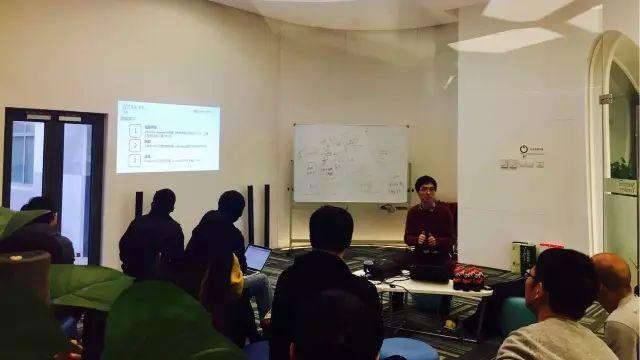
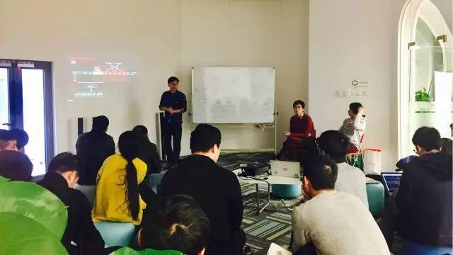

今天是 PingCAP 第 30 期 Meetup，主题是墨迹天气气象算法负责人刘锦龙分享的《深度学习，众包数据与短时临近预报系统》以及刘寅分享的《谈谈 TiDB-Binlog 的设计》。

### Topic 1：深度学习，众包数据与短时临近预报系统

>讲师介绍：刘锦龙，北大理论物理博士，墨迹天气气象算法负责人，负责墨迹相关天气预测算法的研发工作，主要方向为机器学习和深度学习。

Content：

深入介绍如何将深度学习的最新技术用于革新传统气象预测的一些研究和应用，以及如何处理从用户获取的众包反馈数据并进而改进天气预报的精准度。

### Topic 2：谈谈 TiDB-Binlog 的设计

>讲师介绍：刘寅，PingCAP engineer，现负责 TiDB 商业产品开发和自动化运维。

Content：

随着 TiDB 的不断稳定和完善，我们也逐步开发了很多 TiDB 周边工具。今天主要介绍了 TiDB-Binlog 设计上的一些考量和实现细节。

TiDB-Binlog 可实时记录 TiDB 的一切数据变化，可以用来做集群的实时备份和恢复，也可以将数据完整地实时同步到下游的异构数据平台。目前我们已经把 TiDB-Binlog  部署到真实客户的线上系统中，利用实时同步的特性保障了上线过程的可靠和数据安全。今天的分享着重介绍了 Binlog 的原理，以及生成、收集和还原的过程细节。

