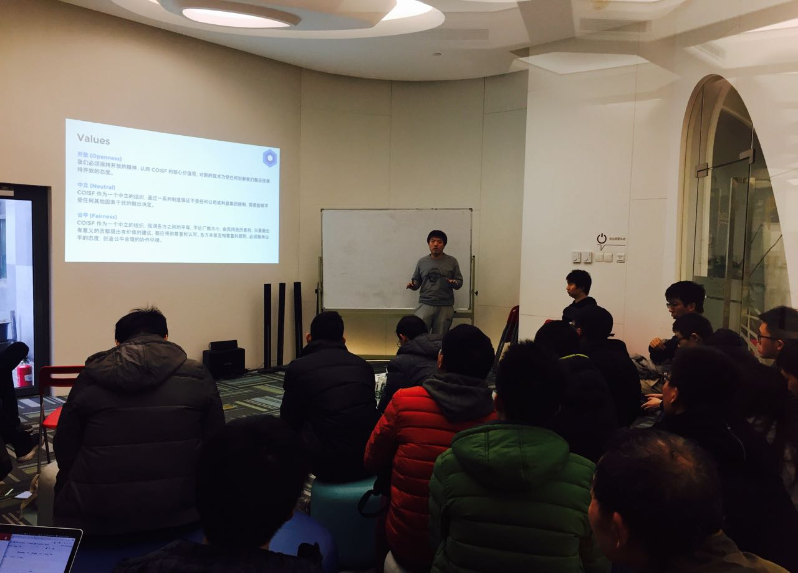
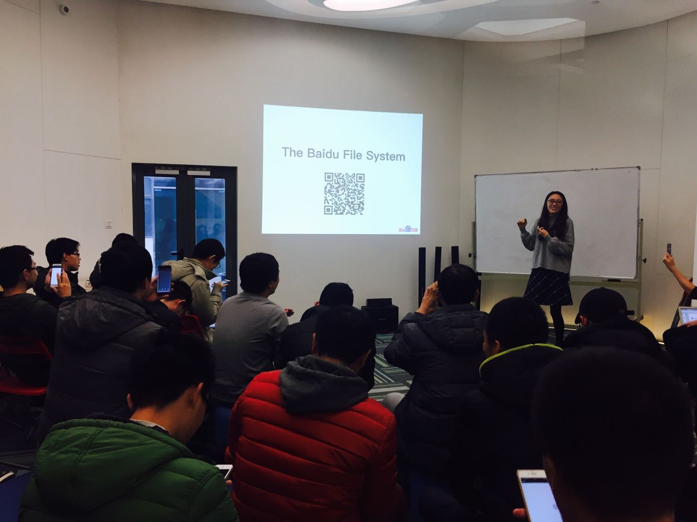
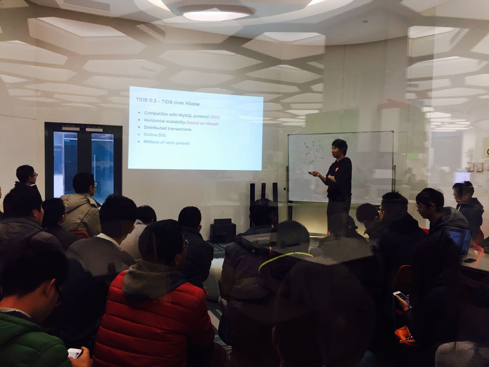

今天是一期人数爆满的 Meetup。作为 COISF 专场，感谢众多小伙伴与我们一起见证 COISF 的首次亮相。当然，首场参与是一定会有福利滴。这一期，我们邀请到了一位女神级讲师--百度网页搜索部工程师雷丽媛，为大家讲解百度文件系统的架构设计；另外，PingCAP 联合创始人崔秋也有出台，为大家深情回顾 TiDB 的发展历程 :)

### 开场：COISF Opening Talk

在本环节中，PingCAP Co-Founder 崔秋，百度搜索基础架构团队技术负责人颜世光，以及奇虎 360 基础架构组存储负责人陈宗志共同为大家介绍了 COISF 的由来和使命，并对目前基金会内的顶级项目进行了简单介绍。

**COISF（China Open Infrastructure Software Foundation ：**中国开放基础软件基金会，其核心技术委员会由 PingCAP、百度、奇虎 360、小米（排名不分先后）等公司的基础软件项目团队组成，致力于促进和发展中国的新一代开源基础软件。目前基金会项目包括：Baidu/BFS、Baidu/Tera、PingCAP/TiDB、PingCAP/TiKV、Qihoo360/Zeppelin 等。

我们认为，一方面开源是软件开发的未来，能更好地促进创新与合作；另一方面未来几十年中国的基础软件必将蓬勃发展，并在世界范围内扮演重要角色。但当前国内有很多优秀的开源软件, 因为文化和语言的藩篱没能融入西方社区, 无法获得足够的关注与支持，导致发展缓慢。我们通过建设中国统一的基础软件开发社区，甄选优秀的项目加入，集中优势资源促进这些项目的快速发展与成熟。

COISF 的使命是：促进中国下一代开源基础软件生态系统的发展。

### Topic 1：百度文件系统－面向实时应用的分布式文件系统

>讲师介绍：雷丽媛，COISF BFS PMC，百度网页搜索部工程师，专注于分布式存储领域，目前负责百度结构化数据存储和分布式系统的相关工作。

Content：

百度的核心业务和数据库系统都依赖分布式文件系统作为底层存储，文件系统的可用性和性能对上层搜索业务的稳定性与效果有着至关重要的影响。现有的分布式文件系统（如HDFS等）是为离线批处理设计的，无法在保证高吞吐的情况下做到低延迟和持续可用，所以百度从搜索的业务特点出发，设计了百度文件系统。本场分享整体介绍了百度文件系统 BFS 的架构设计和子模块。

### Topic 2：TiDB - The Future of Database

>讲师介绍：崔秋，COISF TiDB PMC，PingCAP 联合创始人，重度开源爱好者，曾任职于搜狗、豌豆荚，长期从事广告系统基础组件相关的研究，现主要从事开源 NewSQL 数据库 TiDB/TiKV 相关的设计和研发工作。

Content：

NewSQL 不仅具有传统 SQL 和 ACID 的事务保证，同时还具有 NoSQL 的 Scale 能力, 这是一种世界前沿的数据库新技术。TiDB 以 Google Spanner/F1 作为理论参考，从零到一地完整实现这种面向未来的数据库。今天我们主要回顾 TiDB 的整个发展历程，从单机到分布式，从 Alpha 到 RC，从开源到社区，分享每一次架构演进背后的思考和感悟，以及每个不同阶段我们所做的取舍。最后，从客户的真实反馈中，我们一起探讨了 TiDB 的适用场景和最佳实践。

>COISF（China Open Infrastructure Software Foundation ）：中国开放基础软件基金会，其核心技术委员会由 PingCAP、百度、奇虎 360、小米（排名不分先后）等公司的基础软件项目团队组成，致力于促进和发展中国的新一代开源基础软件。
>为了更好地推动国内开源社区的发展，COISF 专场 Meetup 将定期举办，在这里，我们希望大家不仅能学到技术干货，更能真正感受开源精神的魅力。

