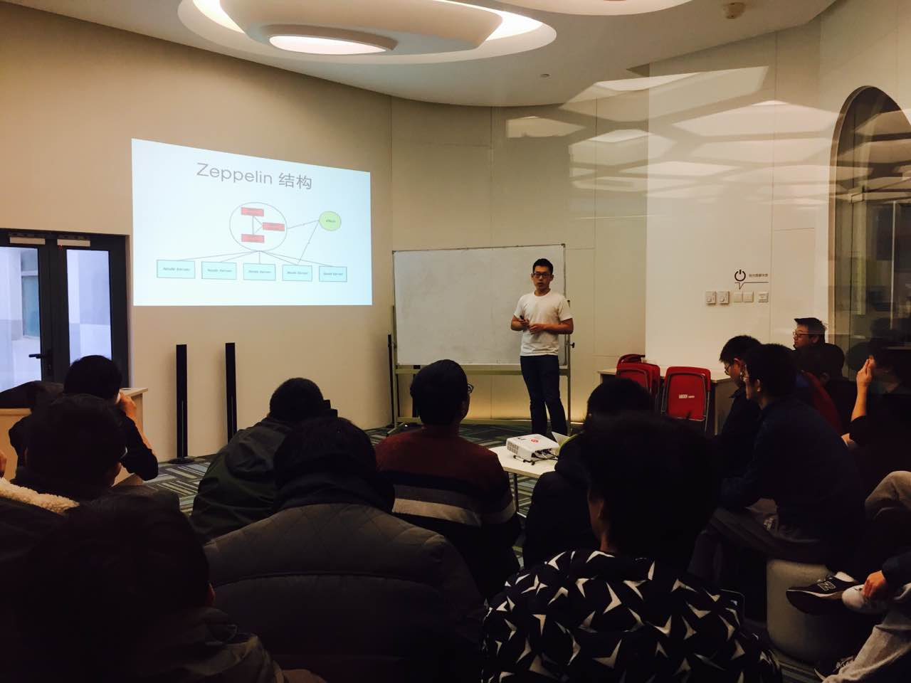
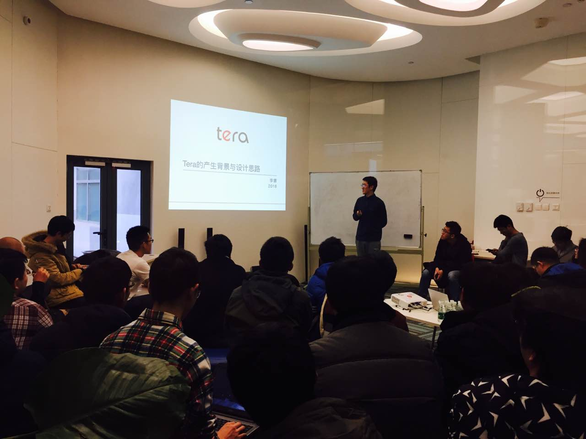

今天是 COISF 专场 Meetup，主题是 360 基础架构组高级研发工程师王康分享的《zeppelin 的设计与实现》以及百度网页搜索部工程师李康分享的《海量结构化数据库 Tera 总览》。

### Topic 1：zeppelin 的设计与实现

>讲师介绍：王康，360 基础架构组高级研发工程师,  负责实现了 360 开源配置管理服务 QConf, 大容量 redis pika，zeppelin 主要设计和实现。

**Content：**

本次分享介绍了 360 半离线存储服务的设计与实现,  介绍 zeppelin 与 pika, bada 等在线存储的区别以及设计上的一些折衷。

### Topic 2：海量结构化数据库 Tera 总览

>讲师介绍：李康，百度网页搜索部工程师，负责百度海量结构化数据库 Tera 的设计和开发工作。

**Content：**

Tera 是百度搜索基础架构团队为管理搜索引擎万亿量级的超链和网页数据设计的结构化数据库，当前已部署上万台机器，支持数十个生产应用。本次分享介绍了 Tera 产生背景和整体设计思路。

