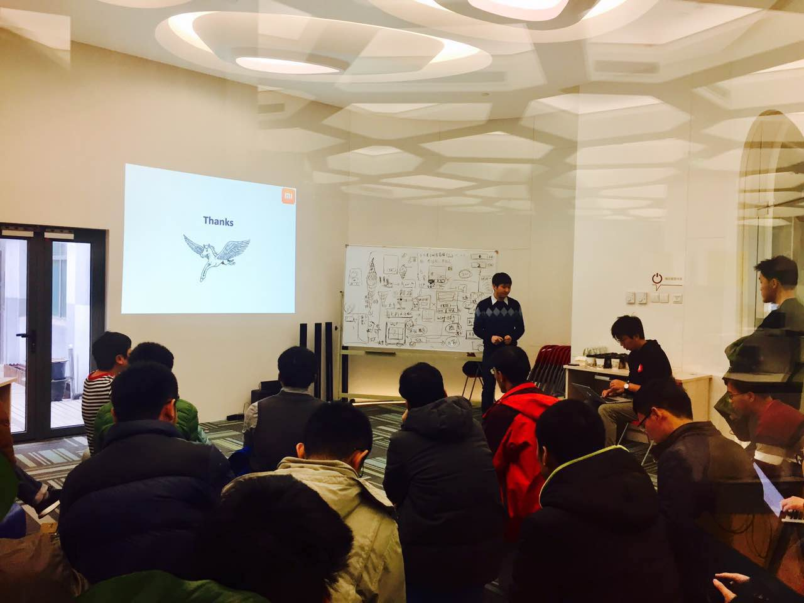
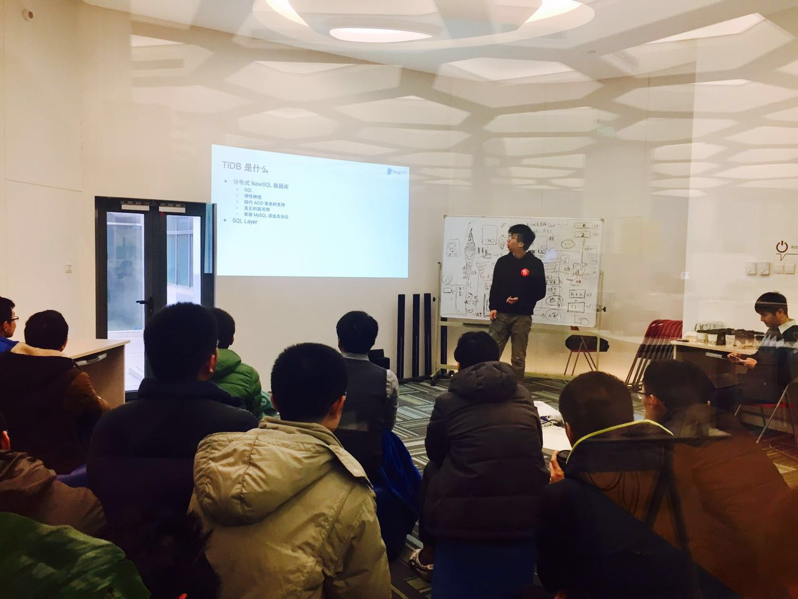

今天是 COISF 专场 Meetup，为了感谢顶着帝都雾霾来听分享的真爱粉们，现场有为大家准备银耳雪梨甜汤哦 😊本周分享的主题是小米工程师覃左言带来的《Pegasus：一个分布式 KV 系统的设计过程》以及 PingCAP TiDB Tech Lead 申砾带来的《TiDB 架构介绍》。

### Topic 1：《Pegasus：一个分布式 KV 系统的设计过程》

>讲师介绍：覃左言，COISF Pegasus PMC，小米工程师，目前主要在小米云平台负责分布式存储系统 Pegasus 的相关工作。专注基础框架和分布式系统，曾在腾讯搜搜基础架构部参与研发分布式存储系统 xcube，后来在百度网页搜索部设计与开发了微服务开发框架 SOFA。热衷开源，是开源 RPC 框架 sofa-pbrpc 的作者，也是分布式系统开发框架 rDSN 的重要贡献者。

**Content：**

随着小米公司业务量的快速增长，小米云平台迎来了越来越多的挑战。原有一些系统在服务业务的过程中，已经逐渐显现出了设计上的瓶颈和不足。譬如小米目前大量使用的 HBase 系统在实际应用中就遇到了一些痛点问题，包括 Java GC 假死造成的无响应、ZooKeeper 的 session 超时不够 敏锐、系统 Failover 过程较慢等。虽然有些问题可以通过优化来缓解，但还有些问题受限于架构本身难以得到根本解决。

为此，小米基于 C++ 开发了一套新的分布式 key-value 系统 Pegasus，以弥补 HBase 的不足，为在线和离线业务提供高可用、高性能、强一致、易使用的存储服务。在本次分享中，首先阐述了 Pegasus 系统产生的背景，重点介绍 Pegasus 系统的整个设计过程，并分享了在分布式系统开发中的一些经验。希望通过带领大家重走 Pegasus 的设计之路，让大家了解如何设计一个分布式存储系统，会遇到哪些问题，有哪些可能的解决思路。

### Topic 2：《TiDB 架构介绍》

>讲师介绍：申砾，COISF TiDB PMC，PingCAP TiDB Tech Lead，前网易有道词典服务器端核心开发，前奇虎 360 新闻推荐系统 / 地图基础数据与检索系统 Tech Lead。

**Content：**

介绍 PingCAP 开发的分布式 NewSQL 数据库 TiDB 的设计思想、整体架构以及最新进展。

