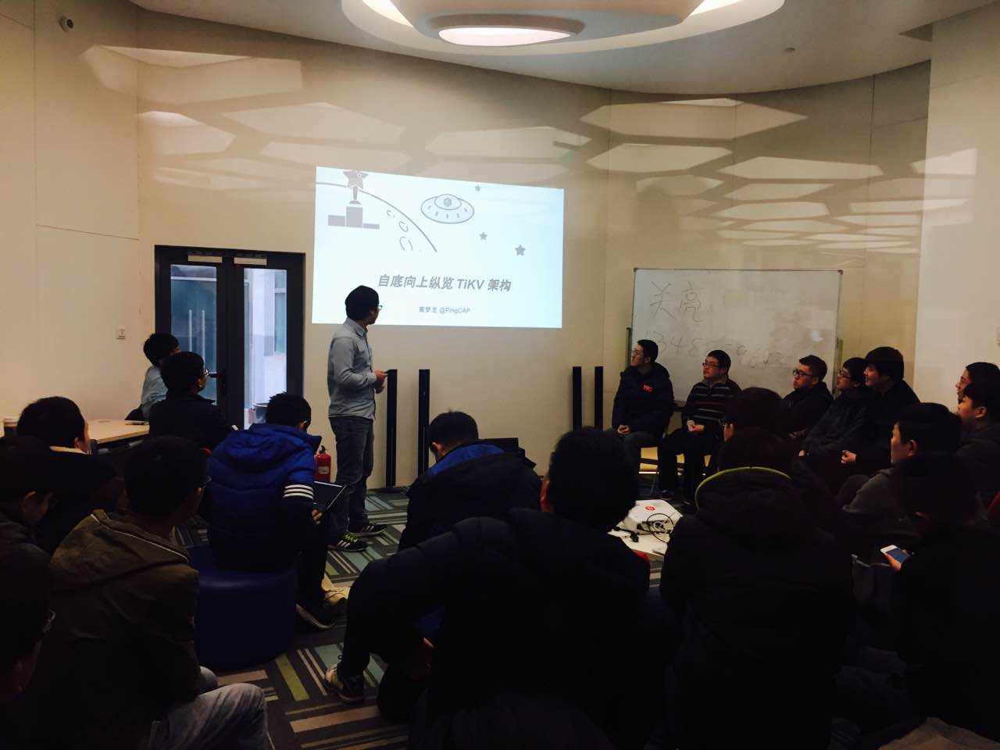
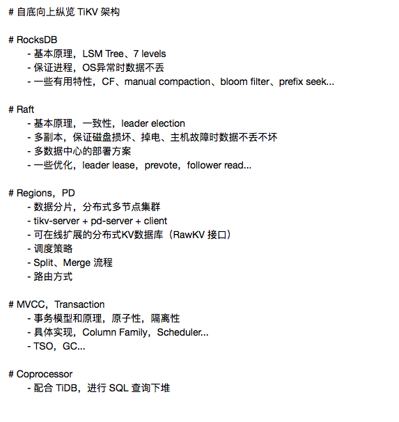

**今天**是平安夜，在圣诞钟声敲响之前，COISF 的专场 Meetup 也带着满满的平安夜祝福与大家相聚在周末，本周分享的主题是《Sofa-pbrpc 设计与实现》以及《自底向上纵览 TiKV 架构》。

### Topic 1：Sofa-pbrpc 设计与实现

>讲师介绍：张頔，百度网页搜索部基础架构工程师。

**Content：**

Sofa-pbrpc 是一个基于 protobuf 的轻量级网络通信框架，在百度搜索架构中广泛应用。单机百万 QPS，接近 ping 的延迟，支持网络流控和多种开发语言。本次分享整体介绍了 Sofa-pbrpc 的设计特点和使用方法。

### Topic 2：自底向上纵览 TiKV 架构

>讲师介绍：黄梦龙( disksing ) ，COISF TiKV Committer，开源爱好者，PingCAP 工程师，现主要负责 TiDB/TiKV 中分布式事务相关研发工作。

**Content：**

分布式开源 Key-Value 存储引擎 TiKV 是 TiDB 项目的重要组成部分，从项目立项至今不到一年时间，已经成功应用于多个产品的生产环境中，这得益于来自开源社区的大量帮助，同时也离不开项目自身良好的分层架构。

本次分享从自底向上的角度剖析分布式 TiKV 的各个组件，阐释其实现高可用、强一致、在线水平扩展、分布式事务的原理，分享在项目构建过程中的一些设计和思考。

**分享提纲：**

