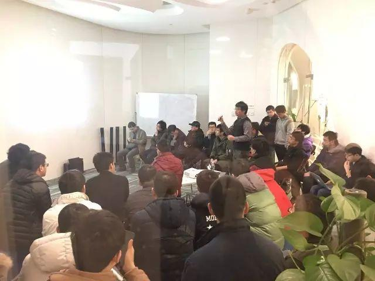
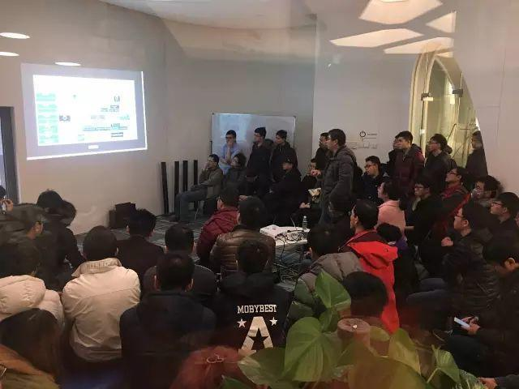

今天是 COISF 专场 Meetup，分享的主题为《Tera 的单机存储引擎的设计与实现》以及《机器学习之我见》。

### Topic 1：Tera 的单机存储引擎的设计与实现

**Speaker**：蔡杰明，百度网页搜索部基础架构工程师，现主要工作从事 Tera 相关的研发工作。

**Content**：Tera 是一个高性能、可伸缩的结构化数据存储系统，被设计用来管理搜索引擎万亿量级的超链与网页信息。Tera 的出现，使得众多业务从基于 map-reduce 批量计算转变为基于 Tera 的实时计算，结果的时效性获得巨大提升；而依赖于 Tera 的高可扩展，实现了业务的计算能力能轻松扩展到数千机器。

本次分享的主要内容是 Tera 的单机存储引擎的设计与实现。通过介绍单机存储引擎的原理，让大家了解 Tera 是如何实现高效的负载均衡和高性能的随机读写。

### Topic 2：机器学习之我见

**Speaker**：袁进辉，2003 年 7 月以年级第一名毕业于西安电子科技大学计算机学院，并被免试推荐入清华大学计算机系攻读博士学位，师从张钹院士，研究方向为计算机视觉及机器学习，2008 年 7 月获得工学博士学位，博士论文获得清华大学优秀博士学位论文奖，同年留校做师资博士后。2004 至 2007 年参与美国国家技术标准局组织的视频检索评测，获得多项第一。2010 年，与国家体育总局合作，负责研发斯诺克比赛“鹰眼”系统，目前该系统服务于各项国际大赛，并被国家队作为日常训练辅助系统。2011 年加入网易有道，任高级应用研究员。 2012 年作为早期成员加入 360 搜索团队，一年之后，产品上线成为国内市场份额第二的搜索引擎。 2013 年加入微软亚洲研究院，主要从事大规模机器学习平台的研发工作。 2014 年，首次将训练 LDA 主题模型的吉布斯采样算法的计算复杂度降到单个词为常数级，基于该算法的分布式实现仅需数十台服务器即可完成以往数千台服务器才能完成的任务。 2015 年至今，专注于搭建基于异构集群的深度学习平台。 2016 年 11 月开始创业。工作之余，乐于在新浪微博讨论技术问题，绰号老师木。

**Content**：机器学习原理及应用。介绍机器学习的基本原理，它在数学和哲学上假设和依据，机器学习能做什么和不能做什么，应用机器学习解决实际问题时的几个关键点。
