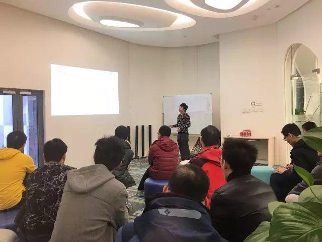
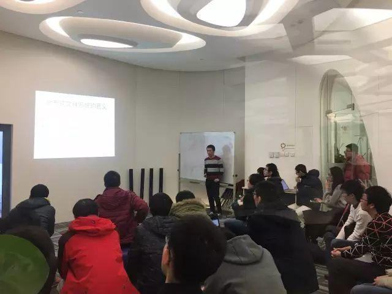

今天是 COISF 专场 Meetup， PingCAP 工程师黄华超和百度网页搜索部基础架构工程师杨策分别与大家分享了《PD 调度的实现》以及《主流分布式文件系统对比介绍》。

### Topic 1：PD 调度的实现

>讲师介绍：黄华超，PingCAP 工程师，曾就职于微信、好赞科技，从事分布式存储相关工作，现负责 PingCAP PD 研发工作。

**Content：**

本次分享主要介绍 PD 是如何实现资源调度的。PD 主要涉及三种调度，分别是 Leader，Storage 和 Replica 调度。Leader 调度是为了让集群的所有节点的负载均衡，Storage 调度的作用是让集群的所有节点的磁盘使用率均衡，Replica 调度则是为了让所有的 Region 有足够的副本数，包括节点故障或者是节点下线的调度。最后还介绍了如何在不同的数据中心、机架以及机器上进行调度。

### Topic 2：主流分布式文件系统对比介绍

>讲师介绍：杨策，百度网页搜索部基础架构工程师，现主要从事分布式文件系统 BFS 相关的研发工作。

**Content：**

分布式文件系统是很多分布式系统里的重要组件，除了可以进行文件存储之外，在此之上可以构造诸如分布式数据库，消息队列等诸多系统。而根据这些系统对元数据量，可扩展性，可用性的不同需求，分布式文件系统又衍生出众多不同的设计和实现。

本次分享的主要内容是对主流的分布式文件系统进行对比介绍，使大家对于不同业务特性、对于分布式文件系统选型的影响有了进一步了解，同时介绍了百度文件系统BFS在设计和实现上的不同之处 。
