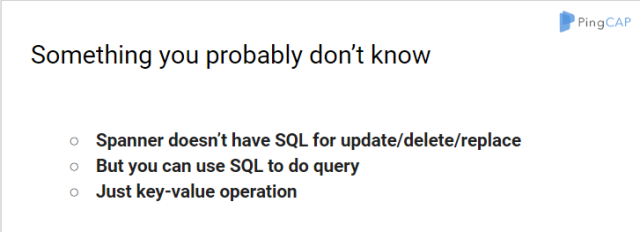

- [视频 | Google Cloud Spanner 小科普](https://v.qq.com/txp/iframe/player.html?origin=https%3A%2F%2Fmp.weixin.qq.com&amp;vid=i0376xqota3&amp;autoplay=false&amp;full=true&amp;show1080p=false&amp;isDebugIframe=false)

>Google 宣布了其 Cloud Spanner 云端数据库服务的 Beta 版测试启动。对此，各方报道层出，大家被新闻刷屏的同时也提出了不少疑问。本期 Meetup 邀请了我司 CEO 刘奇为大家深入解读 Google Spanner，同时与大家讨论了 Spanner 存在的一些限制以及背后的原因。

开始之前，活动报名的人数已达上限

没有成功报名的小伙伴也准时赶来

很是感动~

Meetup 现场，刘奇为大家多层次详细对比介绍了 Google Spanner 和 TiDB：

Google Spanner 的事务模型和 TiDB 事务模型的差异；事务的隔离级别以及不同选择背后的原因；为什么 Spanner 选择悲观锁，而 TiDB 选择了乐观锁；数据分片大小对实际使用场景的影响。

此外，在分析了 Spanner 的最佳实践，以及架构对最佳实践的直接影响之后，刘奇还分享了 Spanner 的 TrueTime API 在跨数据中心的优势，推测未来 Google 会在云上提供 TrueTime API。并解读了 TiDB 在没有原子钟的情况下做了哪些优化来降低延迟，以及后续对调度器的改进计划。

**满满的干货内容，伙伴们听嗨了，讲师也讲嗨了~**

**让我们一起走进活动现场吧~**

……(⊙﹏⊙)

**30 分钟自由讨论环节**

**本期 Meetup 特别设置了半小时的讨论环节**

各位伙伴都热情满满地讨论并分享了自己的观点

更提出了一些疑问~

本次 Meetup 就在大家意犹未尽的会后讨论中~

