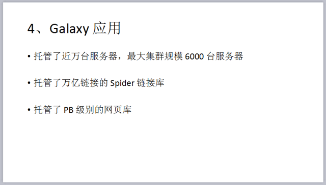

今天的 COISF 专场 Meetup

我们邀请到了百度工程师郝立飞老师

与大家分享百度 Galaxy 集群管理系统

郝立飞从 Galaxy 的背景引入，

为大家详细介绍了

Galaxy 的设计和使用、Galaxy 的功能，

同时，还分享了 Galaxy 的一些具体应用。

以下是节选的 PPT 截图，share 给大家~

听了郝立飞老师分享，大家是不是又涨姿势了呢^^

大家好认真呐，希望有所收获！

