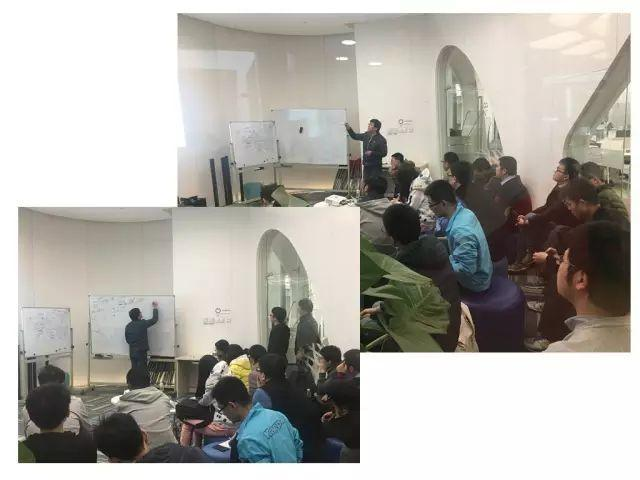
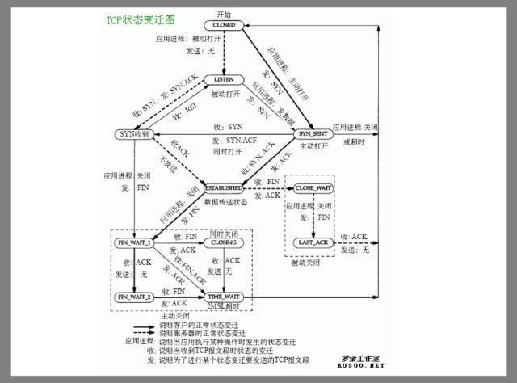
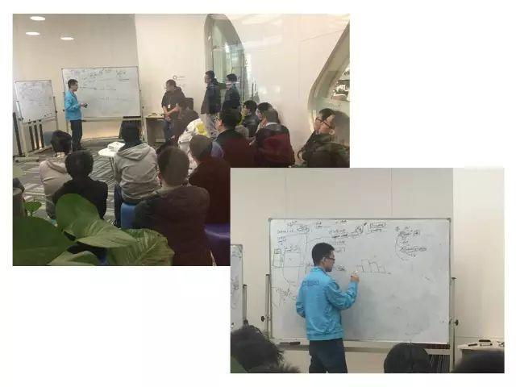

今天的 Meetup，360 基础架构团队工程师吴晓飞和 PingCAP 研发工程师韩飞与大家分享了《tcp 链接的建立与释放》和《分布式数据库中统计信息的收集和使用》，快来看看现场吧~

### Topic 1：tcp 链接的建立与释放

**Speaker：吴晓飞**

吴晓飞，360 基础架构团队工程师，曾参与 360 自主存储项目 bada 的开发，也是 360 开源项目 pika、mongosync 等主要开发者之一。

吴晓飞基于 linux-2.6.32 版本，

介绍了 tcp 连接在内核中的组织结构、

连接建立与释放的大致流程。 

**泼（P）泼（P）特（T）节选→_→**

![ppt 图片]](media/meetup-40-20170304/3.jpeg)

![ppt 图片]](media/meetup-40-20170304/4.jpeg)

### Topic 2：分布式数据库中统计信息的收集和使用

**Speaker：韩飞**

号称 PingCAP SQL 小王子的韩飞童鞋~

**统计信息一般有四种做法：**

采样（Sampling）、直方图（Histogram）、小波（Wavelet）和略图（Sketch），

韩飞童鞋围绕这四种方式进行了逐一的分析。

**泼（P）泼（P）特（T）节选→_→**

![ppt 图片]](media/meetup-40-20170304/6.png)

在分布式数据库中，直接使用采样的方式估算 Join Cost 或者计算 Range-Sum 虽然比较精准，但是会造成比较大的 overhead，而且对内存敏感，难以维护。一般对于非有序列会使用随即采样+全量排序的方式来构建直方图。

![ppt 图片]](media/meetup-40-20170304/7.png)

![ppt 图片]](media/meetup-40-20170304/8.png)

直方图的选择一般从两个方面去考量：一个是分桶策略（Bucket Scheme）；一个是每个桶的估算策略（Estimate Scheme）。

![ppt 图片]](media/meetup-40-20170304/9.png)

最后，在介绍了小波变换（Wavelet Transformation）和略图之后，韩飞童鞋结合 TiDB 的实践讨论了各种统计信息设计和使用方式的优劣，以及离线收集和在线更新的高效算法。

**相信大家在这次 Meetup 里有所收获！**

