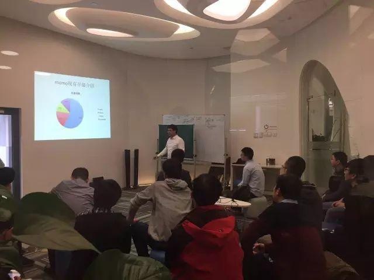
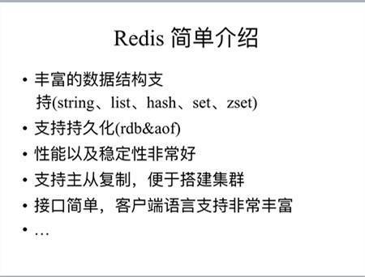
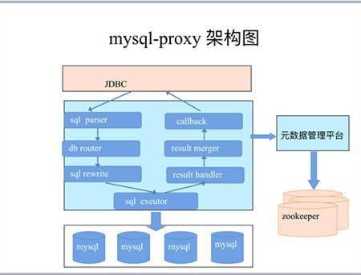
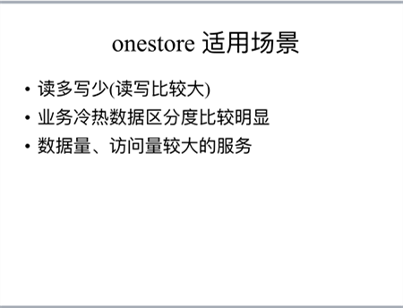
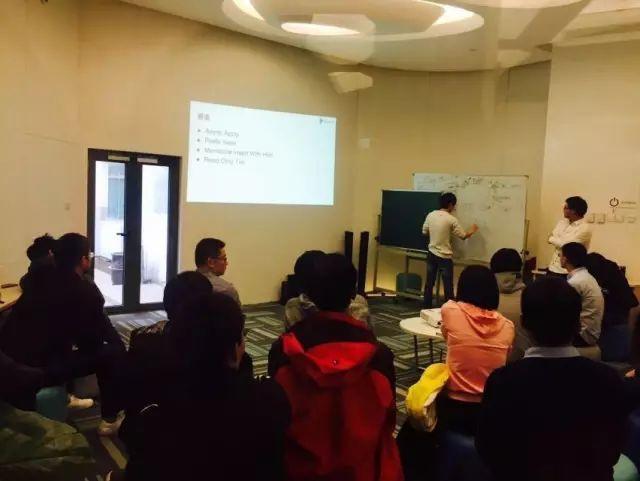
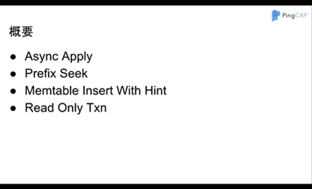
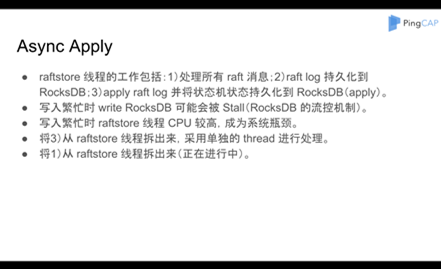

今天的 Meetup，陌陌基础平台部门负责人杨建军与 PingCAP 核心研发工程师张金鹏，为大家分享了《大容量 redis 存储中间件（onestore）架构实践》与《TiKV RC2 性能大幅提升的秘密》两个话题 ，跟小编一起走进现场吧~

### Topic 1: 大容量 redis 存储中间件（onestore）架构实践

>讲师介绍：杨建军，陌陌基础平台部门负责人。先后参与过存储中间件、服务化框架、 统一配置中心、分布式调用跟踪系统等中间件架构设计以及研发工作。个人目前主要关注高并发系统架构、中间件研发、大数据平台、存储、团队管理等方向。

从上线至今 5 年来，

陌陌用户快速增长，服务接口总访问量飙升，

其中存储总访问量达到千万级 /s。

这就要求后端存储的性能也随之提升，

稳定、高效的存储组件是解决这些问题的关键。

今天的 Meetup，

杨建军就为我们分享了

陌陌自研大容量存储中间件 onestore 发展过程、

架构选型、设计以及在陌陌应用情况。

**以下是热气腾腾的干货PPT节选~**

### Topic 2: TiKV RC2 性能大幅提升的秘密

>讲师介绍：张金鹏，PingCAP 核心成员，前百度资深研发工程师／京东数据库专家，《MariaDB 原理和实现》作者。

3 月 1 日，TiDB 正式发布了 RC2 版。该版本对 MySQL 兼容性、SQL 优化器、系统稳定性、性能做了大量的工作，对于 OLTP 场景，读写性能都有大幅度的提升。

在本次分享中，张金鹏为我们剖析了 TiKV 获得大幅性能提升的秘密，包括使用异步 Apply 大幅提升写性能、使用 prefix seek 提升读取性能、引入 memtable insert with hint 提升 Raft CF 的插入性能同时减少 CPU 的使用，以及针对单行只读事务的优化等等。

之前 Raft 相关的工作都是在 raftstore 线程进行的，包括处理所有的 Raft 消息，把 raft log 持久化到 RocksDB，apply raft log 并将状态机的状态持久化到 RocksDB。写入繁忙时 raftstore 会成为系统的瓶颈，同时 write RocksDB 可能会发生 stall，此时容易造成 Raft 的 leader 切换导致系统抖动。将 write RocksDB 的工作以及一些占用 CPU 的工作从 raftstore 线程分离开来，一方面能够充分利用系统资源提升系统的性能，另一方面使系统更加稳定。

prefix seek 首先会对需要 seek 的 key 按照给定的规则提取 prefix，在 seek 的过程中只会操作包含改 prefix 的 sst。

对于 skip list 的插入，如果每次都需要进行 key 的比较然后定位到需要插入的位置，其实是比较耗费 CPU 的。在一些特定的场景下，插入的 key 呈现一定的规律性，例如 key = user_id+time，对于同一个 user_id，下一次的插入很可能在本次插入的相邻位置。TiKV 中的 raft log 也有类似的特征，raft log entry 的 key = raft group id + log index。memtable insert with hint 功能特别适合这种场景，针对相同的 prefix 的 key 建立特殊的索引，减少 key 的比较次数。

对于读取单行的时候，省掉获取 ts 的过程，减少一次 rpc 的延迟。

**以下是香喷喷的干货PPT节选~**

