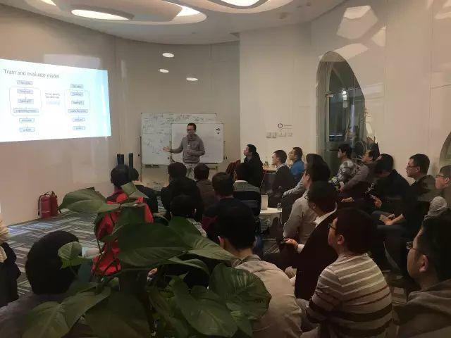
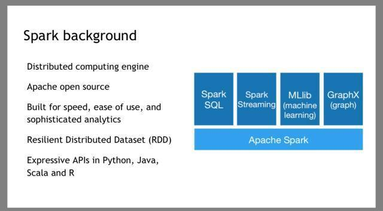
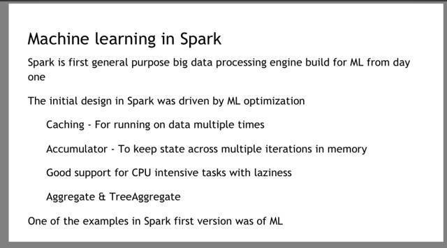
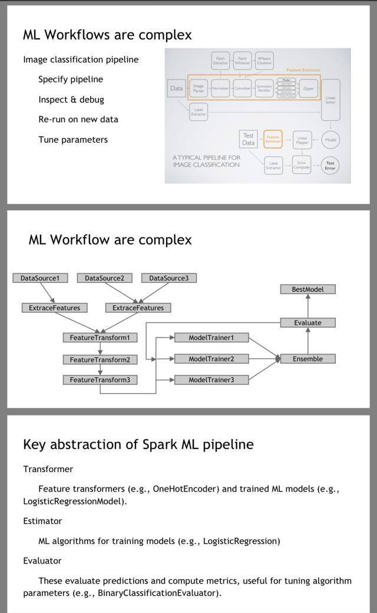
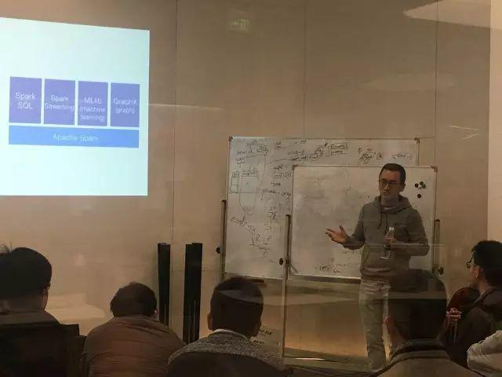
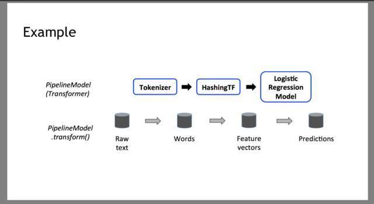

今天的专场 Meetup 邀请到了 Apache Spark Committer 梁堰波～梁老师结合自己的经验为大家分享了话题《Spark 与机器学习》，让我们来回顾一下现场实况吧！

### Spark 与机器学习

Apache Spark 已经成为业界标准的大规模数据处理的标准平台。Spark 的 MLlib 给机器学习工程师和数据科学家提供了一些最常用的机器学习算法库以及一个构建机器学习 pipeline 的工具。

>讲师介绍：梁堰波，Apache Spark Committer，开源爱好者，北京航空航天大学计算机硕士，曾就职于 Yahoo!、美团网、法国电信，具有大数据、数据挖掘和机器学习领域的项目经验。

作为国内活跃的 Spark Committer 之一，

梁老师对 Spark 的理解非常深刻，

他首先为大家分享了 Spark 的基本架构，

又举例说明了 Spark 能够解决的主要问题。

在本次 Meetup 上，

梁老师还分享了 MLlib 的主要算法、

如何扩展 MLlib 算法等姿势~

最后，梁老师通过实际的应用案例，分享了如何使用 Spark 构建机器学习 pipeline。

今天小伙伴们热情高涨~

