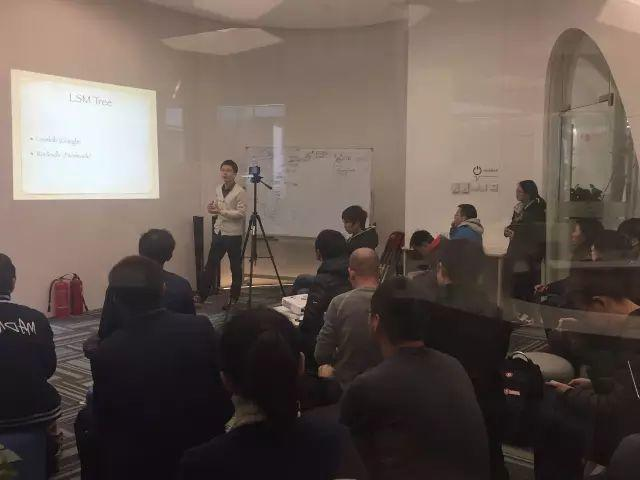
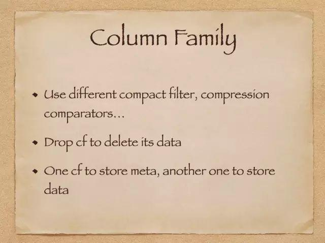
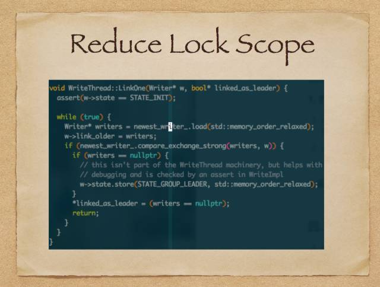
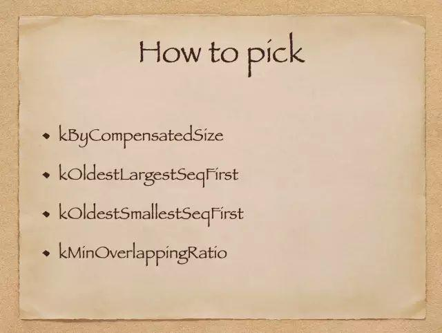
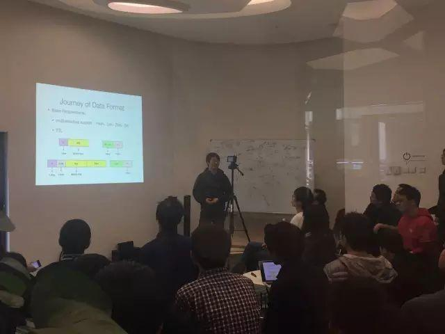
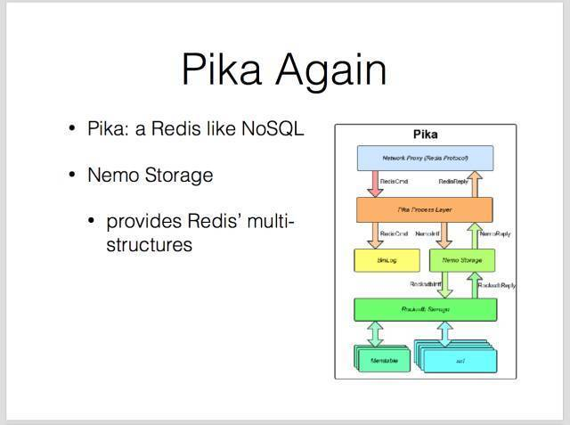
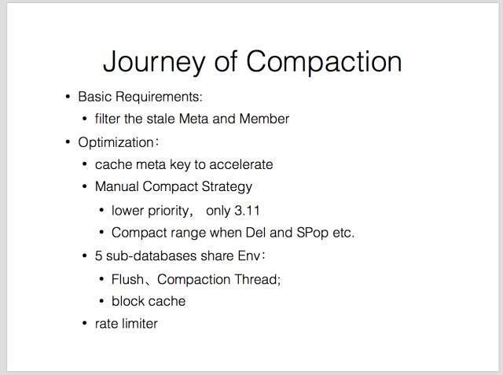
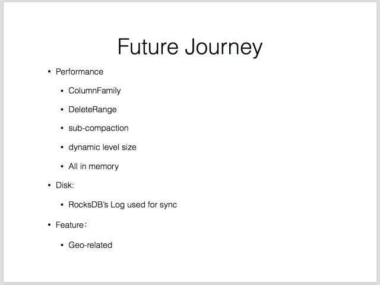
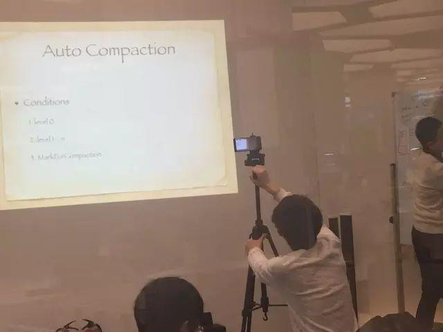

今天的 Meetup，是 RocksDB 专场哦~ :) 这一次，我们请到了来自 360 基础架构组的研发工程师，宋昭与赵安安，为大家分享了他们各自对 RocksDB 的独到见解及研发经验。没有机会来现场的小伙伴，这里有第一手现场资料~👇

### Topic 1：RocksDB  Write & Compaction

>讲师介绍：宋昭，360 基础架构组研发工程师

在本次分享中，宋昭老师基于 RocksDB 5.0.1 代码，为大家详细介绍了 RocksDB write、flush 及 compaction 的具体实现，并对照 LevelDB 来分析对比 RocksDB 在实现及策略上的各种优化。

以下是讲师 PPT 节选~~

## Topic 2：RocksDB in Pika 

>讲师介绍：赵安安，360 基础架构组研发工程师

赵安安老师从 RocksDB 在 Pika 中的应用情况来为大家进行了以下讲解： Pika 如何用 KV 实现多数据结构；基于这一设计，如何定制修改 RocksDB 实现 TTL 和 key 的秒删；特定接口的一些优化；以及使用 RocksDB 的一些经验。

讲师 PPT 节选， Again~

**应众多身在异地的小伙伴们的强烈要求，本期 Meetup 临时开启了线上直播，上图有位帅气的兼职主播 :-D**

