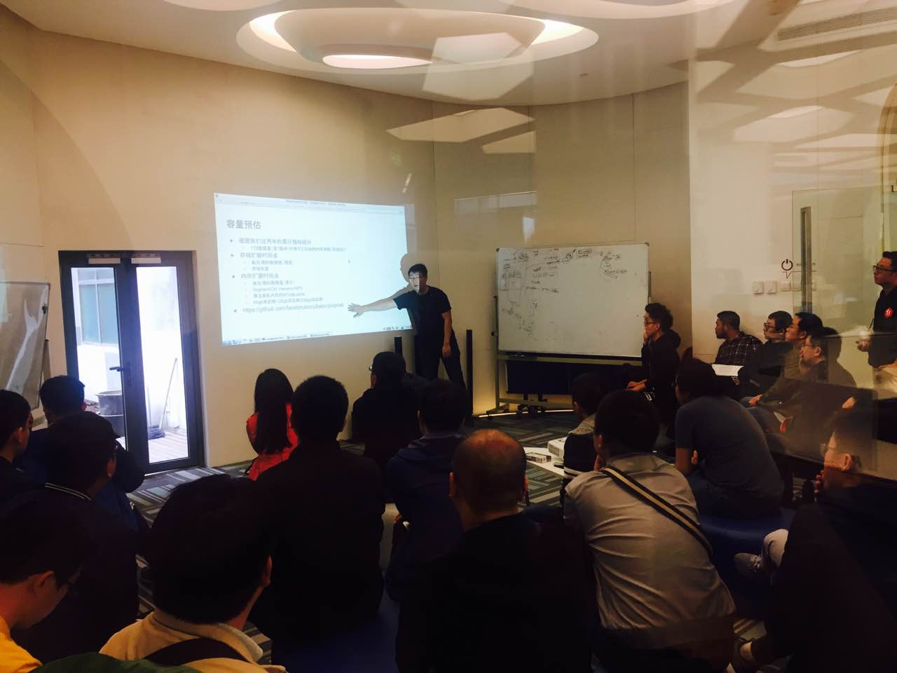
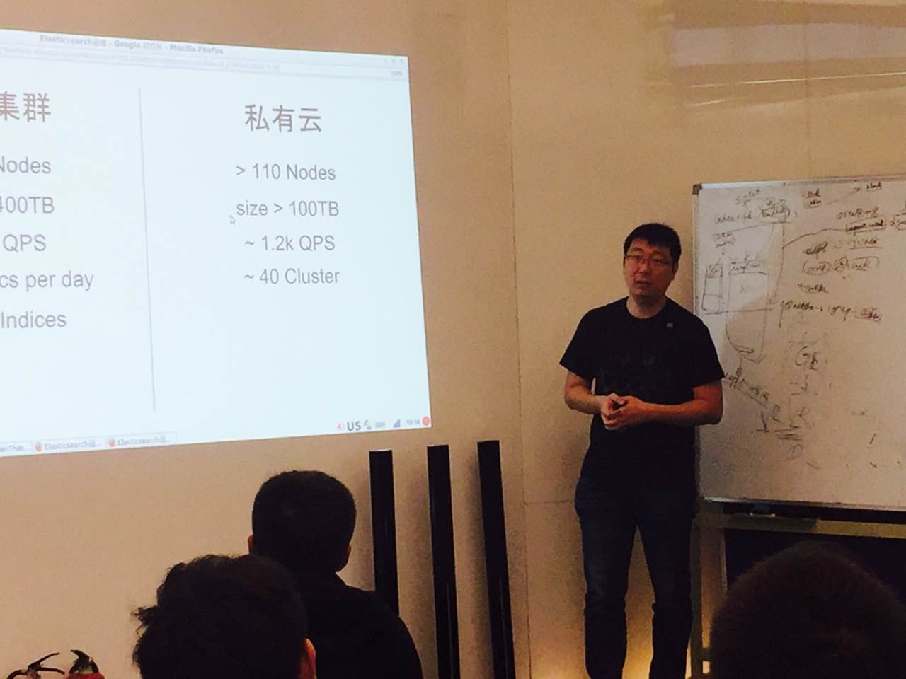
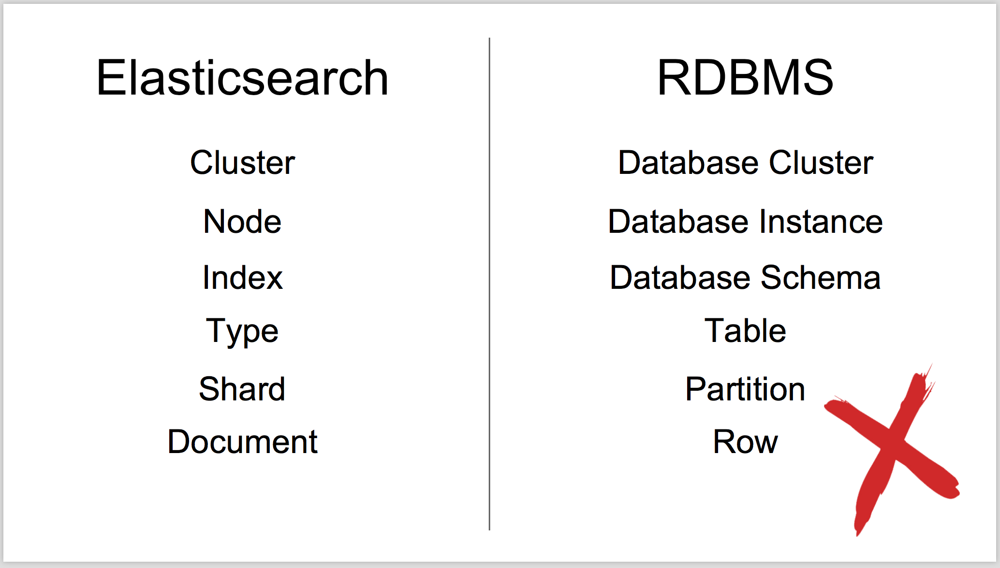
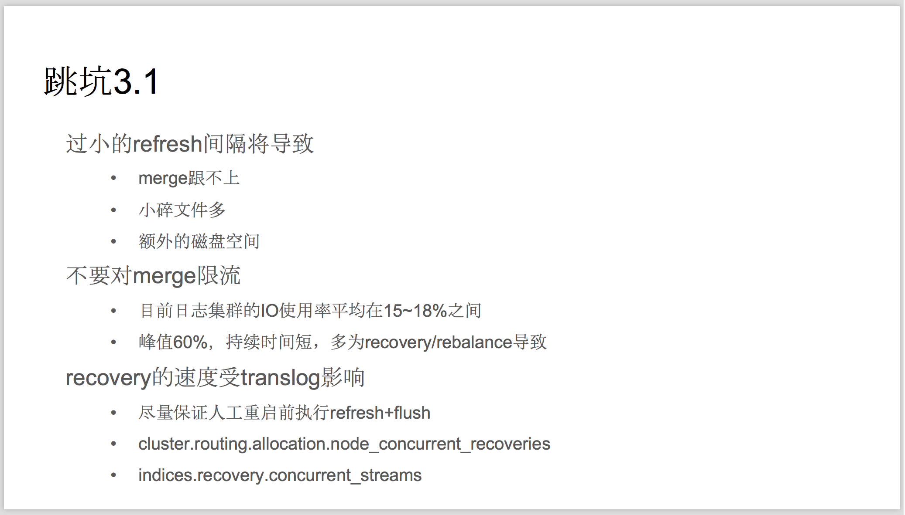

今天的 Meetup，我们邀请到去哪儿网的资深工程师徐磊，为大家分享关于 Elasticsearch 运维的那些事，跟小编一起走进现场吧~~

### Elasticsearch 运维

Elasticsearch 在近两年越来越火了，越来越多的公司和团队尝试使用它支撑业务。运维人员如何保证 Elasticsearch 集群的稳定？有哪些必须掌握的优化技巧？

>讲师介绍：徐磊，2015 年加入去哪儿网平台事业部 OPSDEV 团队，负责实时日志系统的建设和运维工作，开源社区贡献者，曾供职于 Red Hat。

在本次分享中，徐磊老师从数据模型设计，使用技巧，参数优化，监控对比等多个方面为大家分析了 Elasticsearch 的优缺点和运维重点。同时与大家分享了内部的 Elasticsearch 私有云的建设经验。

### 干货节选

来~这里还有讲师的 PPT 节选，一起看看，在 Elasticsearch 中，有哪些要注意的坑吧~~

