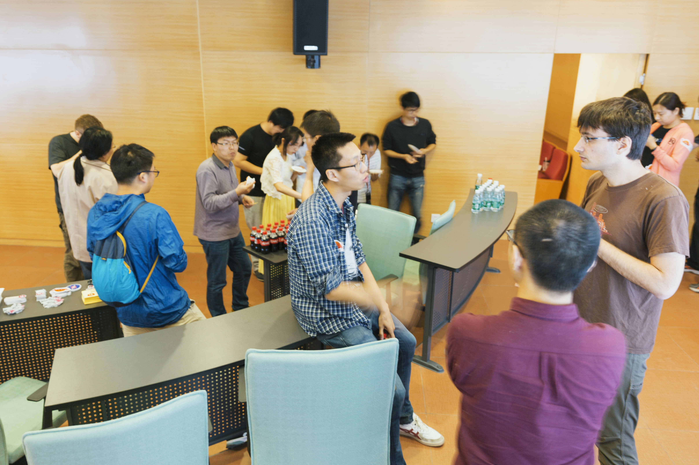

>今天，小伙伴们期待已久的北京 Rust Meetup 终于和大家见面啦！在这场 Rust 社区在中国的首次官方活动中，我们邀请了两位 Rust 团队核心成员，Alex Crichton、Brian Anderson，与我司首席架构师唐刘，共同为大家带来了干货十足的分享内容~第一手现场资料，看这里！

这一次的 Meetup，小伙伴们都好积极 👏 提前一小时就有入场抢座位的~也是让小编感动到不行~~知道大家都已经迫不及待了，简单的开场之后，我们直接上干货！

## Concurrency and asynchronous IO in Rust

并发在当今编程领域是如此重要，然而要想实现并发程序通常会面临数据竞争，竞态，死锁，悬空指针，多次 free 等问题，Alex 在本期 meetup 里给我们讲解了 Rust 是如何用 ownership/borrowing 系统解决这些问题的，其核心思想是:

*   A mutable reference cannot be aliased

*   A reference cannot outlive its referent

>讲师介绍：Alex Crichton，Mozilla 工程师，Rust 核心团队成员。从事 Rust 编程语言方面的工作已有 5 年。在 Mozilla 主要负责 Rust 的标准库、Cargo、异步 I/O 子系统以及 Rust 本身的基础设施。目前在做异步 I/O 栈 Tokio。

Rust 语言本身只提供了 ownership/borrowing 机制，标准库里提供了 thread，channel，arc，atomic，mutex 等基础设施，但没有提供轻量级协程，这样虽说并发程序写起来比较麻烦，但是不会只局限于一种并发模型。而后，简单介绍了第三方并行库 rayon 和 crossbeam。最后重点讲解了异步 IO 库 futures。

Alex 在台上的分享刚刚结束，台下的小伙伴们便开始踊跃提问~让我们递话筒的妹子，不得已开启了满场飞模式 :-D

Q&A 时间抢不到机会，没关系，还有茶歇时间可以利用 ✧(≖ ◡ ≖✿)

## How We Use Rust in TiKV

TiKV 是一个分布式 Key-Value 数据库，它通过 Raft 支持跨数据中心的复制，保证数据安全，提供了分布式事务支持，coprocessor computing 支持等。为了支持这些 feature，需要选择一门高性能的语言，不能有 memory 问题，不能用 data race 问题，同时也需要保证能快速的对 TiKV 进行开发迭代，基于这些原因， PingCAP 团队选择了 Rust 作为 TiKV 的开发语言。

>讲师介绍：唐刘，PingCAP 首席架构师，分布式存储引擎 TiKV 项目负责人。分布式数据库专家，知名开源软件 LedisDB / RebornDB / Mixer 作者。

在 Rust 关键技术选择上面，唐刘表示：“首先我们选择 mio 作为整个网络处理以及异步处理的框架。但 mio 过于底层，需要额外做很多工作，而且 mio 的 callback 写法很容易造成代码逻辑的割裂。所以后面，我们开始使用 gRPC 重构整个网络模块，同时使用 tokio-core 以及 futures 机制来重构整个异步框架。另外，我们也开启了 clippy 在编译的时候对 TiKV 进行更多的检查，保证代码的安全。并嵌入了一些 profile 和 monitoring 的工具来帮助我们在 TiKV 运行时动态的排查问题。”

这是一场 Q&A 时长几近赶超 Talk 时长的一次分享～😜 

宾主尽欢后，当然是要记录下这美好瞬间啦～～

不管你们拍照是喊茄子还是 Cheers，反正我们只喊：Let's Rust the World！

最后附赠两张侧面杀~~ (๑•ᴗ•๑)

