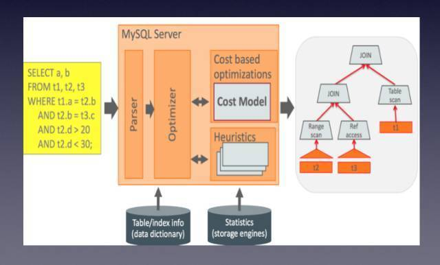

今天的 Meetup，我们邀请到了熊猫直播 DBA 杨尚刚老师，为大家分享《MySQL 5.7 的特性及实践》~

>讲师介绍：杨尚刚，熊猫直播高级 DBA，负责后端数据库平台建设和架构设计。前新浪高级数据库工程师，负责新浪微博核心数据库架构改造优化，以及数据库相关的服务器存储选型设计。

2015 年最重磅的当属 MySQL 5.7 GA 的发布，号称 160 万只读 QPS，大有赶超 NoSQ L趋势。

不过官方的硬件测试环境是很高的，所以这个 160 万 QPS 对于大家测试来说，可能还比较遥远，所以实际测试的结果可能会失望。但是，至少我们看到了基于同样测试环境，MySQL 5.7 在性能上的改进，对于多核利用的改善。

本次分享中，杨老师讲解了 MySQL 5.7  在运维、优化器 Server 层、InnoDB 层等方面的优化，以及 MySQL 未来的发展趋势。

## 运维方面

*   动态修改 Buffer Pool

*   MySQL redo log大小

*   innodb_file_per_table

*   query cache

*   SQL_Mode

*   binlog_rows_query_log_events

*   max_execution_time

*   replication info in tables

*   innodb_numa_interleave

*   动态修改 replication filter

## 优化器 Server 层改进

优化器主要还是基于 cost model 层面和给用户更多自主优化。

可配置cost based optimizer、mysql.server_cost 和mysql.engine_cost。

New JSON 数据类型和函数支持。当然 JSON 也可以存在 Text 或 VARCHAR 里用内置 json，更容易访问，方便修改。

支持生成列（虚拟列），以及虚拟列上索引。

5.7 还对 explain 做了增强，对于当前正在运行查询 explain。

## InnoDB 层优化

InnoDB 层核心还是拆分各种锁，提高并发。只读事务优化就是其中一个例子。

atomic write，disable double write

支持 spatial index 空间索引。

Transparent page compression

performance_schema 改进

新增加的 sys 数据库。

Replication 改进。

最大的亮点 GTID 增强，支持在线调整 GTID。

使用 mysqlbinlog 作为伪 slave 是个不错方案。

并行复制优化，Database 5.6 默认并行复制，logical-clock 5.7 引入。

5.7 引入的 group replication 也是为了提高可用性。多主复制，多点写入，内部检测冲突，保证一致性，自动探测。支持 GTID，共享 UUID，只支持 InnoDB，不支持并发 DDL。

## 讲师总结

从整体来说，MySQL 5.7 做的改进还是非常有吸引力的，不论是从运维角度还是性能优化上，当然真正在生产环境上遇到问题时在所难免的，要做好踩坑的准备。

