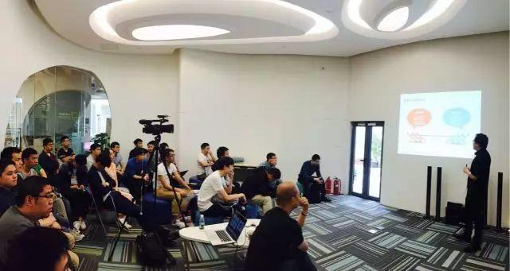
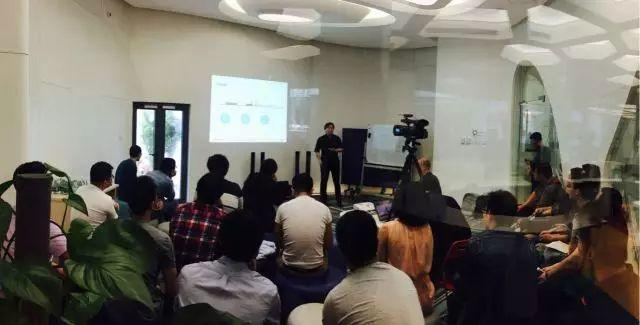
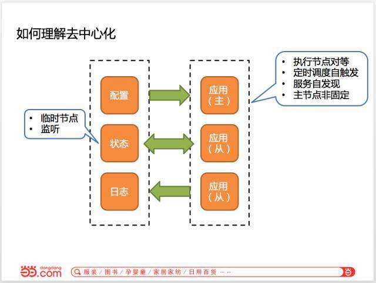
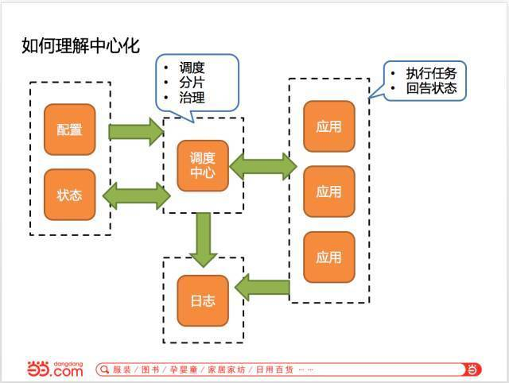
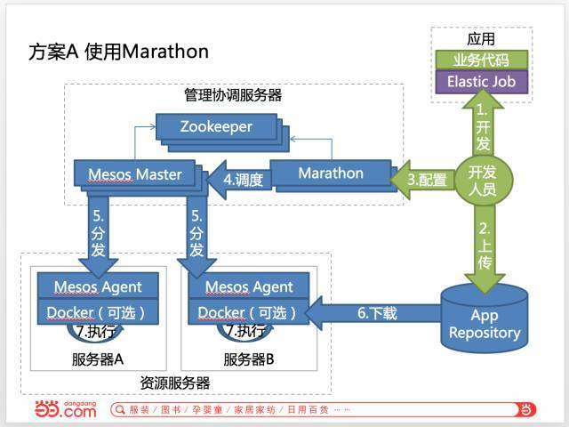

今天的 Meetup ，我们请到了当当架构部负责人张亮，大家分享了《分布式定时任务中间件架构 Elastic-Job 的两种实现》。

>讲师介绍：张亮，当当架构部负责人，主要负责分布式中间件以及私有云平台的搭建。致力于开源，目前主导两个开源项目 elastic-job 和 sharding-jdbc。擅长以 java 为主分布式架构以及以 Mesos 为主的云平台方向，推崇优雅代码，对如何写出具有展现力的代码有较多研究。

今日帝都依然大风，但小伙伴们学习的热情丝毫未减哦~

在本次分享中，张亮老师从分布式定时任务中间件的适用场景，轻量级去中心化架构方案以及基于 Mesos 的中心化架构方案，三个方面为大家进行了详细讲解。

在互联网应用中，各式各样的定时任务存于系统的各个角落，我们希望由一个平台统一将这些作业管理起来。然而，一旦平台中运行大量的作业，发现异常作业并手动处理难免会感到繁琐，同时人工处理还会带来很多其他的额外成本。如何最大限度的减少人工干预？

高可用可以让作业在被系统发现宕机之后能自动切换。而弹性化可以认为是高可用的进阶版本，在高可用的同时还能够提升效率和充分利用资源。对于动态的扩容和缩容，通常采用分片的方式实现。

去中心化架构是指所有的作业节点都是对等的，优点是轻量级，部署成本低；缺点则是，如果各作业服务器时钟不一致会产生同一作业的不同分片运行有先有后，缺乏统一调度，并且不能跨语言。

中心化架构将系统分为调度节点和执行节点，可以解决服务器时间差以及跨语言的问题；缺点是部署和运维稍复杂。

Elastic-Job 最初的版本分离于当当内部的应用框架 ddframe，是一个纯 Java 实现的分布式方案，参照 dubbo 的方式，提供无中心化解决方案。

如今，Elastic-Job 已开源近 2 年，截止目前已更新发布18 次，GitHub Star 数近 2000，成绩出色。更有多个开源产品衍生自 Elastic-Job。

应小伙伴们的强烈要求，张亮老师临时加场 Demo 演示。

最后，还有超多第一手爆料，是属于现场听讲小伙伴们的专属福利 ✌️ 很心动？下周六，老时间，老地点，PingCAP 第 48 期 Infra Meetup 等你呦！

