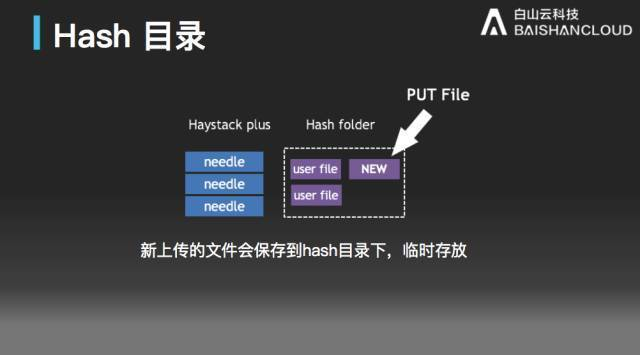
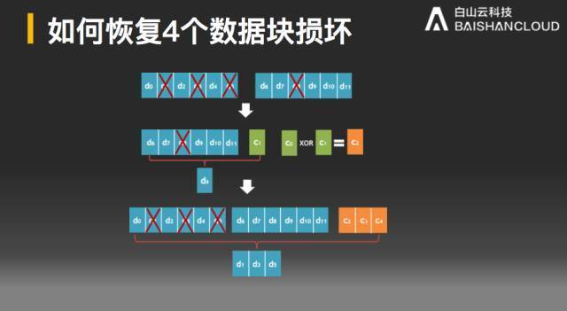

今天的 Meetup，我们请到了来自白山云的张炎泼老师，为大家分享《分布式对象存储面临的挑战》。

>讲师介绍：张炎泼 (xp)，30 年软件开发经验，物理系背叛者，设计师眼中的美工，bug maker，vim 死饭，悬疑片脑残粉。曾就职新浪，美团。现在白山云，不是白云山。

在本次分享中，张炎泼老师从：海量小文件如何存储、如何节省存储成本、如何实现数据的自动恢复，三个方面，为大家进行了详细讲解。

以下是本期 PPT 节选

[附：完整 PPT 下载链接](https://eyun.baidu.com/s/3bpKSlzh)

