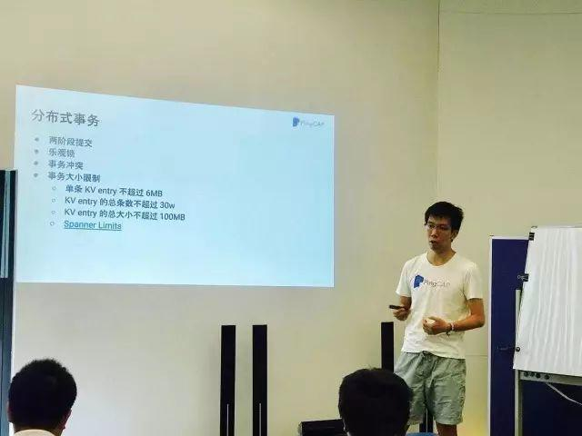
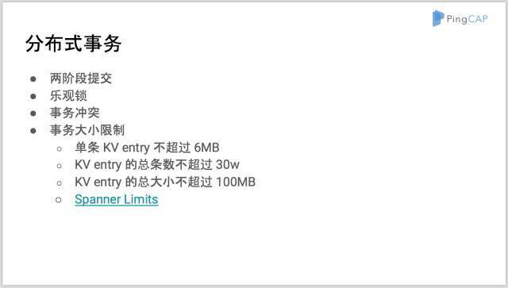
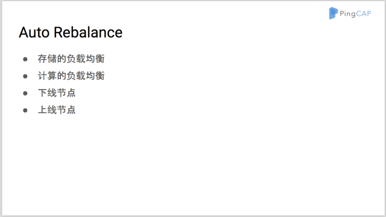
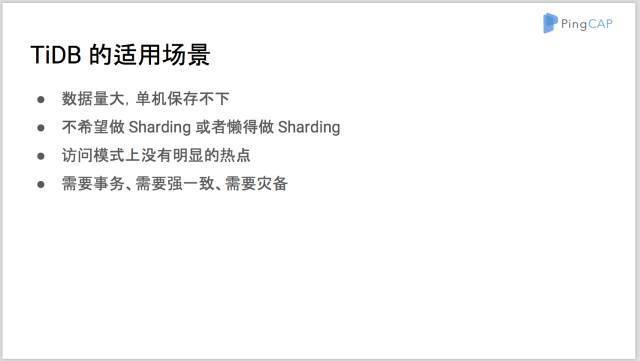

今日的 Meetup，我司 Engineering VP 申砾同学亲自上阵，为大家分享了《TiDB Best Practice 》，好多使用经验及背后技术实现原理都是首次揭秘（当然，包括彩蛋）。

>讲师介绍：申砾，PingCAP Engineering VP，前网易有道词典服务器端核心开发，前奇虎 360 新闻推荐系统 / 地图基础数据与检索系统 Tech Lead。

TiDB 是一个分布式数据库，支持 MySQL 协议以及语法，在一些场景中都可以无缝替换 MySQL，以获得分布式的好处。但是分布式数据库有其自身的特点，想要在业务中用好需要遵循一些实践原则。

本次分享申砾同学首先介绍了 TiDB 的一些关键部分的实现原理，理解这些内部实现有利于理解 TiDB 的外在表现。然后与大家讨论了应用数据库时的典型操作的最佳实践以及要注意的事项，并对 TiDB 的适用场景进行了讲解。

PPT 很干，一点水都挤不出来...随便放几张你们感受下┑(￣Д ￣)┍

最后，申砾同学还分享了 TiDB 最近的一些项目进展，并首次公开披露 PingCAP 最新动向：独立研发的 TiDB 专用的 Spark Connector 即将上线。

Spark 是当下最流行的大数据分析系统，拥有活跃的社区。PingCAP 希望能够将 TiDB 与 Spark 相结合，通过 Spark 对 TiDB 中存储的数据做实时分析，以融入这个生态。为了保证这个连接过程尽可能的高效，所以除了基本的 JDBC Connector 之外，便有了 TiDB 专用的 Spark Connector。

[附：完整 PPT 链接](https://eyun.baidu.com/s/3geM6Ob5)

## 彩蛋来啦

[视频：Demo of Spark on TiDB](https://v.qq.com/txp/iframe/player.html?origin=https%3A%2F%2Fmp.weixin.qq.com&amp;vid=j0509iorseg&amp;autoplay=false&amp;full=true&amp;show1080p=false) 

即将上线，敬请期待～
