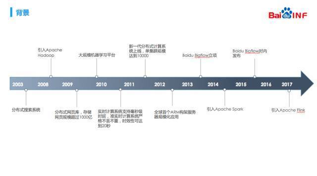

今天的 Meetup，我们邀请到了滴滴地图事业部专家工程师王聪老师，为大家分享《百度统一分布式计算框架 Bigflow 》。

活动现场听得很专注的小伙伴们，桑拿天也阻止不了大家的学习热情。

>讲师介绍：王聪，滴滴地图事业部专家工程师，前百度基础架构部工程师，主要工作方向为分布式计算与流式计算，在百度负责计算表示层 Bigflow 与流式计算引擎 Flink。

王聪老师首先展示了分布式计算在百度的发展例程，他介绍百度在 2003 年建立了自己的分布式搜索系统。08 年引入 hadoop，09 年底搭建了大规模的机器学习平台，当时用的是 MPI。10 年百度自研了两套流式计算引擎，主要用来完成点击流与展现流的 join。

基于多引擎并存、跨引擎成本高、升级困难这几个痛点，最终开发了一款叫做 Bigflow 的计算框架，Bigflow 希望用户使用我们提供的 API 写代码，Bigflow 将作业进行计划的优化和翻译，并提交到计算引擎之上。对于这样的思路，有一种说法“计算机领域的任何问题，都可以通过增加一个额外的中间层来解决”。在这里 Bigflow 就是架在用户与引擎之间的中间层。

**以下是新鲜出炉的 PPT 节选，尽情享用~**

[附：完整 PPT 链接](https://eyun.baidu.com/s/3o8hsHT4)

