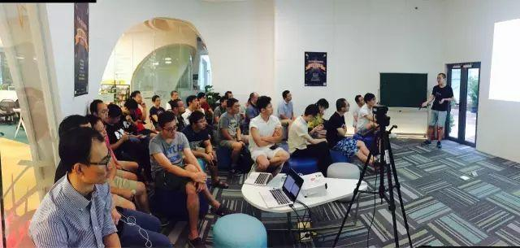
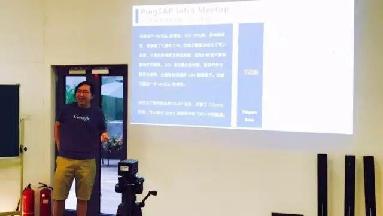
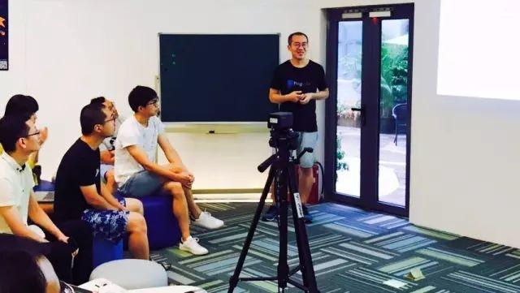
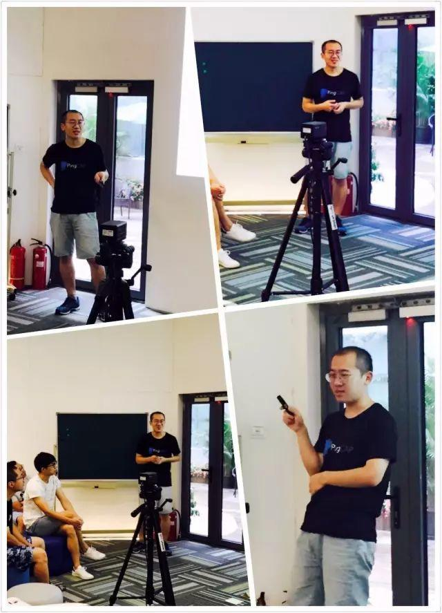
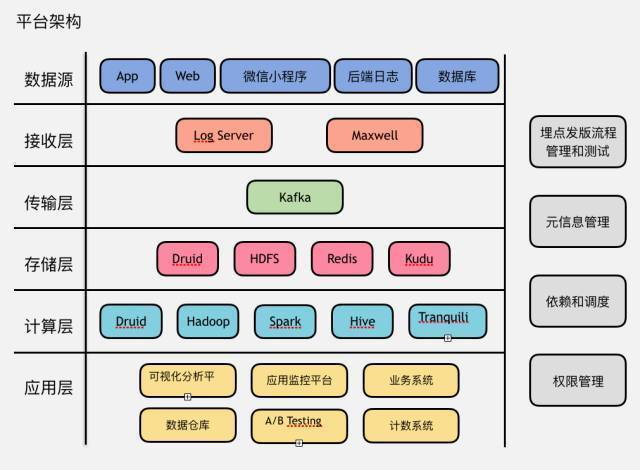
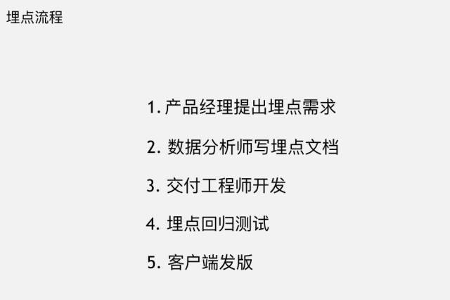
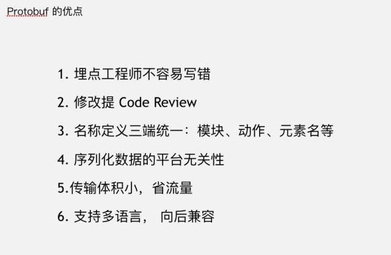
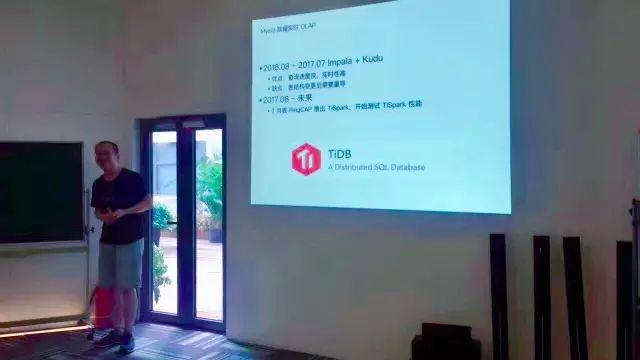

今天的 Meetup，我们邀请到了知乎数据平台负责人王雨舟为大家做《知乎数据平台实践》的技术分享。

又是一个美好的周末，勤劳的小蜜蜂们早早出来参加活动了~🙂 今天的活动现场又是爆满~ 感觉要换地儿的节奏啊~

今天 Meetup 的开场，我司联合创始人兼 CTO 黄东旭同学首先为大家分享了 TiDB 项目的最新进展。黄东旭同学好开心的样子，因为就在昨天，[TiDB 正式发布 RC4 版](http://mp.weixin.qq.com/s?__biz=MzI3NDIxNTQyOQ==&mid=2247485130&idx=1&sn=00d1274012173fe1a4e56aeb309eecd5&chksm=eb1621a0dc61a8b6034bd0faa95d471acbd819063386f3d500310d1d02f22039b3c7ccffac14&scene=21#wechat_redirect) 。

开场过后，接下来由知乎数据平台负责人王雨舟（江湖人称宇宙哥）开始为大家做技术分享。

宇宙哥真是 PingCAP 的真爱粉儿~ 穿着我司的文化衫亮相活动现场，超级有气场~

以下是部分技术干货分享，Enjoy~

宇宙哥在演讲开始先介绍了知乎大数据平台的整体架构情况

并讲解了埋点流程及使用 Protobuf 做埋点标准化规范

除此之外，宇宙哥还从以下几点来分析介绍 Druid

在知乎的实践：

- 自定义多维分析功能和留存分析功能；

- 如何做到实时数据分析；

- 自定义指标、维度、报表、文件夹、Dashboard。

这张 PPT 中有眼熟的部分哦😏宇宙哥用“丝般顺滑”总结了自己现在使用 TiDB 的感受，并表达了对 TiSpark 的期待✌️分享结束后，显然大家都还没有尽兴，接下来是一段时长堪比分享环节的 QA。激烈的讨论后现场小伙伴跟宇宙哥都嗨了，还没有嗨够的小伙伴我们下次见~

