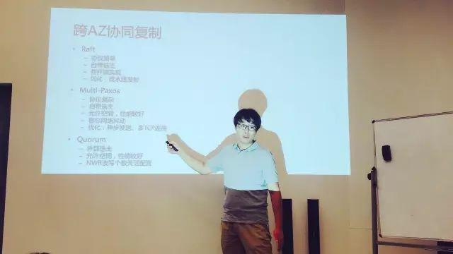
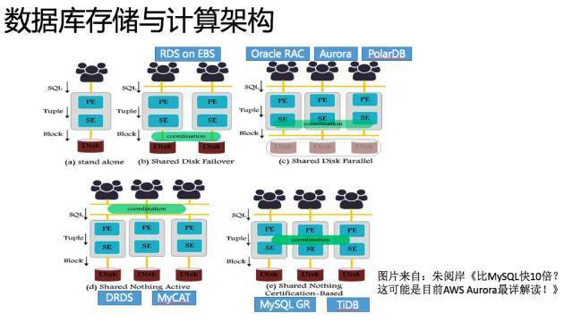
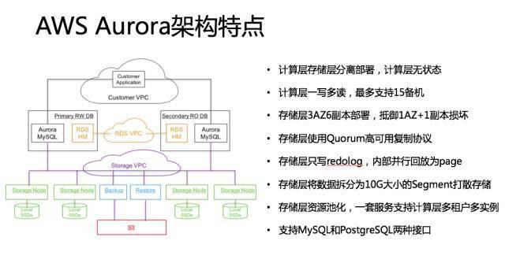
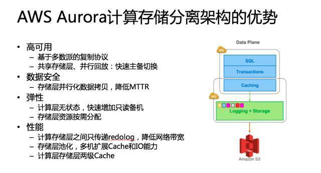
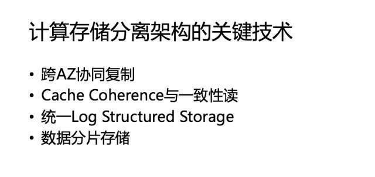
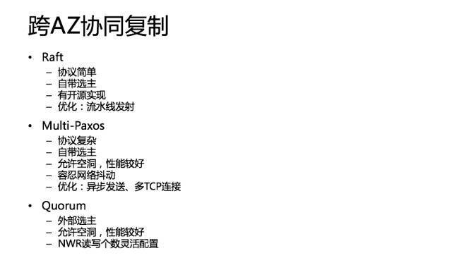
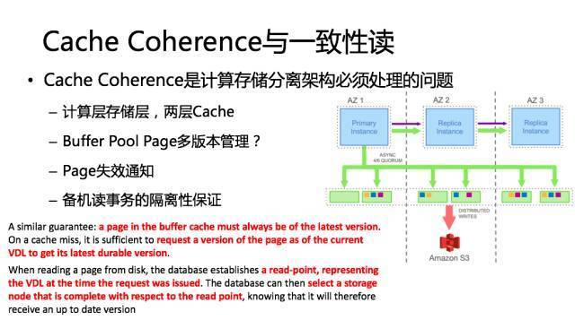
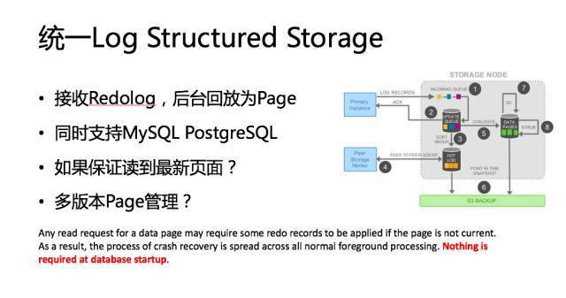
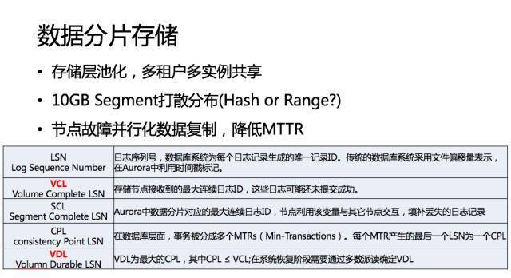

上周六，PingCAP Infra Meetup 第 54 期，我们邀请到了知乎大 V 李凯（知乎 ID：郁白）为大家分享了《数据库计算存储分离架构分析》。在活动现场，郁白老师跟小伙伴们有一番深度的交流与思想碰撞。长话短说，小编带你一起回顾精彩现场。

## 精彩视频

[视频 | Infra Meetup No.54：数据库计算存储分离架构分析](https://v.qq.com/txp/iframe/player.html?origin=https%3A%2F%2Fmp.weixin.qq.com&amp;vid=e054142e24h&amp;autoplay=false&amp;full=true&amp;show1080p=false)

## 精彩现场

PingCAP Infra Meetup 第 54 期的活动现场十分火爆，活动签到时间未开始，小伙伴们就早早来到现场占位置，我想说早来的小伙伴们还是很明智的。因为......

后续到场的小伙伴只能酱婶儿滴扎堆在门口竖起耳朵听了，这场活动简直是一场郁白大神与粉丝的见面会。

说了这么多，先上一张郁白老师的图吧~ 🙂

## 技术干货节选

### **大数据下公有云面临的 5 个挑战**

谈到存储架构分离，为什么现在会有 Aurora 架构？包括前一阵阿里的 PolarDB 推出来以后，他们也在分析为什么要做这个东西。

郁白老师认为单就公有云来说，现在云数据面临的挑战有以下 5 个：

1. 跨 AZ 的可用性与数据安全性。 现在都提多 AZ 部署，亚马逊在全球有 40 多个 AZ，
16 个 Region，基本上每一个 Region 之内的那些关键服务都是跨 3 个 AZ。你要考虑整个 AZ 意外宕机或者计划内维护要怎么处理，数据迁移恢复速度怎么样。以传统的 MySQL 为例，比如说一个机器坏了，可能这个机器上存了几十 T、上百 T 的数据，那么即使在万兆网卡的情况下，也要拷个几分钟或者几十分钟都有可能。那么有没有可能加快这个速度。
还有一个就是服务恢复的速度。可能大家广为诟病就是基于 MySQL Binlog 复制。在主机压力非常大的情况下，是有可能在切换到备机以后，这个备机恢复可能需要几分钟甚至几十分钟。关键因素是回放 Binlog 的效率，MySQL 即使最新版本也只能做到 Group Commit 内的并发回放。这是数据库 RTO 指标，能不能在秒级、分钟级把这个服务恢复起来，这是一个在设计系统的时候要考虑的关键问题。

2. 读写分离与弹性扩展。 一般来说我们讲云上数据库基本上都是集中化的，一写多读的，那这里会涉及到读写分离，把主库上一致性要求不高的读流量分给备库，这种情况下读写分离的备库能不能弹性扩展？我们知道 MySQL 可以通过 Binlog 复制来扩展备机，但是扩展的过程中就意味着复制一份完整数据，就像我们刚才提到的数据恢复一样，他要把整个数据全部复制过去然后把 Binlog 接上，这个时间可能你要真做的话几十分钟就过去了。如果说你的业务真撑不住说我赶快要加备机，那这个东西怎么去解决？

3. 资源的按需分配。 这点其实云计算上的云数据库一定程度上已经做到了，当然有些可能不一样，比如说有硬件独享的数据库就很难做到按需分配。像阿里可能会把 EBS 接到它的数据库虚拟机上，这样的话其实你接上了弹性化存储以后也基本上做到一个弹性的分配，要 1G 给 1G，再要 1G 再给 1G，不说一开始就把资源分配了，这是云上的一个弹性的东西。

4. 高性能。 现在大家都要看跑分，除了跑分，还要看跑实际业务的时候到底行不行，有没有办法去优化。

5. 生态兼容性。 比如说为什么 TiDB 一定要做 MySQL 的兼容？我觉得可能也是考虑这一点，现在开源领域最强的生态可能还是 MySQL，开源的数据库如果不做 MySQL 兼容，别人可能不一定会来用。

从以上这几点出发的话，我们就可以考虑一个云数据库到底怎么去发展。

### **AWS Aurora 的架构特点及优势**

郁白老师选择这几个具有代表性的数据库存储与计算架构做了重点讲解，他介绍到定义数据库服务器集群的架构决策的关键点在于集群共享发生的程度，它定义协调动作发生在什么层以及哪个层（ PE 计算层和 SE 存储层 ）将被复制或者共享。这不仅确定了系统在可扩展性和灵活性上的权衡，而且关系到每一种架构在现成的数据库服务器上的适用性。

AWS Aurora 计算存储分离架构的优势主要体现在高可用、数据安全、弹性部署、性能方面。在介绍这个环节时，现场小伙伴提问不断，讨论非常激烈，强烈感受到思想碰撞在一起擦除的火花，郁白老师也针对大家的问题做了深度交流。

### **计算存储分离架构的 4 个关键技术**

郁白老师总结出计算存储分离架构的四个关键技术与大家一起探讨，接下来将一一解析这些技术的关键点。

关键技术一：跨 AZ 协同复制

关键技术二：Cache Coherence 与一致性读

关键技术三：统一 Log Structured Storage

关键技术四：数据分片存储

以上就是郁白老师带给大家的部分精彩分享，干货满满，特别感谢郁白老师精心准备的内容，意犹未尽的小伙伴们可以观看完整版演讲视频，慢慢 Enjoy~  也敬请期待我们下一期的内容 :)

[附：完整 PPT 链接](https://eyun.baidu.com/s/3eS8G4Si)

