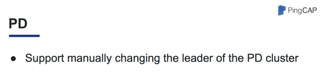

上周六，PingCAP Infra Meetup 第 55 期，由我司 Engineering VP 申砾为大家分享《TiDB Pre-GA 版本新特性介绍以及后续功能展望》。在活动现场，小伙伴们就 TiDB 新特性提出了很多问题，申砾在现场与大家有一番深度的交流与讨论。精彩现场小编立马为你呈现。

## 精彩视频

[视频 | Infra Meetup No.55：TiDB Pre-GA 版本新特性介绍以及后续功能展望](https://v.qq.com/txp/iframe/player.html?origin=https%3A%2F%2Fmp.weixin.qq.com&amp;vid=e0546waf434&amp;autoplay=false&amp;full=true&amp;show1080p=false)

## 精彩现场

上周，TiDB 正式发布了 Pre-GA 版本。针对 Pre-GA 版本的新特性，PingCAP Infra Meetup 第 55 期特设定 Pre-GA 详解专场。活动当天，现场来了很多关注 TiDB 的粉丝们。

简单开场后，我司 Engineering VP 申砾同学介绍到本期内容主要围绕新版本带来的变化和内部实现细节，以及这种新型的 HTAP 数据库解决的实际问题和典型应用场景等做深度解析。

## 技术干货节选

TiDB Pre-GA 版本对 MySQL 兼容性、SQL 优化器、系统稳定性、性能方面做了大量优化工作。本次分享中，申砾就各个组件的优化做了详解：

### TiDB 

在优化器方面

- RC4 已经从一个假的基于代价产品模型，切换成一个真的基于代价产品模型，也真的是用统计信息去算。在 RC3 版本中，一些代价实际上是有规则算法的，比如说，A 等于 10 设置一个过滤比例，A 大于 10 又算另外一个过滤比例，这都是一些规则，RC4 是基于代价的一个传统模型。 Pre-GA 新特性也主要对代价模型做了一些调整。

- 其次，在索引选择上做了优化，可以支持不同类型字段比较的索引选择，这一优化用户反馈查询速度明显变快。

- 再者，支持 Join Reorder，对于 OLTP 层面来说，Join Reorder 不太会用到，但对于一些比较复杂的场景，比如说有的用户使用参报表。这个时候有可能会出现 Join 报表，特别是在 TCH 里面，多表 Join 比较常见。下一步计划也将统计信息导入 TiSpark 里，指导 TiSpark 做 Join Reorder 。

在执行器方面

- **首先在 MySQL 兼容性**做了大量的工作，特别是像时间类型这种比较复杂的类型，字面值的表达方式多种多样，还要考虑各种不合法的字面值，不合法的字面值需要处理成零，还是 Null，其实挺多细节在里面。

- **支持 Natural Join**，我们以前支持 Using 来制订，现在我们支持 Natural Join 这个语法。这个是由我们的 Contributor 一个大二的学生贡献出来的 PR，在此特别感谢。

- **支持 JSON**，然后支持 JSON 字段上各种操作。同时支持去修改使用某一个字段，并支持对 JSON 字段中某一属性去建索引，这样才可以更快速的用其中某一个字段做过滤条件。

- **减小执行器内存占用**，大部分内存消耗在读出来的数据上面，我们把读出来的数据表示结构做了精简，在数据量比较大的时候，大概能比之前的版本少 20% 的内存。

- **支持在 SQL 语句中设置优先级，**并根据查询类型自动设置部分语句的优先级。

- **完成表达式框架重构，**执行速度提升 30% 左右。

在介绍完 TiDB 后，申砾接下来介绍了下 PD 方面的优化。

### PD

主要工作还是支持手动切换 PD 集群 Leader，可以手动的把  PD Leader 做一个迁移。

### TiKV 

- Raft Log 使用独立的 RocksDB 实例。以前是一个 TIKV ,一个 RocksDB，数据和 Raft Log 都写在里面，现在是把数据和 Raft Log 分成两个 RocksDB 实例。这样对未来底层的优化有了更多的可能性。例如 Raft Log 可以不用写入在 RocksDB 中。

- 使用 DeleteRange 加速数据迁移，比如把一个副本从 PGA 迁到 PGB ,然后 PGA 这个副本的数据没有用了，以前的做法是一点点删除，现在可以用 DeleteRange 直接删除。

- 在 TiKV 上支持更多运算符下推，让 where 条件包含这些运算符的聚合操作可以下推到 TiKV 上进行计算。

- 至少有 10% 的性能提升，稳定性提升。

最后，申砾就大家关注的 TiDB GA 版本发布及后续功能优化做了分享。

TiDB GA 将在 9 月底左右发布，核心主要围绕稳定性、性能、正确性、兼容性方面做大量工作。申砾就后续功能做了详解，主要是以下几点：

- 一个更好用的调度器，这个调度器指的是 PD 去调度 TiKV 的 Region 的位置。通过给不同的 TIKV 节点设置不同的权重， PD 会往这些 TIKV 节点 根据这个节点的权重调度不同数量的 Region。

- 增加 SQL Plan Cache ，通过增加 SQL 语法解析 Cache 可以让相同逻辑的 SQL 在命中语法解析 Cache 时速度变得更快。

- 增加更多的并行算子，最大化利用多核 CPU 的能力。

- 增加物理备份，直接使用 RocksDB 的 SST 文件进行备份，这样可以有比较快的备份恢复速度。

以上就是申砾给大家带来的部分精彩内容，干货满满，小伙伴们还可以观看完整版演讲视频，慢慢 Enjoy~  也敬请期待我们下一期的内容 :)

[附：完整 PPT 链接](https://eyun.baidu.com/s/3nvA4SWT)

