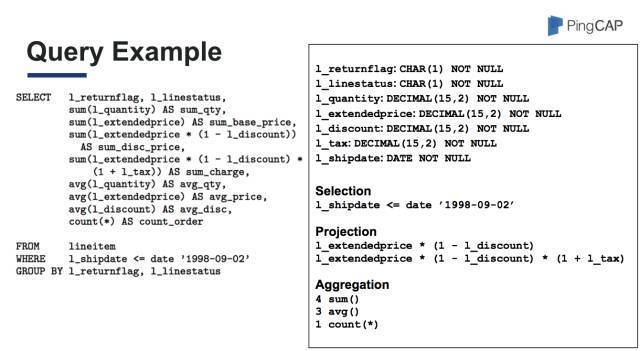
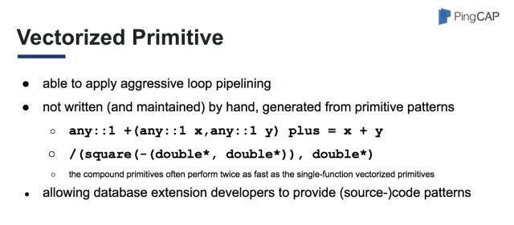

上周六，PingCAP Infra Meetup 第 56 期特设论文专场，我司核心工程师张建与大家一起分享并解读了“MonetDB/X100: Hyper-Pipelining Query Execution” 论文。此篇论文作为分析型数据库领域内引用次数最多的论文之一，它为何如此火爆？在今天的文章里你应该可以找到答案。

## 精彩视频

[视频 | Infra Meetup No.56: MonetDB/X100 Paper 解读](https://v.qq.com/txp/iframe/player.html?origin=https%3A%2F%2Fmp.weixin.qq.com&amp;vid=n05516qdokt&amp;autoplay=false&amp;full=true&amp;show1080p=false)

## 精彩现场

在 PingCAP Infra Meetup 第 56 期论文专场，来了很多对 MonetDB/X100 论文感兴趣的小伙伴们。分享一开始，我司联合创始人兼 CEO 刘奇就为何选择 MonetDB/X100 这篇论文分享了自己看法。

刘奇提到:"如果大家有阅读近两年新出的一些 Paper，会发现里面引用率最高的一篇文章就是 MonetDB/X100。MonetDB/X100 发表于 2005 年，其实不算新。但读过该论文的人会发现目前主流的 OLAP 系统相关的技术，基本上都能在这篇论文中找到影子，如文中提到了列存、Pipeline，甚至是 JIT。他做 JIT 的思路不一样，都是比较早就有的，所以这是一篇很不错的论文。现在也可以看到很多性能比较的时候，大家新做了一个系统，说我的性能非常好，会拿出来 benchmark 说你看我打败了 MonetDB。

另外还有一些比较创新的项目，多是基于 MonetDB 改造的。一个就是英特尔最近出的一篇论文，他把 MonetDB 改造一下，把正则表达式的搜索，放到 FPGA 里面去。英特尔最近出了一款服务器，这个服务器的 CPU 和 FPGA 是放在一起的，他们得到 Performance 最小提倡是 2.3 倍以上，大概意思上就是说，MonetDB 在这上面做一个简单的改造，就可以适应到更新的硬件。

在 2012 年的时候，第一个提供论文、代码的基于 MonetDB 的 GPU 的 Database 也出来了。当时是在 TPCH 的 query 里面，有一些复杂的 query，提升是非常的明显。所以大家可以看到，基于 MonetDB 改造的，在 FPGA 或者 GPU上运行的系统都有，实际上这是一个非常优秀的学术的原形，今年得了十年最佳论文奖。"

接下来，我司核心工程师张建就这篇最佳论文做了拆分讲解。

为了让大家更好的理解今天分享的主题，张建首先简单介绍了一下 SQL 的执行流程、Volcano 执行框架以及 CPU 的硬件特性，进一步展示了当时一些数据库的 performance 情况，并分析了为什么其执行效率低。就大家关心的 MonetDB/X100 的设计思路以及总体架构，分析了一些 MonetDB/X100 的执行算子，通过具体的列举简单介绍了 MonetDB/X100 的执行过程以及动态生成的 Vectorized Primitive 的特点。

## 技术干货节选

以上就是张建带给大家的部分论文精彩内容，小伙伴们可以观看现场演讲视频，慢慢 Enjoy~  也敬请期待我们下一期的内容 :)

[附：完整 PPT 链接](https://eyun.baidu.com/s/3pL7JKa3)
