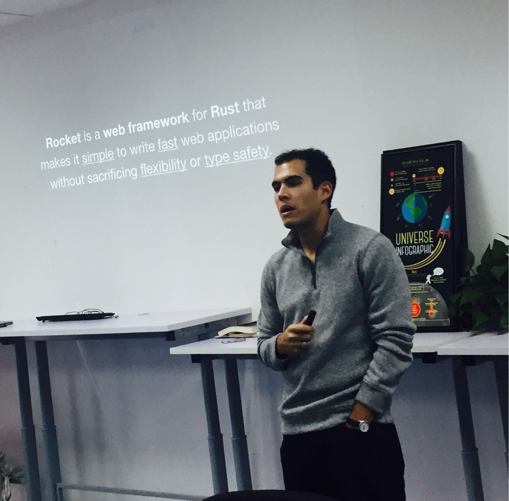

## Rust 专场 2.0

Rust 作为系统级编程语言，同样可以非常方便的开发上层 Web 应用。借助目前 Rust 社区最火的 web 框架 Rocket，可以像动态语言一样方便地创建高性能的 Web 应用，同时可以拥有 Rust 强大的类型安全保障。

在上周六，我们邀请了 Rocket 的作者 Sergio Benitez，与大家面对面分享了《Rocket Web 框架解析》。

据 Sergio 现场表示，这是他首次来中国，以往虽然也有在公开场合解读过 Rocket Web 框架，但本次，有些新鲜内容可是第一时间共享给 Rust 中国社区的小伙伴哦~

这一次，让我们跳过现场内容解读环节，直接为大家奉上新鲜出炉的干货视频，enjoy~~

[视频 | Infra Meetup No.55：Rocket Web 框架解析](https://v.qq.com/txp/iframe/player.html?origin=https%3A%2F%2Fmp.weixin.qq.com&amp;vid=g05654053d4&amp;autoplay=false&amp;full=true&amp;show1080p=false)

>讲师介绍： Sergio Benitez，斯坦福大学博士四年级的学生，主要研究如何将编程语言理论与操作系统和安全性融合在一起。目前在做项目包括对 Rust 的类型系统 “Rusty Types” 的规范化，以及 Rust 的 Rocket Web Framework。在斯坦福大学之前，Sergio 曾在 Google、Apple 和 SpaceX 实习，参与的项目包括设计异常检测算法，火箭及其它航天器的操作系统的性能调优。

