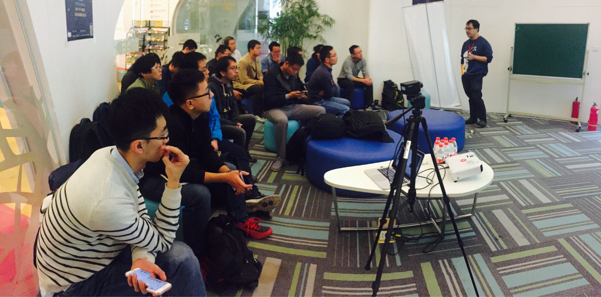
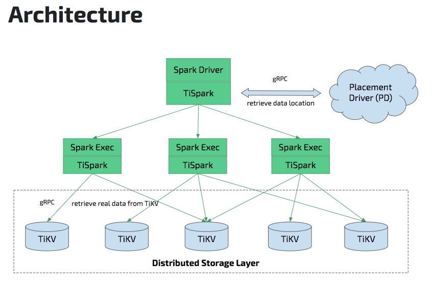
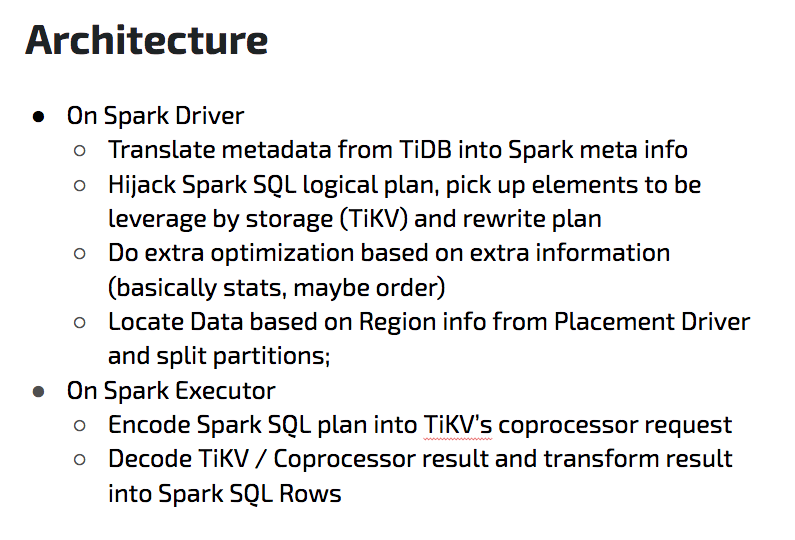
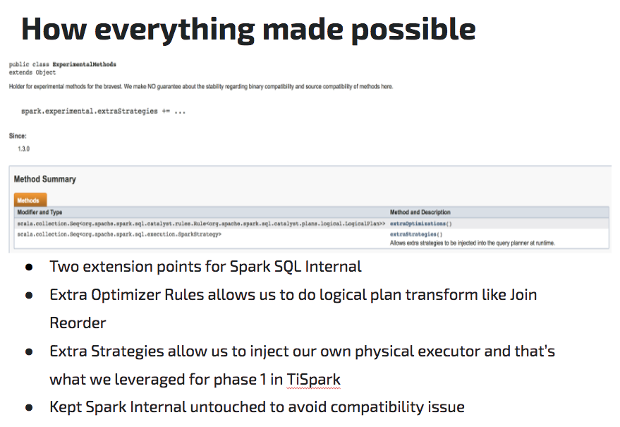
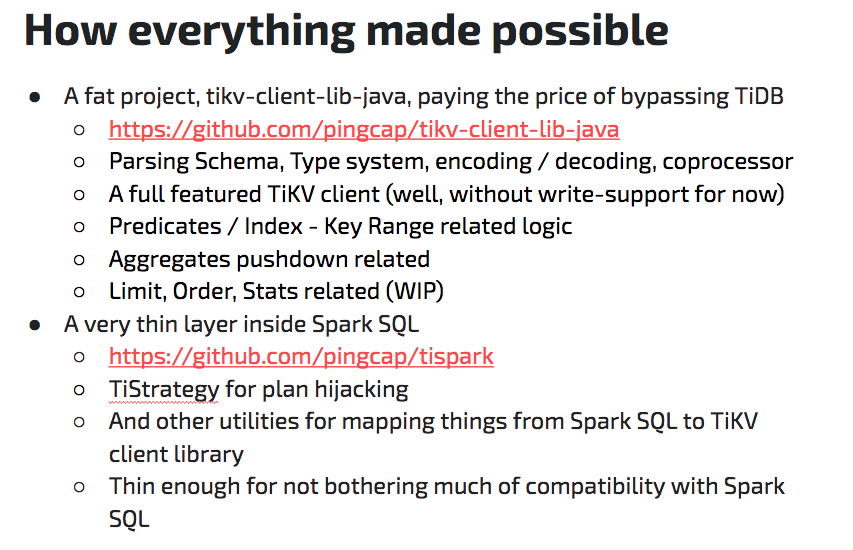
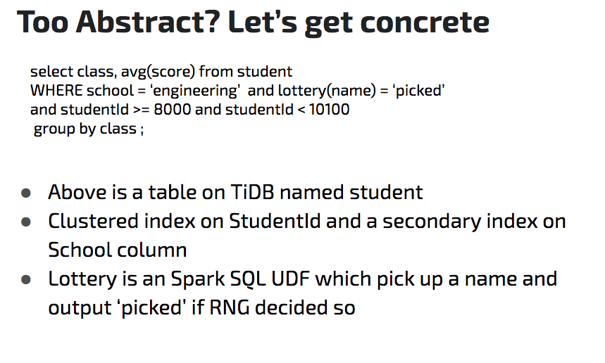

在上周六的 Meetup 中，我司 TiSpark 项目负责人马晓宇同学，与大家分享了《TiDB 遇到 Spark-TiSpark 架构设计与实现》。

马晓宇 | TiSpark 项目负责人

TiSpark 是一款直接运行在分布式数据库 TiDB 存储层的产品，这样紧密结合的设计使它能够提供传统的 Spark SQL 所没有的诸多特性。TiSpark 与 TiDB 在同一套存储上共同支持了分析和在线事物处理两种场景，让复杂的数据平台架构变的简单，减少复杂的 ETL 流程，让大数据分析变的更实时。本次分享，马晓宇同学与大家聊了聊 TiSpark 的架构和实现细节。这一聊，就聊成了一场讨论时长大于分享时长的趴 :-D

## 视频回顾

- [视频 | Infra Meetup No.58：TiSpark 架构设计与实现](https://v.qq.com/txp/iframe/player.html?origin=https%3A%2F%2Fmp.weixin.qq.com&amp;vid=b05041aqdev&amp;autoplay=false&amp;full=true&amp;show1080p=false&amp;isDebugIframe=false)

- [PPT 下载链接](https://eyun.baidu.com/s/3pKPN4Bh)

## PPT节选

