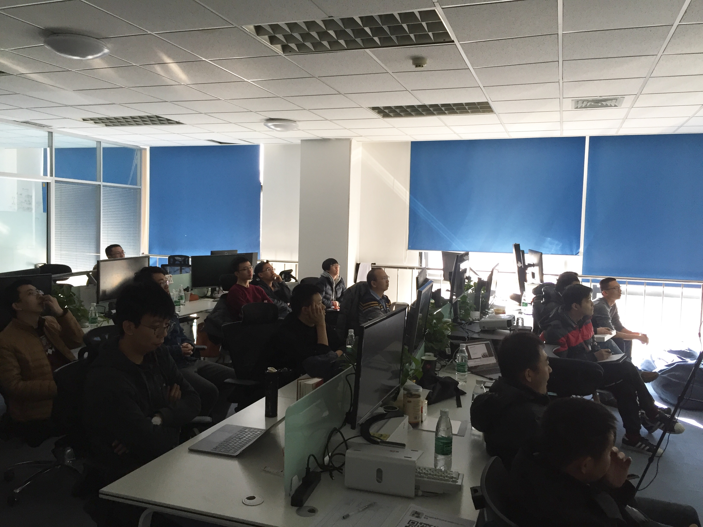
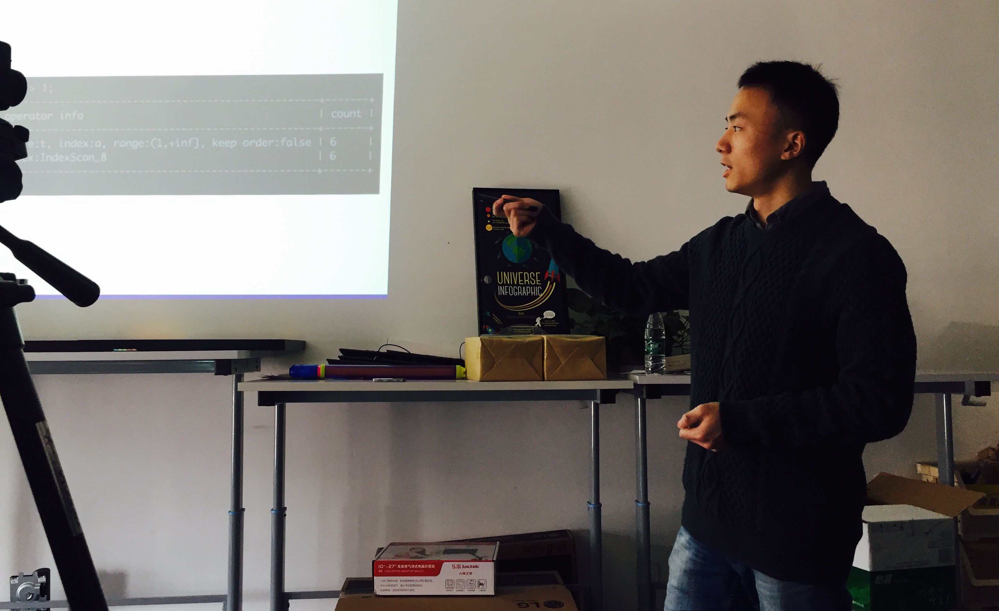
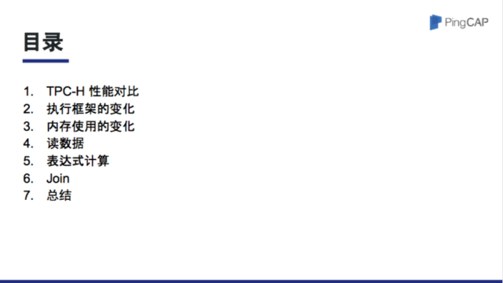
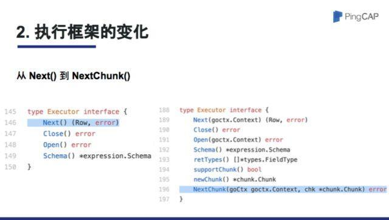
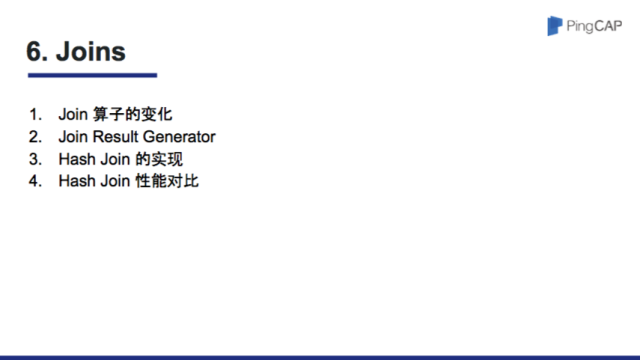

在上周六的 Meetup 中，我司 TiDB SQL 组研发工程师张建同学，为大家解读了 TiDB 的新执行框架。农历新年前的最后一期 Meetup，也是满满干货哦～

## 视频回顾

- [视频 | Infra Meetup No.63：深入了解 TiDB 新执行框架](https://www.bilibili.com/video/av40876899)
- [PPT 链接](https://eyun.baidu.com/s/3o8Wwhn0)

## 干货节选

在 TPC-H 1G 的性能测试结果上，TiDB release 1.1 相比于 1.0 有着巨大的性能提升，获得这些性能提升最主要的两个优化是：

1.  执行器框架由传统的 volcano 模型一次 next 函数调用返回一行结果变为了返回一批结果，减少了框架上的函数调用开销并且给予了每个物理算子更多的优化空间；

2.  这一批结果采用紧凑的、列式的内存布局，使得执行器在计算的时候更加缓存友好。

以 Table Reader 为例，使用新的执行框架和内存布局以后，通过减少函数调用开销以及已申请内存的重复利用，读取 600 万行数据的速度提升了 30% 左右。

本次分享中，张建同学从表达式计算入手跟大家对比了两种表达式计算方式的性能差异以及原因。

第一种计算方式是以行为单位，用一条输入数据计算出一条输出数据，这种计算方式是 1.0 版本采用的；

第二种计算方式是表达式为单位，先计算第一个表达式得到输出的第一列，然后计算其他表达式得到其他输出列，这是目前 1.1 所采用的计算方式；

我们通过简单的 benchmark 证明第二种计算方式快 15% 以上，并通过采集 L2 Cache performance 推断出了第二种计算方式的 L1 Cache Miss 的确比第一种少从而证实了这些性能差距跟 L1 Cache Miss 正相关。

接着，还分享了表达式计算中的另一些优化并从 TPC-H 的 sql 中采集了一些表达式计算作为 benchmark，相比于 1.0 性能提升达到 80% 以上。

我们详细对比了 1.0 和 1.1 版本 Join 实现上的差异，总的来说，1.1 版本通过引入 Join Result Generator 封装了具体的 Join 链接方式使得其和 Hash Join，Merge Join，Index Join 等 Join 数据获取方式解耦并让它们同时支持了所有的连接方式。这使得我们的优化器在 1.1 中对于子查询等 semi join 可以采取更好的数据获取方式，比如 Index Join，来加速查询的执行，TPC-H query 4、21得益于此计算性能提升 3 倍以上

最后详细讲解了一下 Hash Join 的实现以及它是如何复用计算过程中的 buffer 的，得益于 Hash Join 的优化，TPC-H query 5、16、18、22 性能提升在 1 倍到 2 倍之间。

**以下为 PPT 节选：**

