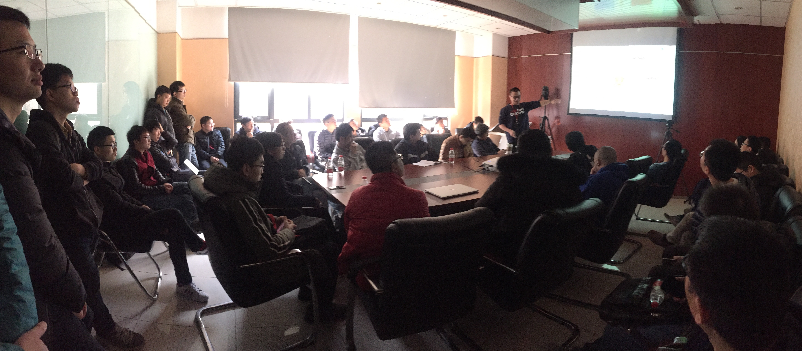

上周六的 Meetup 上，我司首席架构师唐刘为大家分享了《Chaos Practice in TiDB》。现场小伙伴们热情十足，于是就有了这场“分享 40 分钟，畅聊 1 个半小时 ”的技术趴~ :-D 

附带唐刘老师撰写的《混沌工程简介》一文，希望可以帮助未到现场的小伙伴们更好地了解本期 talk :)

## 视频回顾

- [视频 | Infra Meetup No.64 : Chaos Practice in TiDB](https://www.bilibili.com/video/av40148923)
- [PPT 链接](https://eyun.baidu.com/s/3d6Eqn0)

## 干货节选

构造一个健壮的分布式数据库系统是一件非常困难的事情，因为我们需要做非常多的工作来保证用户数据安全，不允许数据丢失或者损坏。而在 TiDB 里面，我们是通过实践 Chaos Engineering 来保证。

在本次分享中，我司首席架构师唐刘首先提出了 Chaos 测试的必要性：“虽然我们有 unit test，integration test 这些，但他们都是有局限性的，为了更好的模拟系统实际的情况，我们需要 Chaos。”

那么在 TiDB 里面是如何做 Chaos 的。在这其中有三个关键技术，monitor，fault injection 以及 automation。现场重点讲解了 fault injection，包括进程干扰，网络干扰，文件干扰等，以及一些集群工具。同时介绍了在 TiDB 里面如何将所有这些进行整合，也就是 Schrodinger 平台，通过 Schrodinger，我们能自动化的进行 Chaos test。

最后，唐刘老师还为大家介绍了一些 PingCAP 现在的研究方向，譬如使用 TLA+ 来证明我们程序的正确性，以及使用  automating fault injection 来自动的分析系统，进行 fault injection。

## 《混沌工程简介》

**以下为唐刘老师于 2017 年 12 月撰写的《混沌工程简介》全文，共享给大家~~**

最近看到 Netflix 的混沌工程的介绍，感触颇深。在 TiDB 里面，我们为了保证系统的健壮性，也做了很多工作。在内部我们开始叫做 stability test，后来进化成 Schodinger 平台。之前我一直苦于没有没法对我们做得工作进行归类，毕竟它可能是一个 test，但又比 test 做得多一点，现在知道，原来我们一直做的其实算是一门工程实践。

既然是工程，那么就会有方法论，也就能详细的归纳总结出来实施的步骤，这样后面的同学就能非常快速的学习掌握，而不会像我们之前那么漫无目的的探索了，但我们现在还做不到这一步，而且相比 Netflix，我们还有很多路要走。所以我打算深入研究下 Netflix 是如何做的，在想想如何提升我们自己的工作。

### 介绍

首先，我们需要知道，混沌工程到底是什么。根据 Netflix 的解释，混沌工程师通过应用一些经验探索的原则，来学习观察系统是如何反应的。这就跟科学家做实验去学习物理定律一样，混沌工程师通过做实验去了解系统。

上图就是混沌工程的典型代表 - 猴子。拜 Netflix 所赐，现在大部分的混沌工程项目都叫做 Monkey，也就是一只讨厌的猴子，在你的系统里面上蹦下窜，不停捣乱，直到搞挂你的系统。

然后，我们需要知道，为什么需要混沌工程。应用混沌工程能提升整个系统的弹性。通过设计并且进行混沌实验，我们可以了解到系统脆弱的一面，在还没出现对用户造成伤害之前，我们就能主动发现这些问题。

混沌工程其实是很重要的，但我之前一直以为混沌工程就是测试，但它们还是有区别的。虽然混沌工程跟传统测试通常都会共用很多测试工具的，譬如都会使用错误注入工具，但混沌工程是通过实践对系统有更新的认知，而传统测试则是使用特定方式对某一块进行特定测试。譬如在传统测试里面，我们可以写一个断言，我们给定特定的条件，产生一个特定的输出，如果不满足断言条件，测试就出错了，这个其实是具有很明确的特性。但混沌工程是试验，而试验会有怎样的新信息生成，我们是不确定的。譬如我们可以进行下面的这些试验：

* 模拟整个 IDC 当掉

* 选择一部分网络连连接注入特定时间的延迟

* 随机让一些函数抛出异常

* 强制 NTP 时间不同步

* 生成 IO 错误

* 榨干 CPU

这些试验到底会有什么样的结果，有些我们可以预料，但有些可能我们就不会预先知道，只有发生了，才会恍然大悟，有一种『喔，这也会出现！』的感叹。

### 原则

在开始应用混沌工程之前，我们必须确保系统是弹性的，也就是当出现了系统错误我们的整个系统还能正常工作。如果不能确保，我们就需要先考虑提升整个系统的健壮性了，因为混沌工程主要是用来发现系统未知的脆弱一面的，如果我们知道应用混沌工程能导致显而易见的问题，那其实就没必要应用了。

虽然 chaos 有混乱的意思，但混沌工程并不是制造混乱。相反，我们可以认为混沌工程是用经验的方法来定位问题的一门实验学科。譬如，我们可以思考：『如果我们在系统里面注入混乱了，这个系统会怎样？』，或者『我们系统离混乱的边界还有多远？』。所以，为了更好的进行混沌试验，我们需要有一些原则来进行指导。

### 假定稳定状态

在一个复杂系统里面，我们有特别多的组件，有很多不同的输入输出，我们需要有一个通用的方式来区别系统哪些行为是可以接受的，而哪一些则是不合适的。我们可以认为当系统处于正常操作时候的状态就是稳定状态。

通常我们可以通过自己测试，来确定一个系统的稳定状态，但这个方法当然是比较低效的，另一种更常用的做法就是收集 metric 信息，不光需要系统的 metric，也需要服务自身的 metric，但收集 metric 需要注意实时性的问题，你如果收集一个每月汇总的 metric 信息，其实没啥用，毕竟系统是实时变化的。现在市面上面有很多不错的开源 metric 系统，譬如我们就在用的 Prometheus。

当我们能收集到信息之后，就需要用这些信息去描述一个稳定状态。这个难度比较大，因为不同的业务是不一样的，即使是同一个业务，不同时间也可能变化很大。但也有一些方法，譬如我们可以根据前面一段时间譬如上周的 metric 的曲线得到一个大概合理的稳定状态，也可以自己做很多压力测试，得到相关的数据。

当有了 metric 以及知道稳定状态对应的 metric 是怎样之后，我们就可以通过这些来考虑混沌实验了。思考当我们注入不同的事件到系统中的时候，稳定状态会如何变化，然后我们就会开始做实验来验证这个假设。

### 变更真实世界事件

在真实的世界中，我们可能遇到各种各样的问题，譬如：

* 硬件故障

* 网络延迟和隔离

* 资源耗尽

* 拜占庭错误

* 下游依赖故障

做混沌试验的时候需要模拟这些故障，来看系统的状态。但从成本上面考虑，我们并不需要模拟所有的故障，仅仅需要考虑那些会比较频繁发生，而且模拟之后会很有效果的。在 TiDB 里面，我们主要就是模拟的网络，文件系统的故障，但现在看起来还是不够，后面会逐渐的添加更多。

### 在生产中进行试验

要看混沌试验有没有效果，在真实生产环境中进行验证是最好的方法。但我相信大部分的厂商还没这么大的魄力，这方面 Netflix 就做的很猛，他们竟然能够直接停掉 Amazon 上面的一个 Zone。

如果不能再生产环境中试验，一个可选的方法就是做 shadow，也就是通常的录制生产环境的流量，然后在测试中重放。或者模拟生产环境，自己造数据测试。

### 自动化持续执行

最开始执行混沌试验，我们可能就是人工进行，试验进行的过程中，看 metric，试验结束之后，通过收集的 metric 在对比，看系统的状态。这个过程后面完全可以做成自动化的，也就是定期执行，或者系统发布的时候执行等。

如果能做到自动化执行试验，已经很不错了，但我们可以做的更多，甚至有可能根据系统的状态自动化的生成相关的试验，这个 Netflix 已经做了很多研究，但我们这边还处于初级阶段，没考虑过自动化生成的问题。

### 最小化影响范围

在进行混沌试验的时候，一定要注意影响的范围，如果没预估好，把整个服务搞挂了，导致所有的用户都没法使用，这个问题还是很严重的。

通常都会使用一种 Canary 的方法，也就是类似 A/B 测试，或者灰度发布这种的，在 Canary 集群这边做很多试验。也就是说，如果真的搞坏了，那也只是一小部分用户被搞坏了，损失会小很多。

在 Canary 里面还有一个好处，因为我们知道整个系统的稳定状态，即使不做混沌测试，也可以观察 Canary 里面的状态是不是跟之前的稳定状态一致的，如果不一致，那也可能有问题。

### 实践

上面我们说了相关的原则，那么如何开始进行一次混沌试验呢？其实很简单，只要做到如下步骤就可以：

1.  选择一个假设

2.  选择试验的范围

3.  明确需要观察的 metric 指标

4.  通知相关的团队

5.  执行试验

6.  分析结果

7.  增大试验的范围

8.  自动化

譬如对于 TiDB 来说，譬如我们可以选择验证网络隔离对系统的影响，我们会：

1.  假设一台机器的网络隔离对整个系统不会造成影响

2.  将一个用户一台 TiKV 进行网络隔离

3.  观察 QPS，latency，等指标

4.  通知负责这个用户的 OPS 同学

5.  断网

6.  一段时间之后分析 metric

7.  在多个集群测试

8.  将这个流程自动化

上面只是一个简单的例子，实际还会复杂很多，但通过这种方式做了操作了很多次之后，大家都会更加熟悉自己的系统。

### 混沌成熟度模型

这里在简单说说混沌成熟度模型，Netflix 总结了两个维度，一个是复杂度，一个就是接受度。前者表示的是混沌工程能有多复杂，而后者则表示的是混沌工程被团队的接受程度。

复杂度分为几个阶段：

+ 初级
    - 试验没有在生产中进行
    - 进程被手工管理
    - 结果只反映系统 metric，没有业务的
    - 只有简单的事件进行试验

+ 简单
    - 试验可以在类生产环境中进行
    - 能自动启动执行，但需要人工监控和终止
    - 结果能反应一些聚合的业务 metric
    - 一些扩展的事件譬如网络延迟可以进行试验
    - 结果可以手工汇总和聚合
    - 试验是预先定义好的
    - 有一些工具能进行历史对照

+ 复杂
    - 试验直接在生产环境中进行
    - 启动，执行，结果分析，终止都是自动完成
    - 试验框架集成在持续发布
    - 业务 metrics 会在实验组和控制组进行比较
    - 一些组合错误或者服务级别影响的事件可以进行试验
    - 结果一直可以追踪
    - 有工具可以更好的交互式的对比试验和控制组

+ 高级
    - 试验在每个开发步骤和任意环境都进行
    - 设计，执行和提前终止这些全部都是自动化的
    - 框架跟 A/B 或者其他试验系统整合
    - 一个事件譬如更改使用模式和返回值或者状态变更开始进行试验
    - 试验包括动态作用域和影响，可以找到突变点
    - 通过试验结果能保护资产流失
    - 容量预测可以通过试验分析提前得出
    - 试验结果可以区分不同服务的临界状态

而接受度也有几个阶段：

+ 在暗处
    - 相关项目不被批准
    - 很少系统被覆盖
    - 很少或者没有团队有意识
    - 早期接受者不定期的进行试验

+ 有投入
    - 试验被官方批准
    - 部分资源被用于实践
    - 多个团队有兴趣并投入
    - 少部分关键服务不定期进行试验

+ 接受
    - 有专门的 team 进行混沌工程
    - 应急响应被集成到框架，从而可以创建回归试验
    - 多数关键系统定期进行混沌试验
    - 一些试验验证会在应急响应或者游戏时间被临时执行

+ 文化
    - 所有关键服务都有频繁的混沌试验
    - 大多数非关键服务定期进行
    - 混沌试验已经是工程师的日常工作
    - 默认所有系统组件都必须参与，如果不想进行，需要有正当的理由

如果按照这上面两个维度来看，我们其实做的并不好，所以还有很大的提升空间。

### 总结

上面就是对混沌工程的简单介绍，后面我会考虑依照混沌工程的原则，开始工程化的实践。虽然之前我们做过很多工作，如果能用理论开始指导，就能更进一步了。
