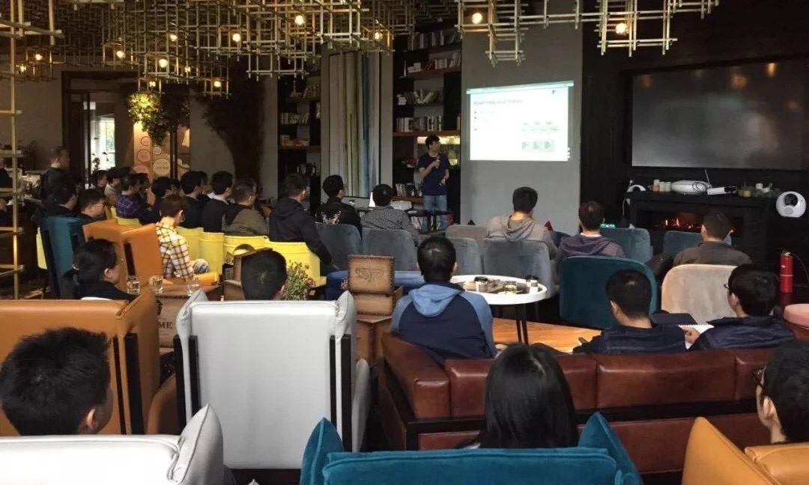

上周 Infra Meetup 走进了成都，来自 G7 汇通天下的廖强老师和来自 PingCAP 的申砾、孙浩老师，为大家带来了三个干货满满的 Talk 。 这是第二场走出帝都的 Meetup，场面依然火爆～**「四美具，二难并」 成都，唯有美食与同道者不可辜负！**

下午两点大家陆续进场，不得不说成都的同学们太热情了，场地差点坐不下，各式各样的椅子都被搬来了～等同学们坐定之后，PingCAP Engineering VP 申砾老师首先上台，深入讲解了 TiDB 的各项核心性能，让同学们对 TiDB 的架构和性能有了充分的认知。

## 申砾：《Deep Dive into TiDB》

[视频回顾 | Infra Meetup No.65 成都站：Deep Dive into TiDB（申砾）](https://www.bilibili.com/video/av39881111/?p=1)

>PingCAP Engineering VP 申砾

申砾老师从系统整体到技术细节，从核心项目到周边工具，介绍了 TiDB 的方方面面。

* TiDB 的设计目标、核心特性以及整体架构。

* 系统分层介绍，包括分布式 Key-Value 存储引擎 TiKV 的核心技术及实现细节，分布式 SQL 引擎的设计思路以及优化器、执行引擎等核心组件的介绍。

* Cloud TiDB、TiSpark 等核心项目以及 TiDB 集群的周边工具。

* Q&A 环节：TiDB 在实践中的使用经验，TiDB 2.0 版本的最新进展以及如何实现性能上的巨大提升。

短暂休息之后，G7 汇通天下技术合伙人廖强老师讲述了他为什么选择了 TiDB ，以及 G7 的实践方案。

## 廖强：《拥抱开源社区 - G7 TiDB 实践之路》 

[视频回顾 | Infra Meetup No.65 成都站：拥抱开源社区 - G7 TiDB 实践之路（廖强）](https://www.bilibili.com/video/av39881111/?p=2)

>G7 汇通天下技术合伙人 廖强

廖强老师主要从自己的工作经验出发，介绍了 TiDB 在 G7 业务实践中的细节。

* 介绍之前工作中在 MySQL Sharding 方案遇到的一些“坑”，以及早期使用开源技术碰到的问题和解决方案。

* 分享 G7 进行数据库选型的原则：业务层改动少，平滑迁移，掌控力强，稳定改进——TiDB 非常符合这个标准。G7 已经使用了 TiDB 很长时间，有非常丰富的迁移经验。因此，廖强老师进一步讲解了把 TiDB 从 MySQL 读库推进到完全使用 TiDB 作为业务库的流程，以及在此过程中需要注意的问题。

* 重点介绍 TiDB 的应用场景之一——金融风控，以及在场景中使用 TiDB 和 TiSpark 的情况。

* 分享参与开源的基本方法和步骤。

最后，由 PingCAP 资深解决方案架构师孙浩老师给大家分享了具有代表性的 TiDB 最佳实践，同学们对 TiDB 的开发和部署有了更加深入的感受，在 Talk 结束之后，也踊跃提问和讨论，气氛非常活跃～

## 孙浩：《TiDB Best Practice》

[视频回顾 | Infra Meetup No.65 成都站：TiDB Best Practice（孙浩）](https://www.bilibili.com/video/av39881111/?p=3)

>PingCAP 资深解决方案架构师 孙浩

孙浩老师从 TiDB 的基础知识出发，深入介绍了 TiDB 的部署最佳实践和开发最佳实践。

* TiDB 适用场景、架构与部署以及其他基础概念。

* 以三个部署场景为例，解析大型 OLTP 和 OLTP / OLAP 混合型场景的需求、硬件配置等部署细节。

* TiDB 的开发最佳实践，TiDB 外围接口与表设计，数据导入与写入实践，TiDB 生态工具的使用。

