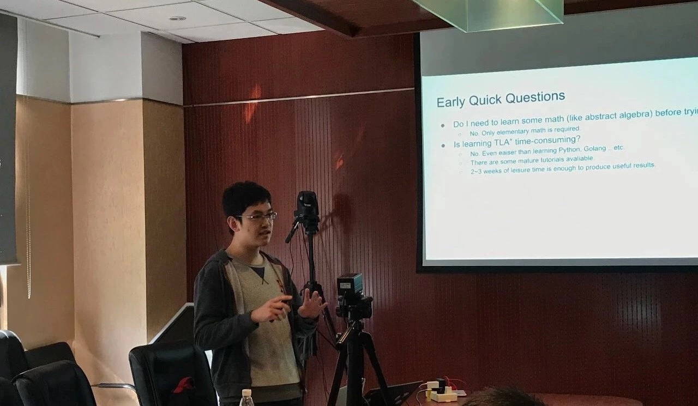
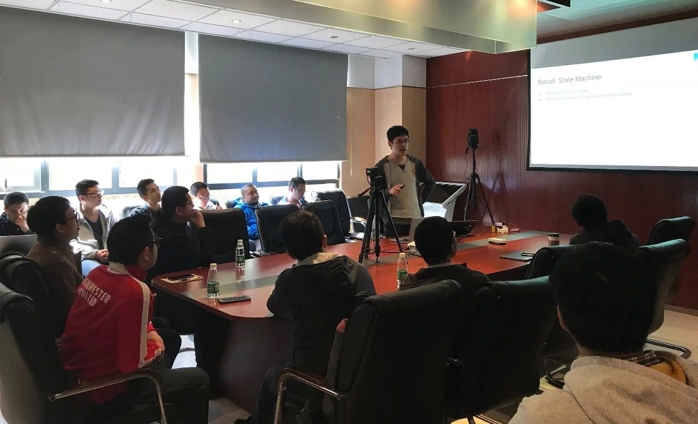

上周六的 Meetup 上，我司董麒麟同学为大家讲解了 TLA+ 在 TiDB 中的应用。现奉上现场视频 & 干货节选，Enjoy～

## 视频回顾

[视频 | Infra Meetup No.66：Application of TLA+ at PingCAP](https://www.bilibili.com/video/av39814172)

可下载 [完整 PPT](https://www.inoreader.com/all_articles) 配合观看

## 干货节选

董麒麟 | PingCAP

TLA+ 是一个用来设计、描述和验证并发系统的一套形式化语言，易学易用。在 TiDB 中，我们非常关心一些关键系统的设计正确性，所以使用 TLA+ 来保证这一点。PingCAP 在 2017 年底开始尝试使用 TLA+，到目前为止，已经用 TLA+ 验证了我们优化过的 Percolator 协议以及 Multi-raft region merge 的正确性。这些代码可以在 [pingcap/tla-plus](https://github.com/pingcap/tla-plus) 上找到。

TLA+ 可以在一个比代码更高的层面上描述系统。在编写代码之前，将系统完整地表述一遍是很重要的。这能强迫我们去思考这个系统的细节，避免早期设计时出现失误并保证正确性。TLA+ 的基本原理是将系统描述成为一个状态机。系统可以用 TLA+ 来抽象出若干变量表达它的当前状态，并用形式化的语言去描述这个状态机的初始结束状态与状态转移。我们对这个系统的一些 Safety 性质比较感兴趣，这些 Safety 的性质也可以在 TLA+ 中用谓词来刻画。另外一个工具 TLC 可以用来验证被 TLA+ 抽象出来的系统模型。TLC 的原理是枚举状态机的所有可以遍历到的状态集。验证系统的正确性就是确保所有状态都满足对应的谓词。

TLA+ 在 TiDB 的第一个应用是 Percolator 事务协议。这个协议是一个二阶段提交算法，用来在只支持单行事物的存储上实现多行事务。这个协议的具体介绍可以在 [这里](https://pingcap.com/blog-cn/percolator-and-txn/) 找到。和原始协议的不同，TiDB 做了一个很重要的优化，在 prewrite 阶段，我们并不是采取了先 prewrite 主锁，再并发副锁的策略，而是主锁和副锁一起并发。但是如果直接这样设计是存在问题的。在视频中可以看到我们是如何用 TLA+ 定位这个问题，然后提出了一个解决方案来克服这个问题。我们用 TLA+ 验证了优化的正确性。

TLA+ 在 TiDB 的第二个应用是 Multi-raft region merge。这个是因为在很多情况下，不同的 region 可能分片并不均匀。我们用 TLA+ 来保证这个系统的正确性是一方面。另外一个方面是在设计这个文档时，我们发现用自然语言来描述这个系统会存在歧义模糊的问题，而用 TLA+ 这种形式化的语言就能很好地克服这个问题。这里想表达的是，写 TLA+ 代码也是一种投资的行为，如果想让这个系统一直健壮地跑下去，而且能被后面加入公司的员工以及 contributors 理解，那么用 TLA+ 去描述这个系统是一个非常划算的事情。

