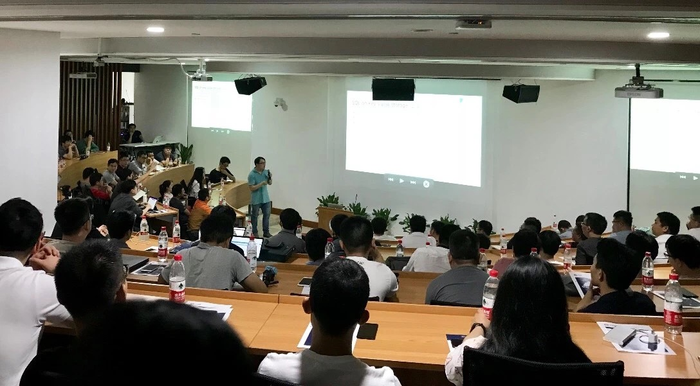
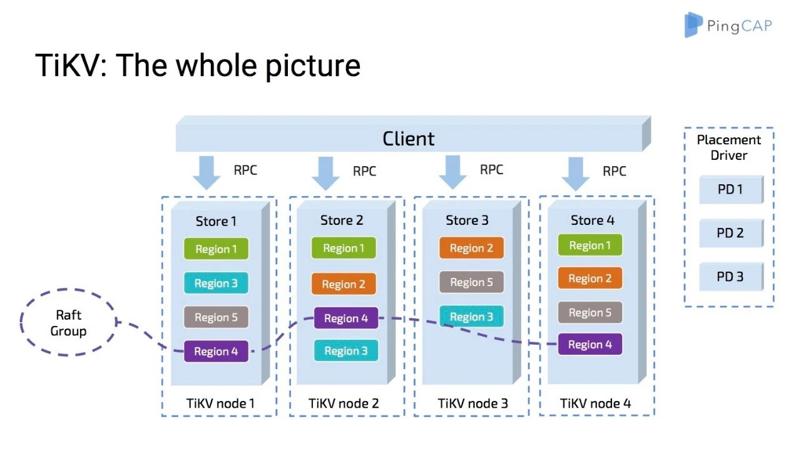
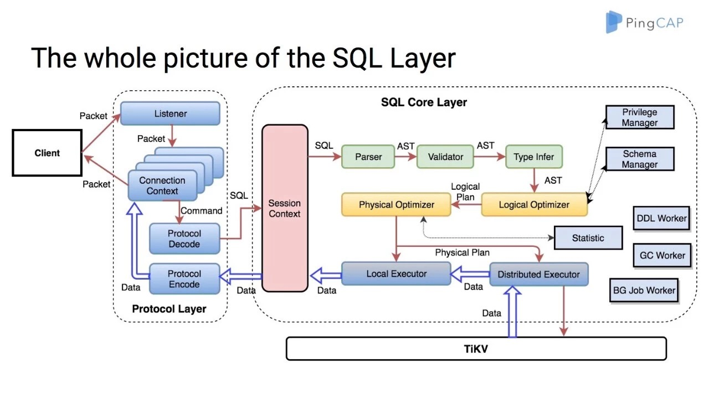
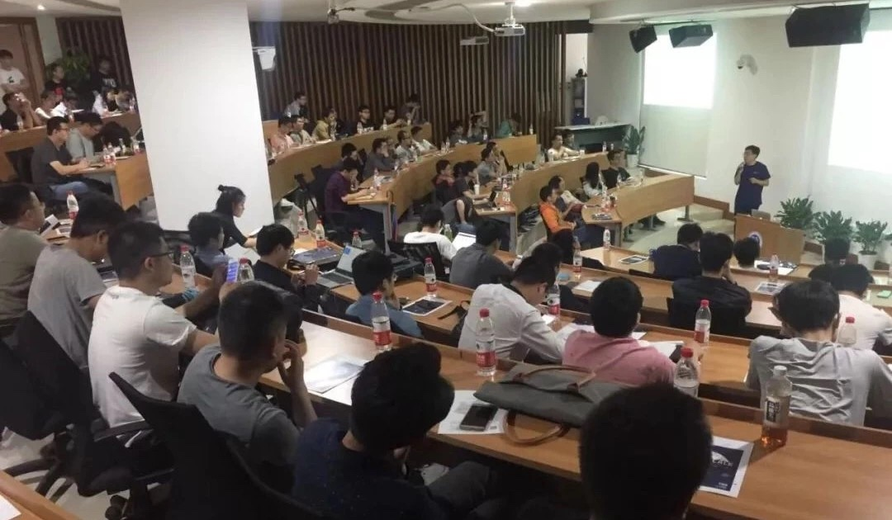
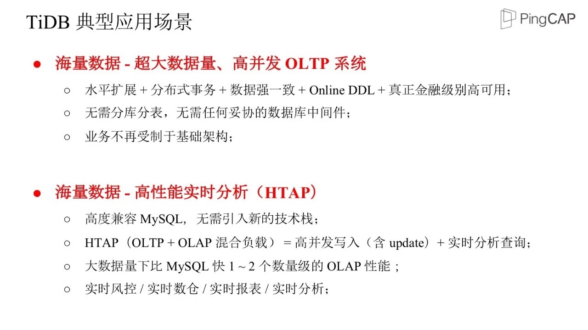
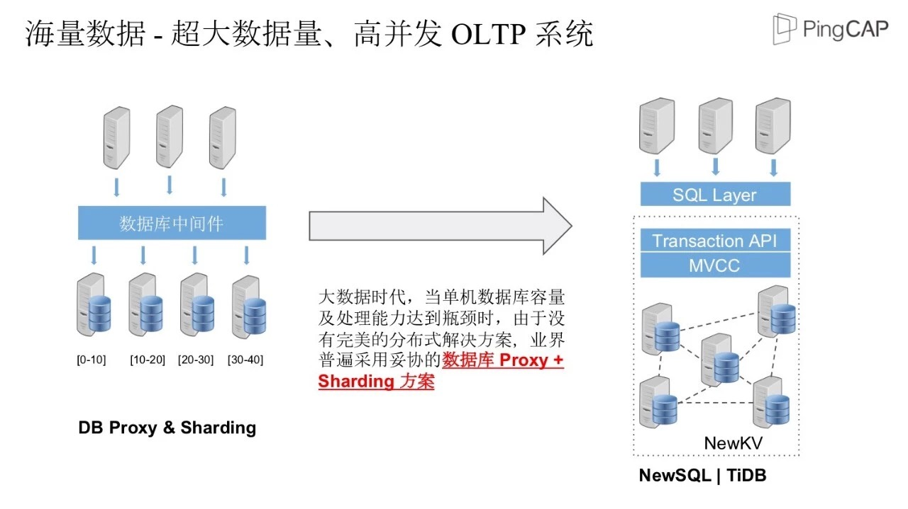
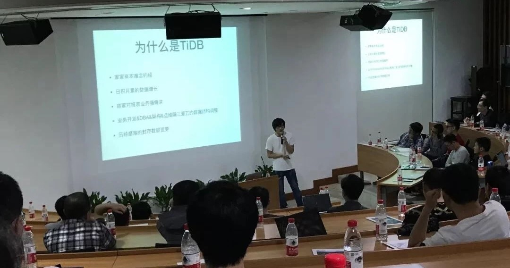
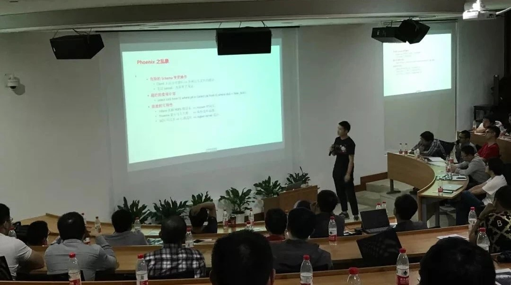
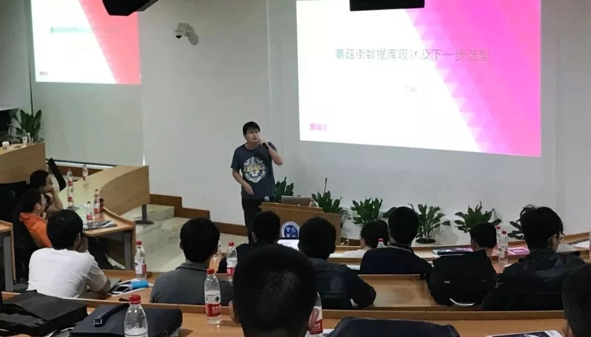
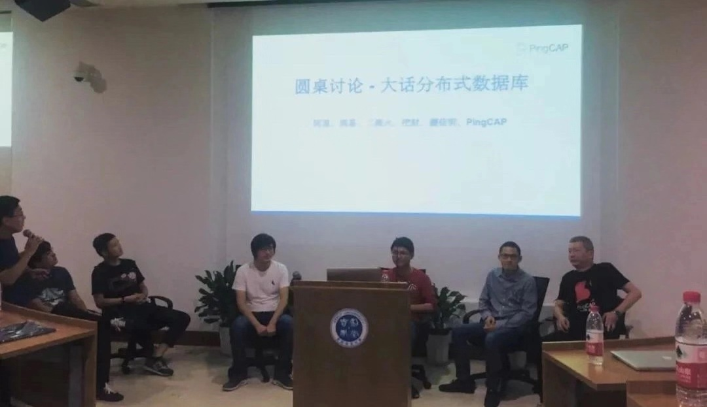

上周日 Infra Meetup 首次走进杭州，感谢热情的杭州社区小伙伴们冒雨参加活动～这次活动由我司数据库专家马晓宇老师和资深数据库架构师房晓乐老师为大家带来精彩的分享，还有来自二维火、挖财、蘑菇街的社区小伙伴带来了三个闪电 Talk，分享了他们的 TiDB 实践经验。

## 马晓宇：TiDB 架构及 2.0 详解

马晓宇 | PingCAP

首先，我司数据库专家马晓宇老师带来《TiDB 架构及 2.0 详解》精彩分享，介绍了 TiDB 的方方面面，包括存储模块 TiKV，调度模块 PD，计算模块 TiDB， OLAP 组件 TiSpark，数据流转 Syncer 和 Binlog 以及 Cloud 集成等等众多组件和独立产品。

TiKV 架构

马晓宇老师更与现场的同学深入探讨了 TiDB 背后的技术细节以及一些重大选择的原因。

例如，从单体 KV 演进到分布式，就不得不思考如何多副本容错，且还需要在多个副本之间达到一致性，这是选择 Raft 协议的根本动机。然而，仅仅是 Raft 并不能满足扩展性的需求，因此又引入了 Raft Group / Region 的分片机制，再加上 PD 模块的调度，让数据和负载均衡得以实现。

在 TiDB 部分，马晓宇老师重点介绍了数据库计算引擎的详细架构，包含模块及其不同作用，详细讲解了用户的 SQL 输入如何被分解分析之后产生执行计划并执行，以及数据在 TiDB 中如何将行数据以及索引编码成 TiKV 所需的键值对等等。

SQL Layer

另外，4 月底 TiDB 2.0 GA 和 TiSpark 1.0 正式发布，马晓宇老师在分享中也提到了 TiDB 和 TiSpark 版本的重大提升：相对 1.0 版本，TiDB 加强了稳定性和性能，针对 TPC-H 等分析型场景，TiDB 有了本质的飞跃。而 TiSpark 1.0 相对于之前发布的 beta 测试版则添加了统计信息用以索引选择，由此让 TiSpark 完整的支持了次级索引。

**延展阅读**

*   [【详解】TiDB 2.0 GA is here！](https://pingcap.com/blog-cn/tidb-2.0-ga-release-detail/)

*   [TiDB 2.0 GA Release Notes](https://pingcap.com/blog-cn/tidb-2.0-ga-release/)

## 房晓乐：TiDB 最佳实践

房晓乐 | PingCAP

短暂休息过后，我司资深解决方案架构师房晓乐分享了《TiDB 的最佳实践》。详细介绍 TiDB 安装部署、性能调优、最新周边工具等最佳实践，重点介绍了 TiDB 的典型应用场景及多个 TiDB 实践案例。

场景一：海量数据超大数据量、高并发的 OLTP 系统。

在今日头条案例中，TiDB 主要应用在今日头条核心 OLTP 系统 - 对象存储系统中，存储其中一部分元数据，支持头条图片和视频相关业务，比如抖音等。如今，TiDB 支撑着今日头条 OLTP 系统里 QPS 比较高的场景：集群容量约几十 T，日常 QPS 峰值会达到几十万。

场景二：海量数据-高性能实时分析（HTAP）

在同程旅游火车票/飞机票分析系统中，用 TiDB 实时同步火车票/飞机票业务的 MySQL，数千个分片，在 TiDB 中进行关联查询。使用 TiDB 以后，火车票/飞机票的分析不影响主库，集群吞吐/计算能力强悍，春节等节日期间运行稳定。而企业成长带来的基础设施压力，只需要简单增加 x86 机器就可以解决。

## 社区分享

随后，来自 TiDB 社区的三位小伙伴——二维火运维负责人火烧、挖财数据库工程师长扬、蘑菇街运维负责人迈克，分享了他们的 TiDB 实践经验。

火烧 | 二维火

**二维火运维负责人火烧**：“TiDB 上线前的测试要像‘五年高考三年模拟’，不仅要测试不同的业务情况，还要测试不同 TiDB/TiKV 版本、数量的组合。”

长扬 | 挖财

**挖财数据库工程师长扬**：“选用 TiDB 有我的私心，我是 Rust 死忠粉，在 Rust 社区了解到明星开源项目——TiKV 之后，进而了解到 TiDB。”

迈克 | 蘑菇街

**蘑菇街运维负责人迈克**：“如果 TiDB 是在 2013 年横空出世，我们就只需要在 TiDB 中做业务的纵向拆分 -> 加机器、加机器、加机器 ，就不会有分库分表中间件/MHA/自研监控告警/DDL 工具开发……也就没-有-通-宵。”

### 社区圆桌讨论

社区圆桌讨论环节，来自阿里、网易、二维火、挖财、蘑菇街的技术小伙伴与我们共同畅聊了未来 3 年数据库的发展、数据库技术在云计算领域的发展趋势、开源数据库项目的成功路径等话题，让我们感受到了杭州超棒的技术氛围。

最后，再次感谢杭州小伙伴们的热情参与和吉利集团提供的场地支持。杭州，我们还会再回来的~
