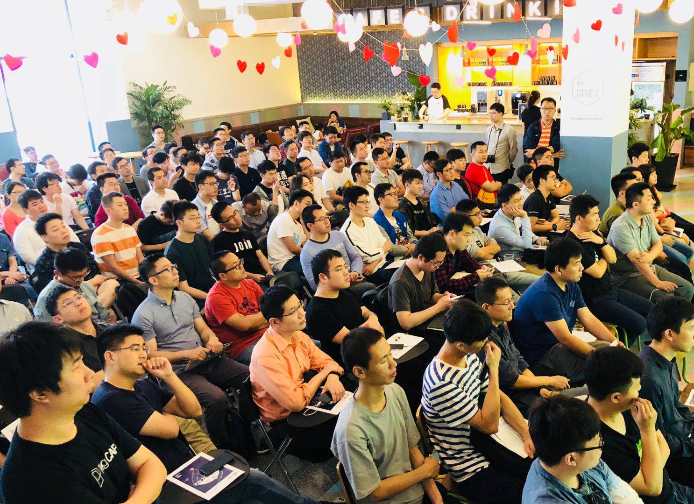
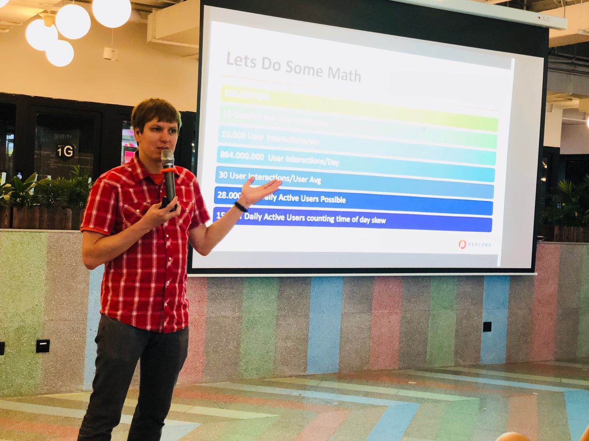
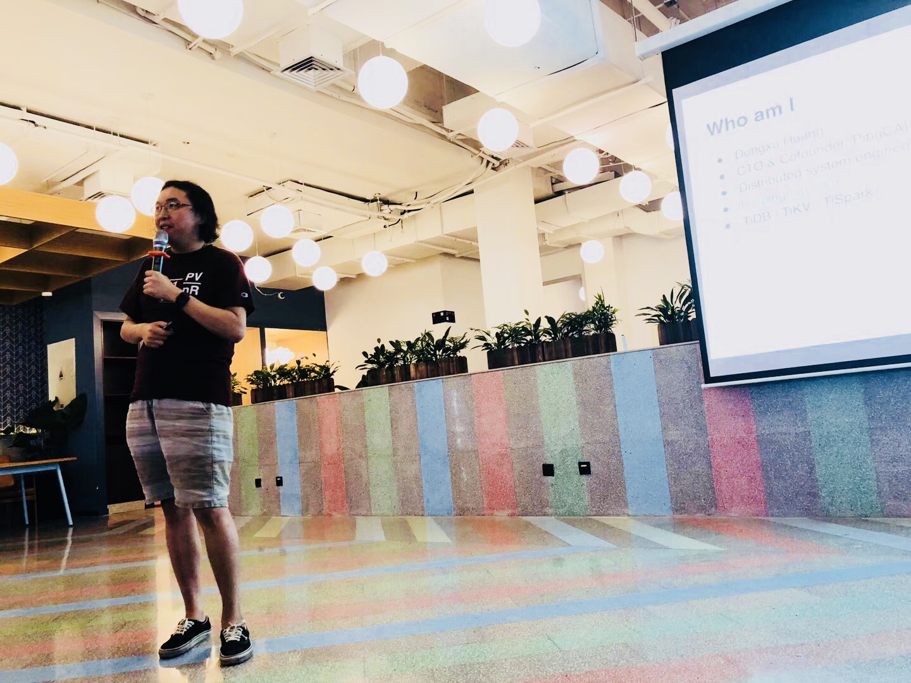
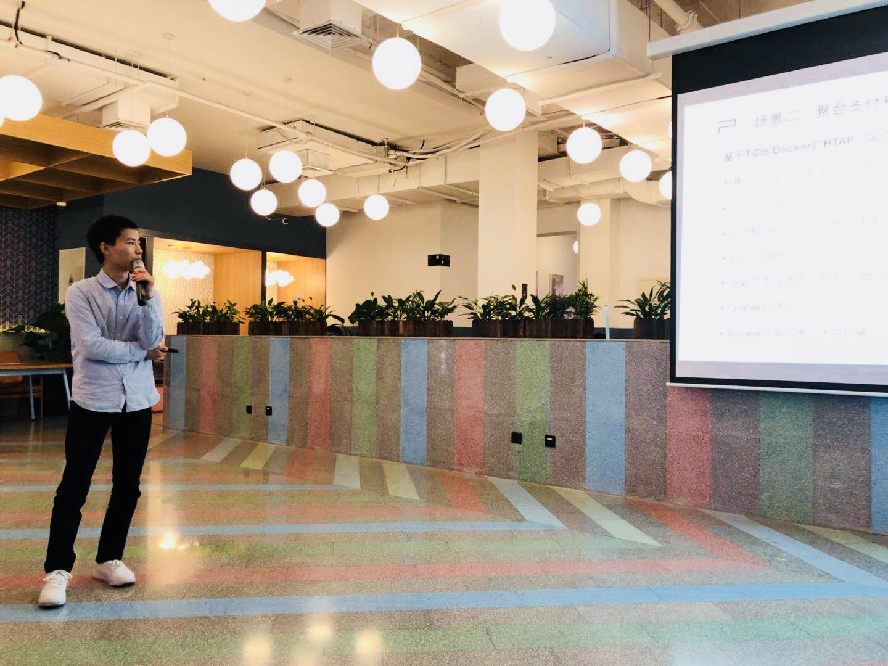
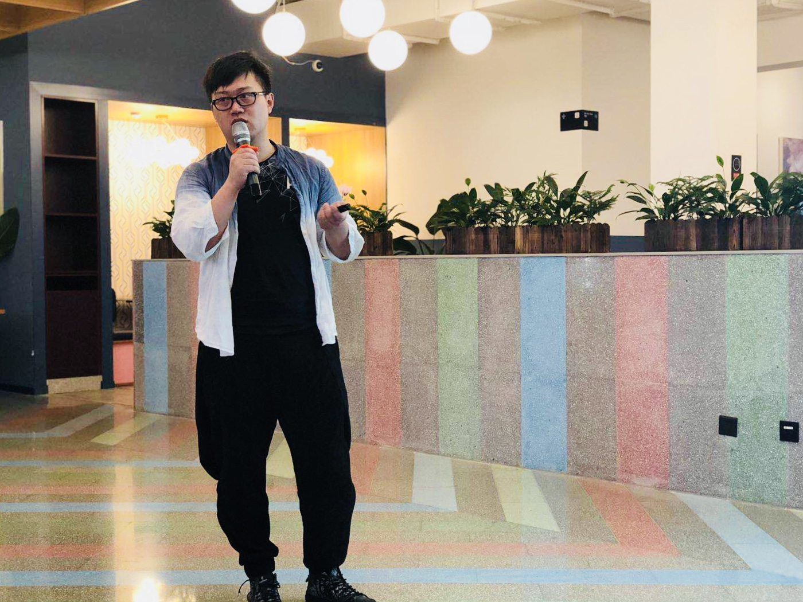
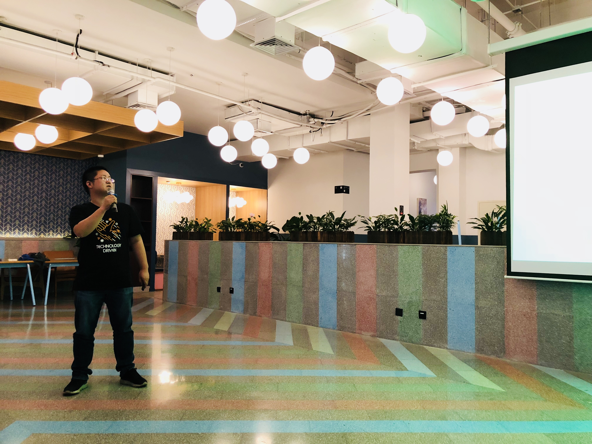
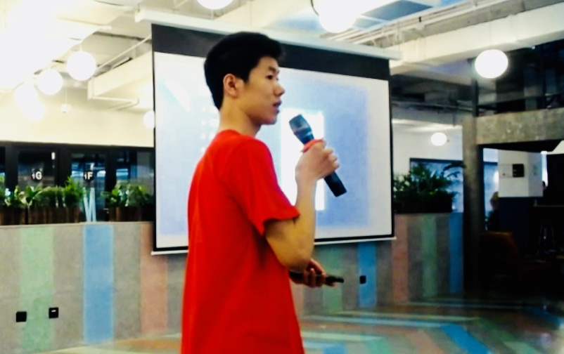

距离去年在上海举办的 TechDay 已经过去了近一年，上海社区小伙伴们积攒已久的热情终于在上周六的 Infra Meetup 现场释放了出来~ 现场爆满不说，Q&A 环节大家都抢着与讲师互动，结束后还有小伙伴意犹未尽，强烈要求多在上海举办这样的技术交流趴（我们会努力的，嗯💪）。以下是现场视频&文字回顾，enjoy！

现场同学坐定之后，我司 CTO 黄东旭简短开场，欢迎 Percona CEO Peter Zaitsev 做客 Infra Meetup No.68 上海站～随后 Peter 带来了 *Using MySQL for Distributed Database Architectures* 的主题演讲。

## Using MySQL for Distributed Database Architectures

Percona CEO Peter Zaitsev

[视频链接：1st Talk by Peter Zaitsev](https://www.bilibili.com/video/av39068019/?p=1)

Peter 首先介绍了 MySQL 最近几个版本迭代的性能升级数据。他认为 MySQL 单机性能提升很大，但是与分布式数据库在应用场景上仍有较大的区别，很多问题是单机解决不了的。从而引出了基于 MySQL 做分布式尝试的方法论，并从高可用、扩展性、数据分布策略几个方面进行了详细解读。随后分享了在 MySQL 上实现分布式计算和分布式系统的方法。

Peter 提到不同业务对数据库的需求不一样，对隔离级别和一致性的要求也不一样, 需要仔细思考相关配置。他重点介绍了 Percona 数据库管理工具和集群方案，同时分享了对市面上常见的基于 MySQL 分片的中间件的看法，以及对 TiDB 等 NewSQL 未来发展的期待。

## How to build a Self-Driving database

PingCAP CTO 黄东旭

[视频链接：2nd Talk by Ed Huang](https://www.bilibili.com/video/av39068019/?p=2)

智能化和自动化运维是当今数据库界的大趋势。在本次分享中，我司 CTO 黄东旭首先介绍了人工智能技术在数据库中可能的应用方向，以及在 TiDB 中的落地情况（包括 SQL 优化器的优化模型、 智能的数据调度、自动监控和运维系统等），最后展望了一下未来 TiDB 的技术 Roadmap。

（我司 CTO 被上海朋友们的热情所感染，非常激动滴…讲超时了，所以现场有些同学没有机会提问，非常遗憾。下次我们一定留足时间给大家好好交流～）

## 社区闪电 Talk

[视频链接：Community Lightning Talk * 4](https://www.bilibili.com/video/av39068019/?p=3)

除了 Peter 和东旭带来的精彩分享，上海社区伙伴还用心准备了四个闪电 Talk，分享自己的 TiDB 实践经验。不知道大家听完之后有没有激发出更多的 TiDB 实践想法和方向呢？

### TiDB 在金融聚合支付业务的实践

Ping++ DBA 宋涛介绍了过去调研的阿里云上的一些数仓方案，比如 ODPS 和 ADS 以及相关的优势和痛点，以及为何 Ping++ 最终选择 TiDB 作为实时数仓方案的原因。最后还分享了他们在云上基于 Docker 运维 TiDB 的一套方案以及相关运维经验。

Ping++ DBA 宋涛

### TiDB 在易果生鲜数据中台的应用

易果生鲜大数据架构师罗瑞星介绍了易果生鲜的实时数仓的业务特点，分享了使用 SQLServer 和存储过程遇到的痛点（替换成 TiDB + TiSpark 的方案后，实时性和可运维性得到了大幅提升）。

易果生鲜 大数据架构师 罗瑞星

### 沪江数据库转型之路

沪江数据库负责人胡钉钉介绍了之前从 SQL server 转型 MySQL 的原因，以及过去 MySQL 和分库分表的方案的一些痛点（包括扩展性、DDL、主从同步延迟等问题），重点分享了 TiDB 的核心特点以及沪江在一些核心系统用 TiDB 替换 MySQL 的一些经验。

沪江 数据库负责人 胡钉钉

### 上海电信微信营业厅 TiDB 实践

上海电信微信营业厅项目技术负责人闫志学介绍了上海电信微信营业厅的业务，以及从 MyCAT 迁移到 TiDB 的一些经验和上线后的效果。

上海电信微信营业厅项目技术负责人 闫志学

这次 Infra Meetup 让我们感受到了上海的朋友们“爆棚”的热情，下次可能要定一个更大的场地啦哈哈～～

偷偷滴说，下期 Infra Meetup 将回归北京，北京的老朋友们咱们下期见!
～
