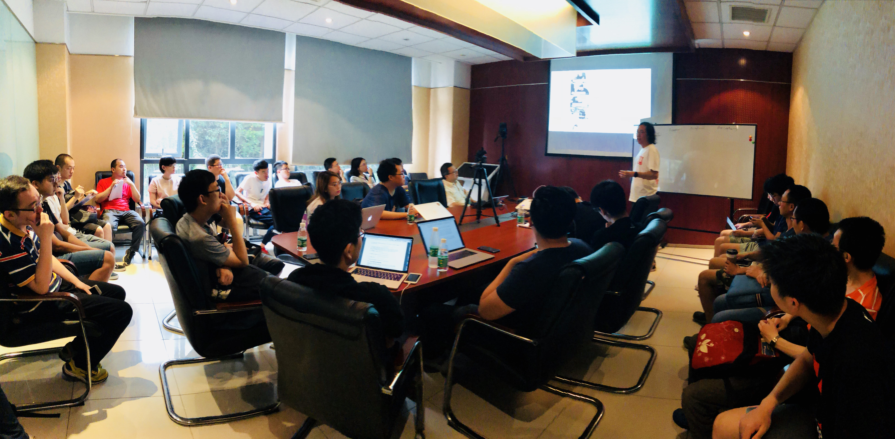

上周六，Infra Meetup 时隔一个月终于回归北京大本营，北京的朋友们格外热情，会议室最后都挤不下啦 ～现场有几位朋友拿着提前打印的论文认真地记笔记，分享结束后大家还围绕 CASPaxos 讨论了很久，瞬间有种“Paper Party”的感觉——看来 Infra Meetup 不定期的论文分享大大激发了社区小伙伴的“学术”之心啊！（不过，全场最大的亮点还是我司 CTO 的“魔性”PPT……）

## 视频回顾

[视频 | Infra Meetup No.69：CASPaxos，一个有趣的 RSM 算法](https://www.bilibili.com/video/av38910681)

配合 [PPT](https://eyun.baidu.com/s/3htaJNDU) 观看更佳～

## 干货节选

本期 Meetup 我司 CTO 黄东旭分享了一篇有趣的论文——***CASPaxos: Replicated State Machines without logs***。他首先通过一个简单的例子通俗易懂地介绍了经典 Paxos 的算法。随后引入了 RSM（日志复制状态机）的概念 ， 并指出 CASPaxos 其实是在经典 Paxos 的基础上进行了拓展，变成了没有日志的 RSM 。接着，他介绍了 CASPaxos 的主体算法，包括 membership change 算法以及用 CASPaxos 实现一个通用数据库时需要考虑的问题。

来自大神的“魔性” PPT

东旭接着对比了目前常用的 RSM 算法 ，比如 TiDB 中用到的 Raft 算法与 CASPaxos 的区别。相较而言，CASPaxos 目前是一个偏学术性的理论，在工业上应用的完整度和相关优化算法还不够。CASPaxos 的优点在于出现异常时的不可用时间非常短，并且没有额外的日志开销，缺陷是做数据丢失的故障恢复代价比较高，而且读依然是多数派读，对业务上的灵活性会有一些影响。

P.S. 东旭还和现场的朋友们一起针对 CASPaxos 的缺点，大开脑洞，畅聊了一些可能的优化方法 。现场越聊越嗨，不得不说大家想法都很“清奇”啊 ( ´▽｀) 。

欢迎大家多来现场感受 Infra Meetup 的氛围哦～北京，我们下期再见！

