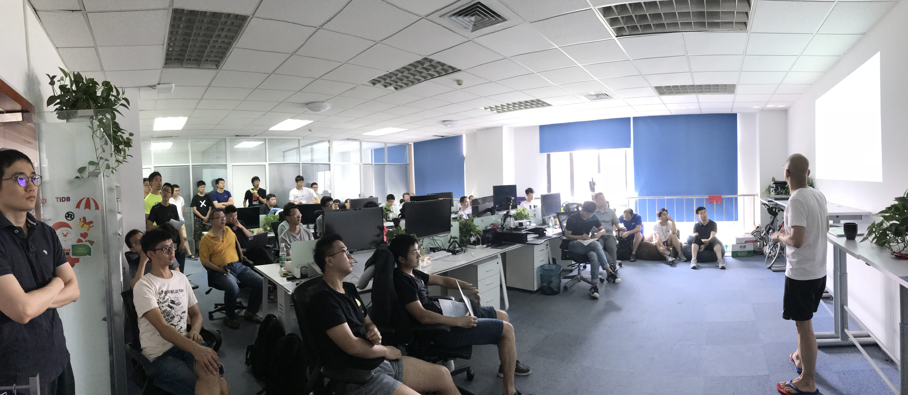
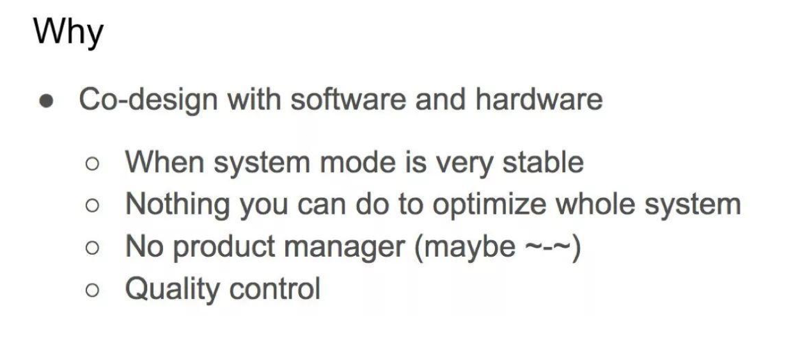
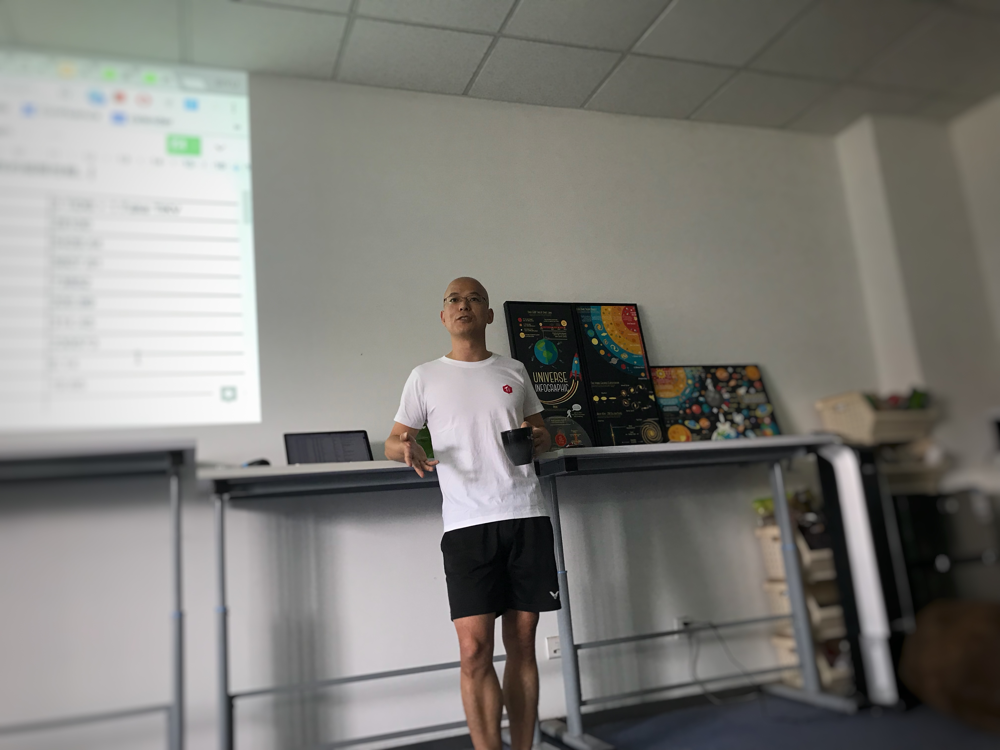

上周六举办的 Infra Meetup No.70，我们换了一个开阔些的场地——嗯，没看错，是我司的一间办公室，然而掏空了房间里的椅子沙发，还是不够坐。

爆满的原因当然是我司 CEO 刘奇的**「重磅分享」**：刘奇分享了受威斯康辛的论文启发的 TiDB 下一代存储引擎的设计考量及实践，以及**「关门福利」**——非常强悍的测试结果，以下是现场视频 & 文字回顾，enjoy！

## 视频回顾

[视频 | Infra Meetup No.70：CEO 解读 TiDB 下一代存储引擎](https://www.bilibili.com/video/av38660494)

[论文 slides 链接](http://research.cs.wisc.edu/wind/Publications/wisckey-slides.pdf)

我司 CEO 刘奇首先为大家介绍了新的磁盘进化发展趋势，如何做软硬件协同设计，以及硬件的发展对数据库系统架构的影响。

## 干货节选

存储引擎是数据库的核心组件之一，目前 TiDB 使用 LSM-Tree 作为底层的存储引擎，其良好的顺序写入特性得到了很大的发挥。然而 LSM-Tree 模型本身也不是尽善尽美，其中较为突出的缺点是写放大比较严重。该问题也吸引了不少学者的研究，也有不少改进论文出现。来自威斯康辛的论文 ***WiscKey: Separating Keys from Values in SSD-conscious Storage*** 是其中的典型代表。

刘奇 | PingCAP CEO
 

刘奇接着介绍了新一代存储引擎利用新的硬件特性的方式（比如充分发挥 SSD/NVMe/Optane 的多通道写入对存储引擎的提升），并解读了威斯康辛的论文在这方面的实践——利用多通道的并行能力来弥补 Key-Value 分离带来的开销。这个方法实现简单，效果极佳。TiDB 的新一代存储模型也受到这篇论文的启发。

最后，刘奇分享了 PingCAP 在这方面的思考与实践，以及对下一代存储引擎设计的具体考量，并展示了正在研发的 TiDB 下一代存储引擎的强悍实测性能。**测试结果显示，相比当前的版本，系统整体性能提升了 2-10 倍。**

