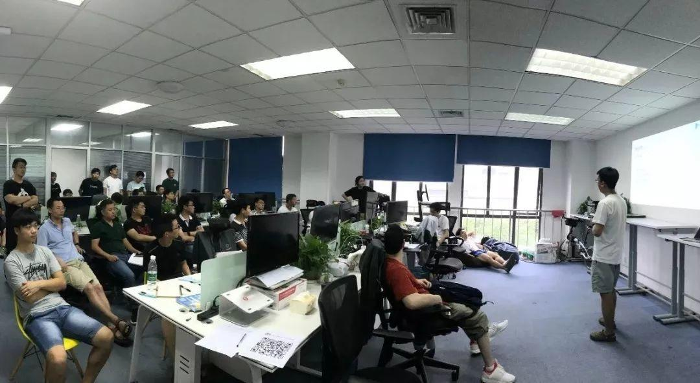
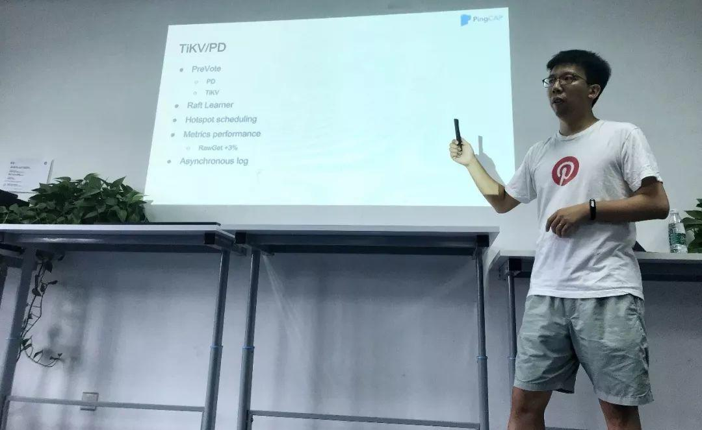

在上周六举办的 Infra Meetup No.71 上，我司申砾老师重点介绍了 TiDB 2.1 Beta 版本在 Raft / PD / SQL 执行引擎等方面的新特性以及未来的规划（中间穿插着我司 CTO 的各种「插播新闻」😂）。当天虽然下着小雨，但丝毫没有影响大家的热情，活动结束后还有不少童鞋留下来讨论哦～以下是现场视频&文字回顾，enjoy ！

## 视频回顾

[视频 | Infra Meetup No.72：TiDB 2.1 新特性与未来规划](https://www.bilibili.com/video/av40442562)

可下载 [完整 PPT](https://eyun.baidu.com/s/3ggd9wY3) 配合观看

## 干货节选

TiDB 2.0 版本于今年 4 月底发布，经过两个月的开发，2.1-Beta 版本于 6 月底发布。这个版本在 2.0 的基础之上做了不少改进。

在 Raft 方面，2.1 最大的变化是引入了 Learner 和 PreVote 两个特性。其中 Learner 可以加强调度过程中的数据安全性，并且为将来 OLAP 请求读 Learner 副本打下基础；PreVote 可以增强系统的稳定性，降低诸如网络隔离后节点重新加入造成的系统抖动。

在 PD 方面，2.1 优化了热点调度功能，收集更详细更准确的集群负载信息，并做更合理的调度在 SQL 优化器方面对 CBO 框架做了进一步改进，提升代价估算准确度。

在 SQL 执行引擎方面，将 Hash 聚合算子以及 Projection 算子做了并行化，提升大数据量下查询的性能。同时我们也在探索 OLTP 场景下的性能提升方案，预计到 2.1 正式版本时可以看到一些明显的进步。

申砾 | PingCAP

对于下一步的计划，我们依然将系统的正确性、稳定性放在首位，在此基础之上尽可能提升性能，比如我们准备的大杀器 ——新一代存储引擎，在内部原型测试中表现出良好的性能。

另外，TiDB 作为一个开源项目，非常欢迎大家参与，我们也会将 TiDB 源码阅读系列文章持续写下去，并且将更多的内部设计文档开源处理，敬请期待。

[附：TiDB 2.1 Beta Release Notes](https://pingcap.com/docs-cn/v3.0/releases/21beta/)

