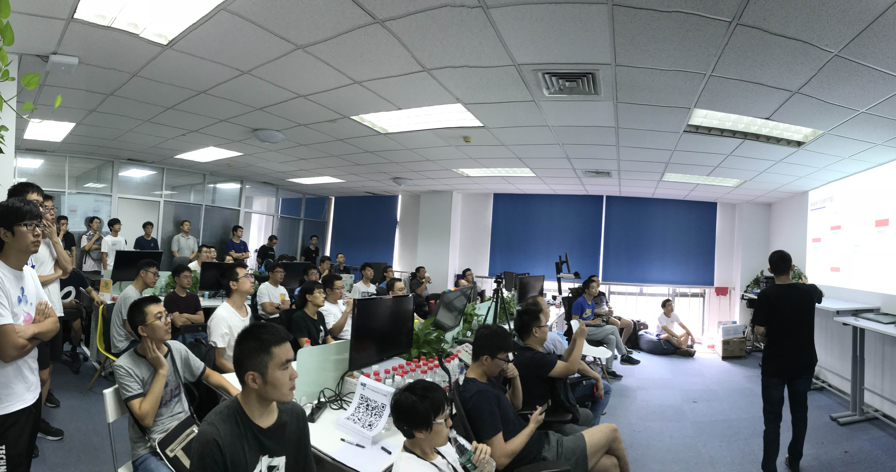
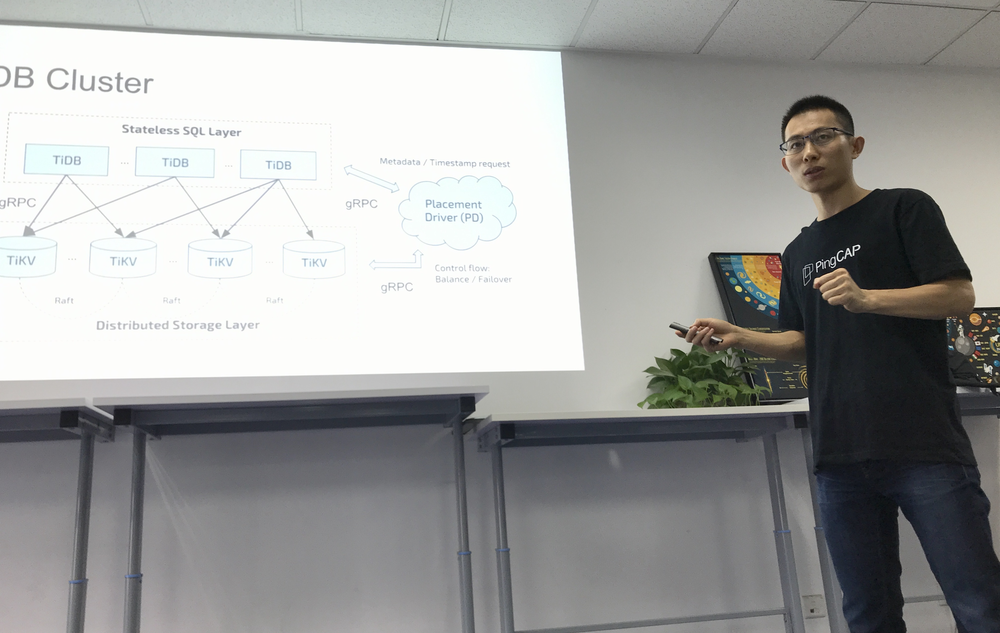
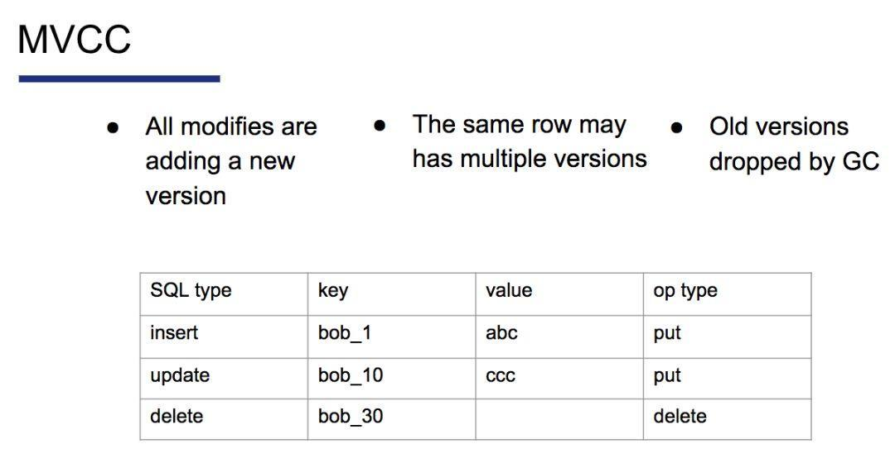
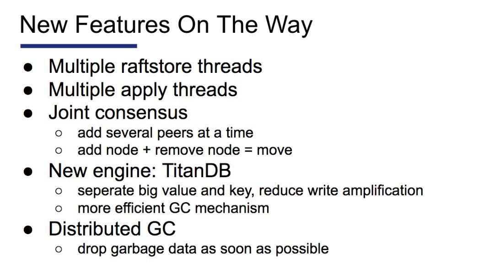

在上周六举办的 Infra Meetup No.73 上，我司 TiKV 核心开发工程师张金鹏老师分享了 TiKV 的原理与正在开发的新功能，整整讲满了 100 分钟～这可能是近期关于 TiKV 最深入的一次分享交流了吧~haha），结束后现场的小伙伴三五成群，意犹未尽地聚在一起讨论交流，钻研精神可嘉！以下是现场视频&文字回顾，enjoy～

- [视频 | Infra Meetup No.74 - 张金鹏 - TiKV 原理剖析](https://www.bilibili.com/video/av38439525)
- [PPT 下载链接](https://eyun.baidu.com/s/3gfShXBl)

金鹏老师首先介绍了 TiKV 中的几个概念，包括 Region、Peer 和 ts，其中 Region 代表一段连续的数据，Peer 是 Region 的一个副本，ts 表示时间戳。然后从宏观的角度分析了数据在 TiKV 之间是如何分布的，以及如何进行 balance，并介绍了 TiKV 的分层结构，分析了读和写请求在 TiKV 内部的各个层之间是怎样流转的。

接着，他重点介绍了 TiKV 的几个核心组件，包括 Multi-raft、RocksDB、分布式事务、Coprocessor、GC 和调度。其中 Multi-raft 涉及到 region 的 split 和 merge，以及 leader lease、pre-vote、learner 等概念；RocksDB 相关的内容包括 column family、delete files in range、ingest sst files、多线程 compaction、sub-compaction 等。（课代表温馨提示：金鹏老师对这些概念的讲解非常细致深入，也耐心解答了现场小伙伴的提问，
 对这些名词不太熟悉的朋友赶紧点开视频跳到相关章节观看吧！）

随后，他举例讲解了 TiDB 的表数据是如何映射成 KV 数据，并详细介绍了 TiKV 中的 MVCC 机制，以及是如何支持分布式事务的。

GC 模块主要负载清理掉过期的数据，同时 TiKV 针对 drop/truncate table/index 进行了优化，使用 RocksDB 的 delete files in range 删除过期的数据，达到快速回收空间的效果。PD 通过 TiKV 上报的读写流量，进行动态调度，使集群中各个 TiKV 节点的负载达到均衡，充分利用集群的资源。

最后金鹏老师透露，TiKV 还在不断地完善中，多个新功能正在开发中，包括消除系统瓶颈的多线程 raftstore 多线程 apply 功能，通过分离 value 来减少写放大的 TitanDB engine，加速垃圾数据回收的分布式 GC 系统，以及正在实现 raft 的 Joint Consensus 功能。

**欢迎大家到 TiKV Repo 逛一逛，捞一捞有趣的 issues，或者参考 ****[这篇文章](http://mp.weixin.qq.com/s?__biz=MzI3NDIxNTQyOQ==&mid=2247486438&idx=1&sn=7c3994542c072e8be5296f1602408d4d&chksm=eb162c8cdc61a59a8942c9ce89f6c7d7ff4a176c8a8ffeca9e8c5af14aa55ef52eac1c23eefe&scene=21#wechat_redirect)**** 练练手，为 TiKV 添加 built-in 函数。**

P.S. TiKV 在 8 月 28 日正式成为 CNCF 托管项目，源码地址变更为：github.com/tikv/tikv/。

