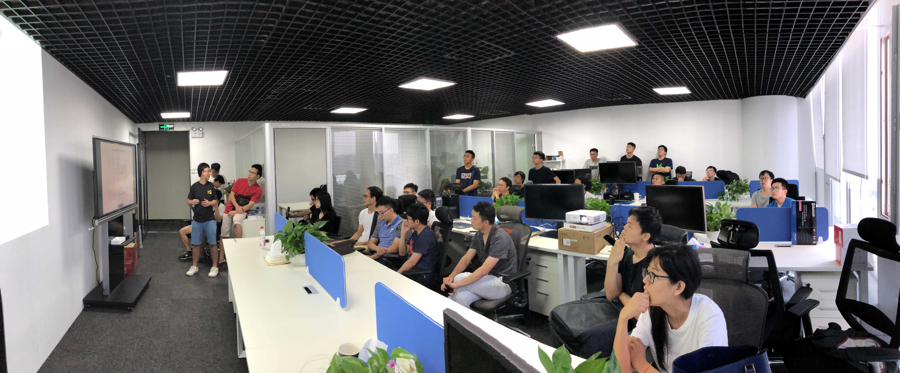
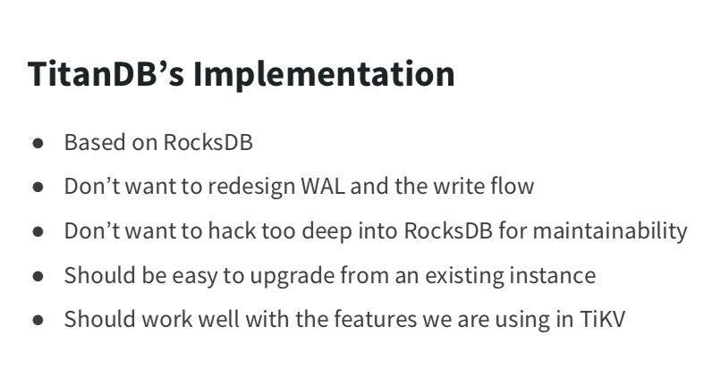
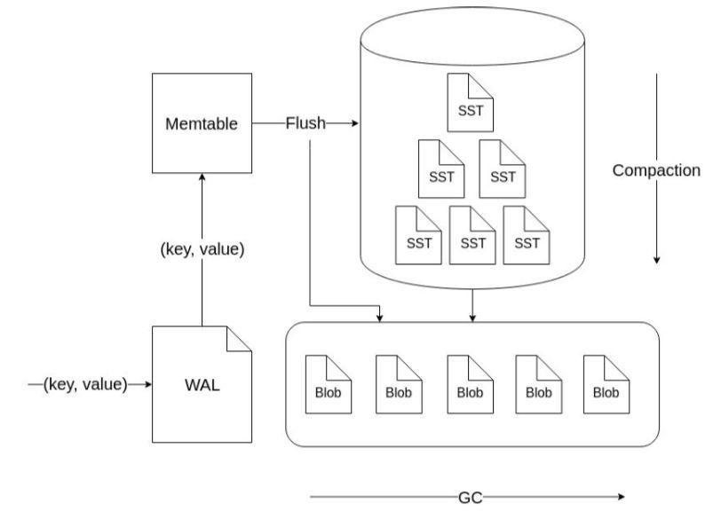

上周六在广州举办的 Infra Meetup No.74 上，我司 TiKV 核心开发工程师黄华超老师为大家介绍了我们自研的 TitanDB——**TitanDB 是基于 RocksDB 做的 key-value 分离的实现，主要解决大 value 写放大严重的问题。这次 Meetup 是 TitanDB 第一次公开分享。**现场的小伙伴从 TiDB 的架构开始，由浅入深，最后对 TiKV、TitanDB 的架构都有了深入的了解，分享结束后的自由讨论依然非常热烈～ 以下是视频 & 文字回顾，enjoy～

- [视频 | Infra Meetup No.74 - 黄华超 - TitanDB](https://www.bilibili.com/video/av38368607)
- [PPT 下载链接](https://eyun.baidu.com/s/3htZNF2O)

华超老师先给大家讲解了 TiDB 和 TiKV 各自的架构，以及 TiDB 和 TiKV 的读写交互流程，并且解答了大家的一些问题。然后集中介绍了 TiKV 存储相关内容，包括 TiKV 是如何使用 RocksDB 的，使用过程中遇到的一些问题以及写放大的计算和如何在读写之间做权衡。最后介绍了 KV 分离的概念以及 Badger 和 TitanDB 的实现和优化。

**TitanDB 是基于 RocksDB 做的 key-value 分离的实现，主要解决大 value 写放大严重的问题。TitanDB 通过把大的 value 从 LSM-Tree 中分离出来，减少 LSM-Tree 的写放大，但是会对读的性能造成一些影响，实际使用中需要根据业务情况选择把多大的 value 分离出来。TitanDB 可以说是给读写放大以及空间放大之间的权衡提供另外一种选择。**

