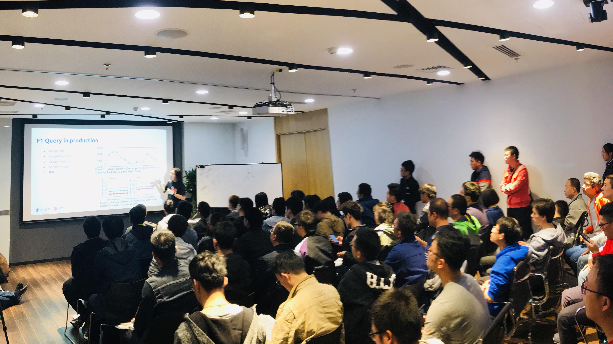
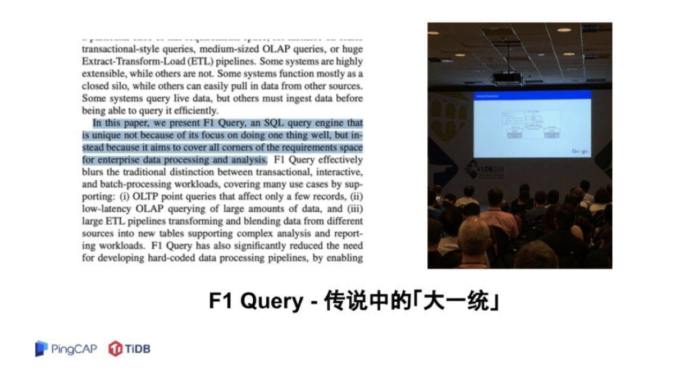
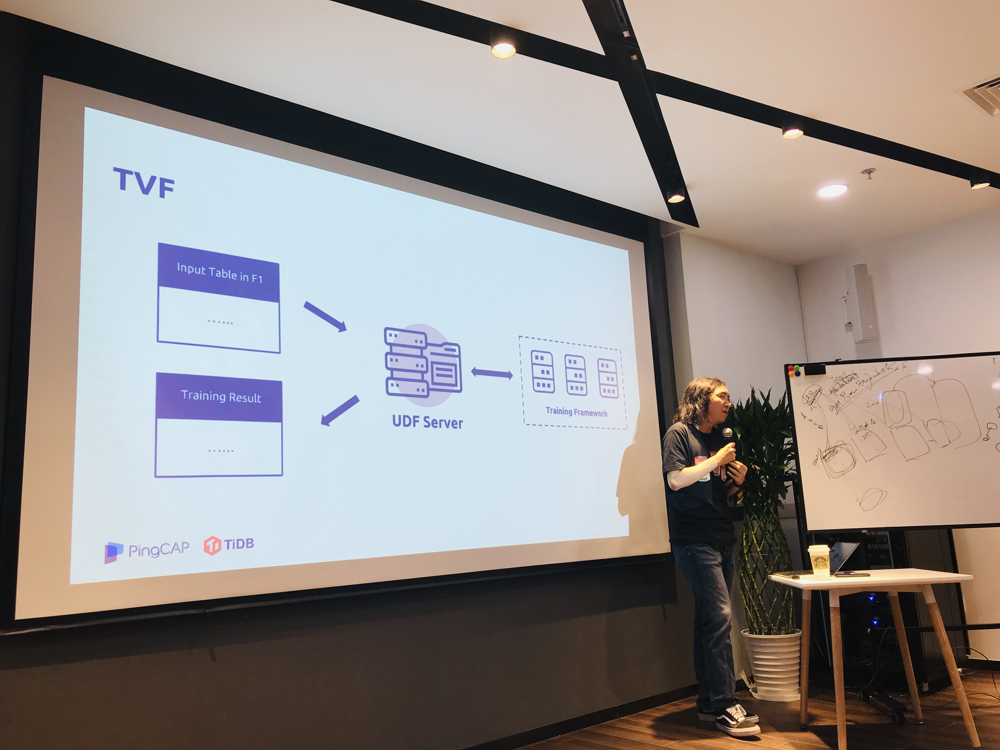
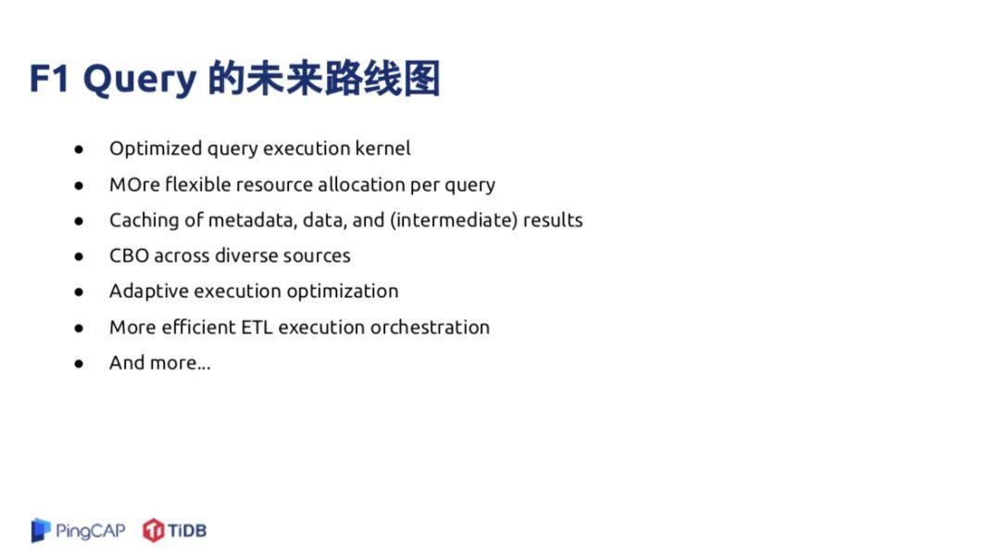

上周六我们在「新根据地」举办了第 75 期 Infra Meetup，由于是在新办公室举行的第一场 Meetup，到场的小伙伴都收到了特别福利——社区 T 恤一件～很多小伙伴还好奇参观了一圈我们的工作环境。“你们公司为什么要这么大的会议室啊？” ——要为定期举办的社区交流活动准备空间呀～不过照本期火爆程度，这个空间恐怕不久就不够用了 haha

言归正传，在本期 Meetup 上，我司 CTO 黄东旭从最新的论文出发，结合 Google F1 团队在今年 VLDB 上的演讲内容，为大家分享了 F1 Query 的架构原理。以下是文字 & 视频回顾，enjoy~ 

## 视频回顾

- [视频 | Infra Meetup No.75 - F1 Query: Declarative Querying at Scale](https://www.bilibili.com/video/av38126687)
- [PPT 链接](https://eyun.baidu.com/s/3nwKJoox)

Google 在今年的 VLDB 上发布了 F1 的新进展（《F1 Query: Declarative Querying at Scale》），距离 Google 的上一篇 F1 论文已经过去 5 年了。2013 年论文《F1: A Distributed SQL Database That Scales》中的 F1 是基于 Spanner 的，主要提供 OLTP 服务，而新的 F1 的定位则是大一统：旨在处理 OLTP/OLAP/ETL 等多种不同的 workload。

本期 Meetup，东旭主要分享了  F1 Query 以下几个重要的设计点，从不同角度详细介绍了 F1 Query 的架构原理。首先，F1 Query 是面向多数据中心的高可用设计的，它并不太关心 Data locality, 这一决定大大降低了计算和存储耦合度。但是可能牺牲掉一些 OLTP 类型业务的延迟。其次，F1 Query 支持多数据源，查询语言上支持 SQL，并提供两种不同的查询交互模式：Interactive mode、Batch mode。

在扩展性方面，由于很多复杂的业务逻辑无法通过 SQL 表达，所以 F1 Query 提供用户自定义函数的方法，包括 UDF（标量函数）、UDA（自定义聚合函数）、TVF（表转化函数），对于更复杂或者性能要求高的 UDF 需求，则可以用其它开发语言通过 UDF Server 的形式实现。

最后，东旭分享了 Google F1 团队在  VLDB 现场 分享的 F1 Query 未来路线图。

>有一位小伙伴在 Meetup 结束之后，结合东旭的分享内容整理了一篇论文笔记，学习精神值得鼓励呀，所以我们送出了一份小礼物（给一直惦记着周边的小伙伴们划一下重点）。点击 [这里](https://zhuanlan.zhihu.com/p/46709577) 即可阅读笔记～

