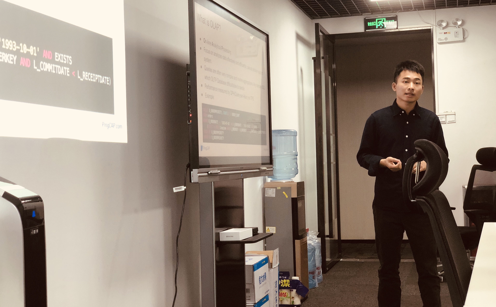

- [视频 | Infra Meetup No.76 - 韦万 - 列式存储如何进行在线更新](https://www.bilibili.com/video/av38062272)
- [PPT 链接](https://eyun.baidu.com/s/3dGKuM8T)

时隔一月，我们又与广州的社区小伙伴们相聚啦～这次是由我司数据库核心研发工程师韦万老师带来的《列式存储如何进行在线更新》主题分享。他首先介绍了 OLAP 场景与 OLTP 的区别，以及为何列式数据库特别适合 OLAP 场景，并介绍了主流的对 OLAP 进行优化的技术。

韦万 | 数据库核心研发工程师

然后进入主题，韦万老师分别列举了目前流行的几种列式数据库的更新方案，包括 SQL Server, Vertica, Kudu 以及 VectorWise， 并分析了它们的优缺点。最后介绍了同学们比较关注的部分，即 TiDB 作为一款 HTAP（Hybrid Transactional/Analytical Processing）数据库，当前的架构以及最新进展（视频中剧透了“神秘武器”——TheFlash）。

