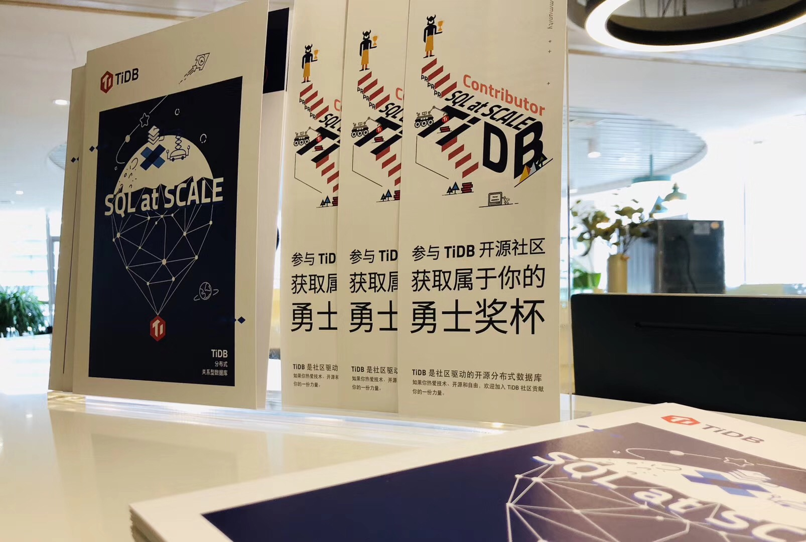
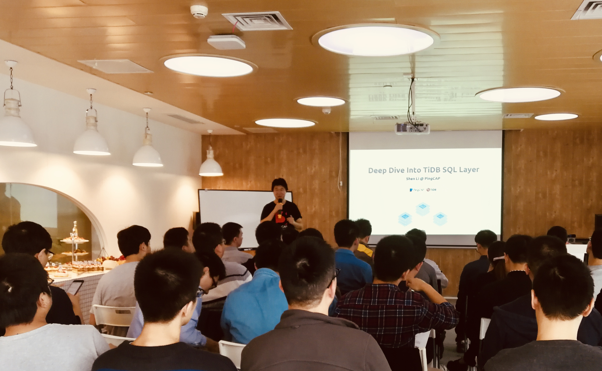
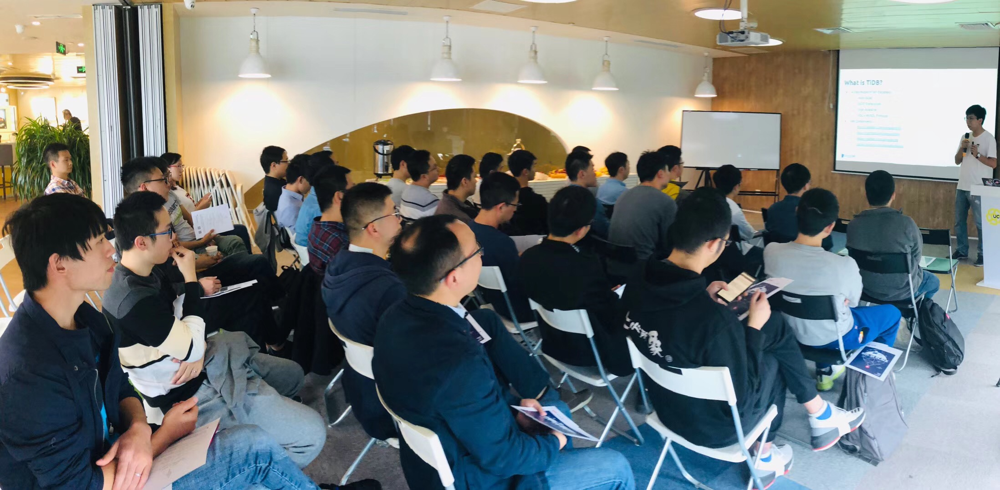
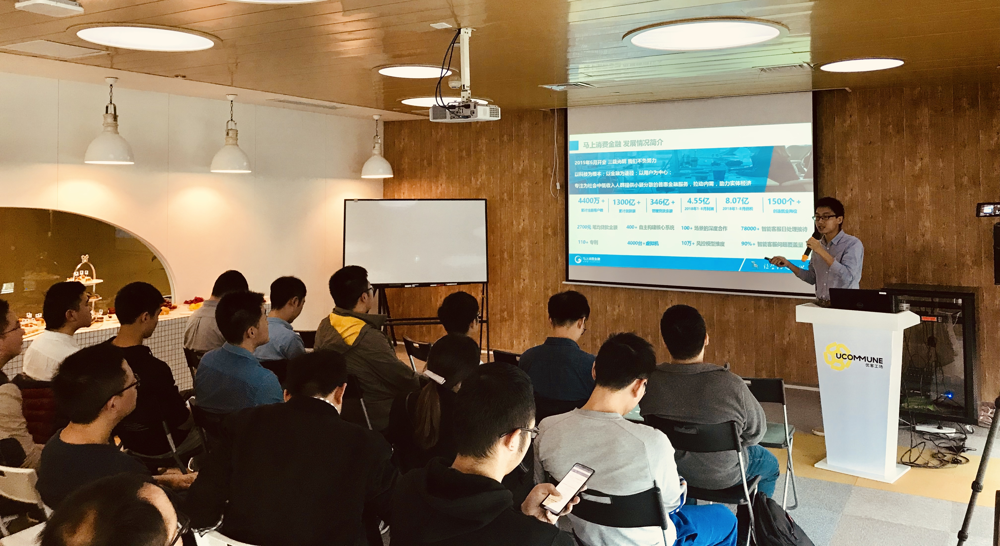

此次成都 Infra Meetup，恰逢我司成都 Office 正式成立，驻成都的所有 PingCAPer 及 Contributor，与到场小伙伴一起让这首场成都 Infra Meetup 充满了庆祝的热烈气氛：一场成都 TiDB 社区小伙伴的线下见面会开始了。

崔秋，我司联合创始人

在我司联合创始人崔秋做了感谢社区的开场白后，我司技术副总裁申砾老师带来《Deep Dive Into TiDB SQL Layer》的分享，他首先为大家介绍了 TiDB 的整体架构，重点分享了 SQL 层的架构和核心组件，包括 Query Optimizer 和 Execution Engine，并举例说明了其中的实现细节。最后申老师简要介绍了 TiDB 的 Roadmap，鼓励大家通过各种方式参与 TiDB 开源社区里来。（欢迎捞 issue 提 PR 成为 TiDB Contributor，我们会有神秘小礼物相送哦～）

- [视频 | 申砾-Deep Dive Into TiDB SQL Layer](https://www.bilibili.com/video/av37990086/?p=1)
- [PPT 下载链接](https://eyun.baidu.com/s/3c3MyJhI)

申砾，我司技术副总裁

茶歇时间，大家三三两两聚在一起讨论，现场 PingCAPer 很耐心的一一回答大家关于 TiDB 技术细节的问题，现场讨论氛围非常热烈。

茶歇过后，马上消费金融 NewSQL 负责人李银龙老师为大家分享了 TiDB 实践经验。

- [视频 | Infra Meetup No.77 - 李银龙 - 马上消费金融 TiDB 实践分享](https://www.bilibili.com/video/av37990086/?p=2)

李银龙，马上消费金融 NewSQL 负责人

李老师首先介绍了马上消费金融上一代数据库解决方案的核心痛点，然后介绍了对 NewSQL 产品的需求要点，以及一些 NewSQL 产品的对比选型，并深入的分享了 TiDB 解决方案体系的细节和最佳实践经验。最后，李老师表达了对 TiDB 云化方案和类 Redis 分布式方案的期待。
