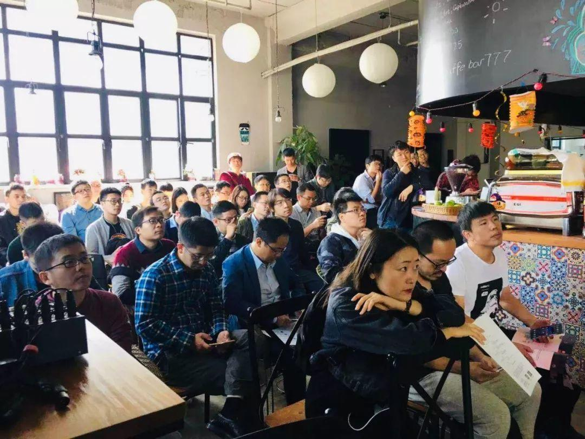
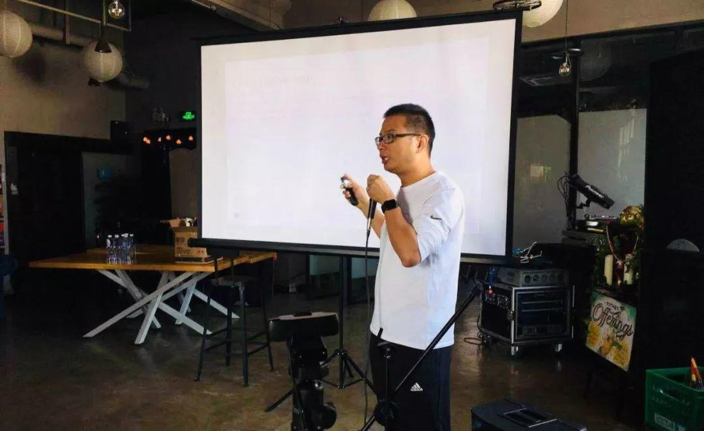

上周六在上海举办的 Infra Meetup No.78 上，B 站数据平台技术经理薛赵明老师和我司首架唐刘老师带来了精彩分享，以下是视频&文字回顾～

## 《B 站大数据建设实践》

- [视频 | Infra Meetup No.78 - 薛赵明 -  B 站大数据建设实践](https://www.bilibili.com/video/av37935761/?p=1)

- [PPT 下载链接](https://eyun.baidu.com/s/3c3JGQU8)

本次分享薛赵明老师主要介绍了 B 站在大数据建设方面的历程及不同时期做的选择和其中犯的错误。主要涉及我们在存储、调度、计算、分布式队列方面的一些技术选型。

我们在离线存储上采用的还是社区的 HDFS，大数据的 KV 存储上我们尝试了 HBase、ES 等组件，同时对于业务属性分为了 online 和 offline 集群。在随着集群规模的扩大上， namenode 也遇到了不少的挑战，例如内存过大，队列过长、存储空间等方面。

调度层选择的 YARN，不过基于该组件我们在外围做了一些保障性的工作，例如队列资源的利用率，自动调整分配，作业执行成功率，提交成功率等。

薛赵明，Bilibili（哔哩哔哩）数据平台技术经理

计算层区分了批量计算（Hive,MR,Spark）、流式计算（Flink,Spark streaming）、ad-hoc（Presto）、OLAP（Kylin）。平台层提供计算方式，业务方自己选择符合合适的计算场景。

消息队列上采用的是 kafka，在 0.10.1.1 这个版本上我们遇见了不少问题，例如 conusmer log skew, produce block , multiple Kafka controllers等。经过近两年的使用，最近计划迁移到最新的 2.0 版本。

上层服务上，基于我们的大数据套件，针对不同的用户，我开发了相应的大数据工具和数据产品，例如开发 IDE，报表工具，监控系统,数据交换工具等等。

## 《Chaos Practice in TiDB》

- [视频 | Infra Meetup No.78 - 唐刘 -  Chaos Practice in TiDB](https://www.bilibili.com/video/av37935761/?p=2)

- [PPT 下载链接](https://eyun.baidu.com/s/3kWtKh5X)

构造一个健壮的分布式数据库系统是一件非常困难的事情，因为我们需要做非常多的工作来保证用户数据安全，不允许数据丢失或者损坏。而在 TiDB 里面，我们是通过实践 Chaos Engineering 来保证。

在本次分享中，我司首席架构师唐刘首先提出了 Chaos 测试的必要性：“虽然我们有 unit test，integration test 这些，但他们都是有局限性的，为了更好的模拟系统实际的情况，我们需要 Chaos。”

唐刘，我司首席架构师

那么在 TiDB 里面是如何做 Chaos 的？在这其中有三个关键技术，monitor，fault injection 以及 automation。现场重点讲解了 fault injection，包括进程干扰，网络干扰，文件干扰等，以及一些集群工具。同时介绍了在 TiDB 里面如何将所有这些进行整合，也就是 Schrodinger 平台，通过 Schrodinger，我们能自动化的进行 Chaos test。最后，唐刘老师还为大家介绍了一些 PingCAP 现在的研究方向，譬如使用 TLA+ 来证明我们程序的正确性，以及使用  automating fault injection 来自动的分析系统，进行 fault injection。

