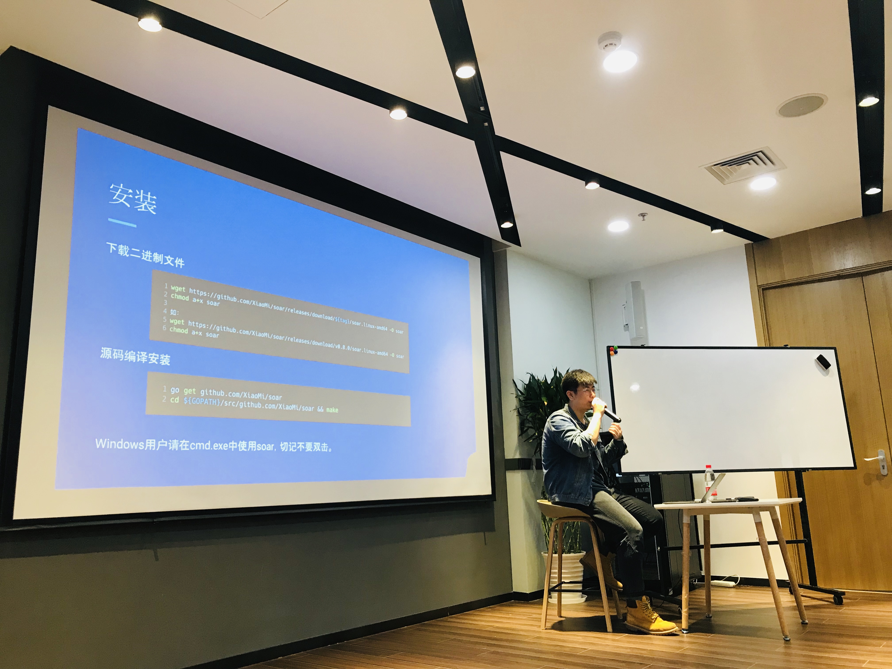

在 Infra Meetup No.79 上，来自小米的李鹏翔老师为大家分享了小米开源的智能 SQL 优化工具——SOAR，并进行了现场 Demo 演示，以下是现场视频 & 文字回顾，enjoy~

在过去的几年间，小米互联网业务高速发展，数据库规模也在不断的增长。为了提供稳定、高效的数据库服务，进一步的提高 DBA 工作效率，解放生产力，小米 DBA 基于 Go 语言自主研发了智能 SQL 优化改写工具 SOAR。该工具在内部使用期间效果显著，小米运维部决定将其开源，为开源数据库生态助力。 在 10 月 20 日的开源先锋日（OSCAR）上，小米正式宣布开源自研的 SOAR（SQL Optimizer And Rewriter），开源后两周时间 GitHub 上的 Star 数便超过了 2700。

- [视频 | Infra Meetup No.79：小米开源 SQL 优化工具 SOAR 技术内幕]
(https://www.bilibili.com/video/av37851944)

- [PPT 链接](https://eyun.baidu.com/s/3raldaMS)

**SOAR 是一款智能 SQL 优化和改写工具，开发人员可以直接通过 SOAR 快速的对自己的 SQL 进行质量检查，生成评估报告，防止将问题 SQL 带到线上从而导致服务质量下降。**它不仅能够尽可能地提高线上代码质量，还能避免一些由于人为疏漏而带来的隐患。

李鹏翔 | 小米

在本期 Meetup 上，李鹏翔老师主要介绍了 SOAR 的基本使用场景和使用方式，介绍了在不同操作系统下如何快速上手 SOAR，并讲解了 SOAR 的常用配置，在现场 Demo 过程中对一些常见问题进行了解答。

