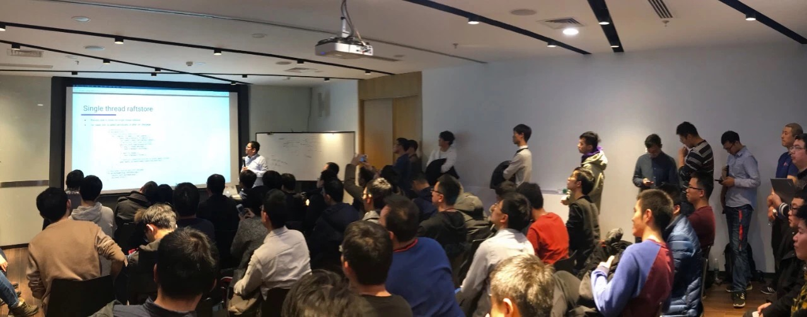

在上周六举办的 Infra Meetup 上，TiKV 研发工程师屈鹏为大家介绍了 TiKV 最新性能优化。现场讨论非常热烈，分享结束后还有很多小伙伴意犹未尽，留在现场和讲师交流。欢迎大家多来参加 Meetup 感受现场交流的乐趣哦～ 以下是本期 Meetup 的文字 & 视频回顾，enjoy！

>讲师介绍：屈鹏，2017 年加入 PingCAP，TiKV 研发工程师。专注于分布式数据库领域，擅长 Raft 及 TiKV 的性能优化。

- [视频 | Infra Meetup No.89：TiKV 最新性能优化](https://www.bilibili.com/video/av44925049)

- [PPT 链接](https://eyun.baidu.com/s/3ggdLWmJ)

屈鹏老师首先为大家介绍了 TiKV 最新版本的 3 个新的优化：

- batch gRPC/Raft messages 特性可以将消息收集为一个 batch 批量发送，减少了网络相关的系统调用次数，达到了性能上的提升。

- threaded raftstore/apply 特性将之前系统中的两个单线程组件替换为多线程，同时避免了数据倾斜和饥饿，消除了 TiKV 在写入上的瓶颈。

- distributed GC 大幅重构了 GC 相关的代码，GC 的驱动者由客户端变成了 TiKV 自己，简化了客户端的编写难度，同时将 GC 速度加快了 3 倍。

最后屈鹏老师分享了几个正在开发中的优化，包括事务提交不取 timestamp 等等。

>PingCAP Infra Meetup 
>
>作为一个基础架构领域的前沿技术公司，PingCAP 希望能为国内真正关注技术本身的 Hackers 打造一个自由分享的平台。自 2016 年 3 月 5 日开始，我们定期在周末举办 Infra Meetup，与大家深度探讨基础架构领域的前瞻性技术思考与经验，目前已在北京、上海、广州、成都、杭州等地举办。在这里，我们希望提供一个高水准的前沿技术讨论空间，让大家真正感受到自由的开源精神魅力。